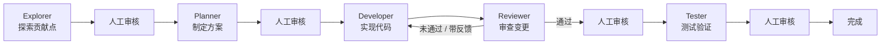
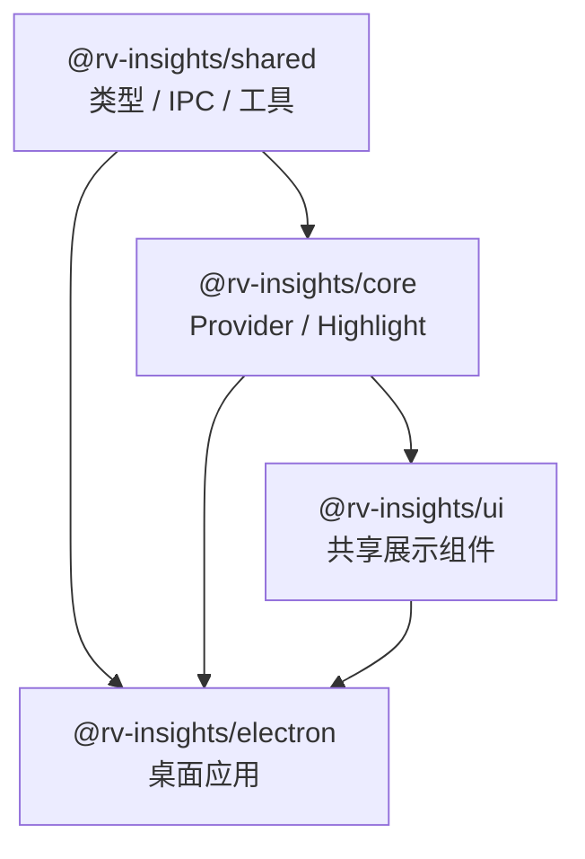
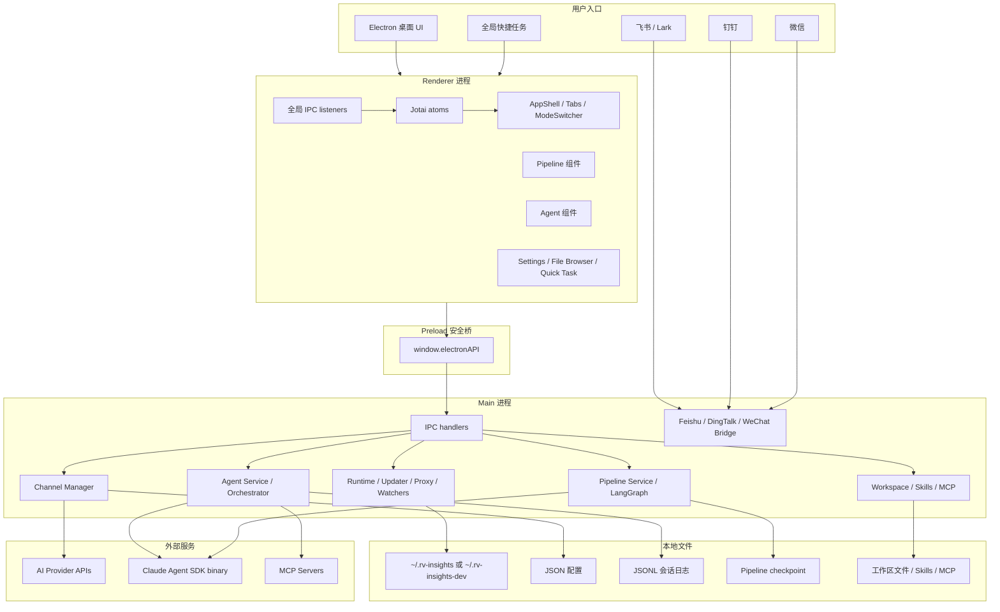
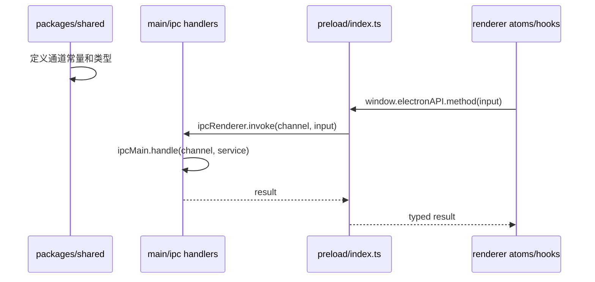
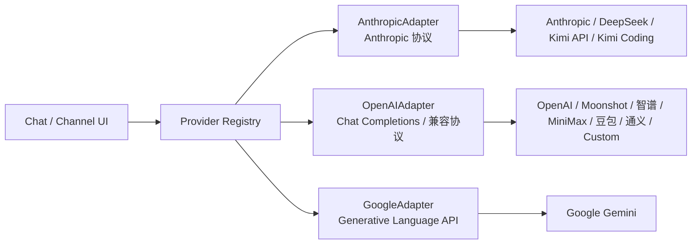
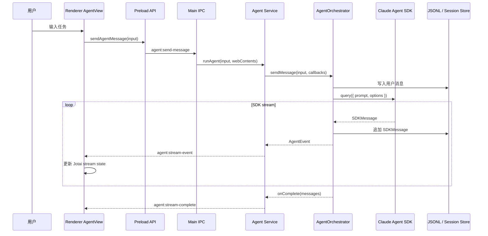
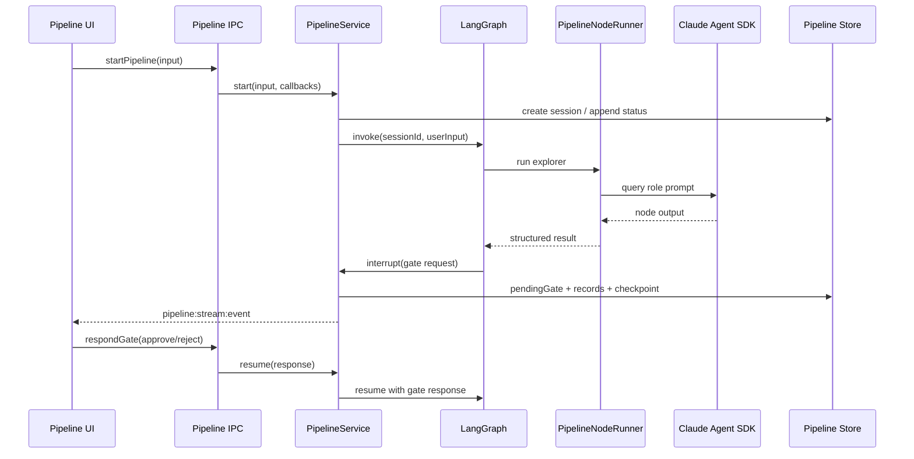
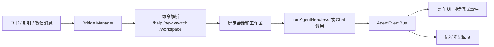
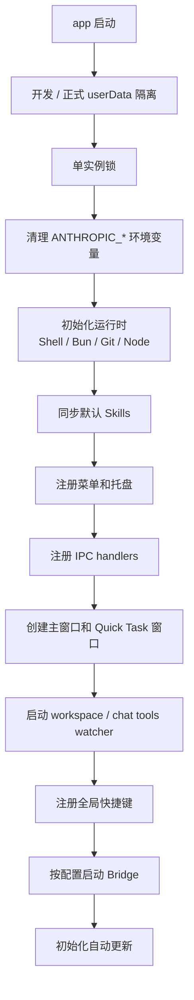

# RV-Insights

RV-Insights 是一个本地优先的开源 AI Agent 桌面应用，面向开源软件贡献、代码协作和长期工作流自动化。项目基于 Electron + React + TypeScript + Bun 构建，公开主入口为 `Pipeline | Agent`：`Pipeline` 提供结构化的贡献流水线，`Agent` 提供通用自主执行能力；旧 `Chat` 路径仍保留为隐藏回退和兼容能力。

核心设计目标：

- **本地优先**：配置、会话索引、消息记录、Pipeline checkpoint 和工作区文件默认保存在本机配置目录，优先使用 JSON / JSONL 文件而不是本地数据库。
- **Agent 工作流**：基于 `@anthropic-ai/claude-agent-sdk`，支持工具调用、文件操作、终端执行、权限确认、AskUser、ExitPlan 和 Agent Teams 运行状态跟踪。
- **结构化贡献流水线**：`explorer -> planner -> developer -> reviewer -> tester` 五阶段 Pipeline，由 LangGraph 在主进程编排，每个关键阶段可人工审核后继续。
- **多供应商渠道**：统一管理 Anthropic、OpenAI、DeepSeek、Google、Kimi、智谱、MiniMax、豆包、通义千问和自定义 OpenAI 兼容端点。
- **远程桥接**：通过飞书、钉钉、微信 Bridge 远程触发 Agent 会话，支持私聊、群组、工作区切换和会话切换。
- **可扩展工具链**：按工作区管理 Skills、MCP Server、工作区文件和默认 Skill 模板。

## 目录

- [核心能力](#核心能力)
- [技术栈](#技术栈)
- [快速开始](#快速开始)
- [项目结构](#项目结构)
- [整体架构](#整体架构)
- [模块功能](#模块功能)
- [核心流程](#核心流程)
- [本地数据与配置](#本地数据与配置)
- [开发指南](#开发指南)
- [打包发布](#打包发布)
- [常见问题](#常见问题)

## 核心能力

### Pipeline

Pipeline 是面向开源贡献的结构化工作流。当前固定主链路为：



Pipeline 的状态、节点输出、人工审核、阶段产物和 checkpoint 都会落盘，应用重启后可以恢复待审核状态。节点执行统一通过 Claude Agent SDK 兼容链路，由主进程服务封装，不把 LangGraph 暴露给渲染进程。

### Agent

Agent 模式提供通用自主执行能力，适合调研、代码修改、文件整理、自动化任务和长上下文工作。它支持：

- 工作区隔离：每个工作区拥有自己的 cwd、MCP 配置、Skills 和共享文件目录。
- 权限管理：支持安全模式、询问模式和允许全部等权限策略。
- 流式输出：SDK 消息实时转换成 UI 事件，并持久化为 JSONL。
- 用户交互：工具权限请求、AskUser、ExitPlan 等事件会按 sessionId 排队，不因页面切换丢失。
- Agent Teams：已接入 Claude Agent SDK Tasks / Teammates 事件跟踪，可延迟 result、收集 teammate inbox 结果并 auto-resume 汇总。

Agent 兼容供应商限定为 Anthropic 协议兼容集合：`anthropic`、`deepseek`、`kimi-api`、`kimi-coding`。OpenAI、MiniMax、智谱、豆包、通义千问等渠道仍可用于普通 Chat / 渠道层能力。

### Skills 与 MCP

RV-Insights 按工作区管理 Skills 和 MCP Server：

- 默认 Skills 模板在首次启动时同步到用户配置目录。
- 每个工作区拥有独立的 `mcp.json`、`skills/`、`skills-inactive/` 和 `workspace-files/`。
- 支持通过工作区配置让 Agent 获取不同任务场景下的工具、文档和能力。

当前内置默认 Skill 目录包括 `brainstorming`、`docx`、`xlsx`、`pptx`、`pdf`、`find-skills`、`skill-creator`、`writing-plans`、`executing-plans`、`tool-builder` 等。

### 远程 Bridge

主进程内置飞书、钉钉、微信 Bridge 注册表。启用配置后，应用启动时可自动启动对应 Bridge，并把远程消息转成 Agent / Chat 会话请求。

常用桥接命令包括：

| 命令 | 功能 |
|------|------|
| `/help` | 查看帮助 |
| `/new` | 创建新会话 |
| `/list` | 查看会话列表 |
| `/switch` | 切换会话 |
| `/stop` | 停止当前任务 |
| `/workspace` | 切换工作区 |
| `/agent` | 切换到 Agent 模式 |
| `/chat` | 切换到 Chat 模式 |
| `/now` | 查看当前绑定状态 |

### 其他能力

- 多标签主界面：Pipeline、Agent、Chat 会话可以在标签页中打开和切换。
- Quick Task：全局快捷任务窗口，快速提交任务并打开对应会话。
- 文件浏览与附件：支持工作区文件浏览、文件提及、附件保存、PDF / Office / 文本解析。
- AI 展示组件：Markdown、代码高亮、Mermaid、KaTeX、推理折叠和工具活动展示。
- 记忆功能：支持 MemOS 配置和记忆工具。注意，记忆数据是否完全本地取决于你配置的记忆后端。
- 自动更新：基于 Electron Updater。
- 代理设置：支持系统代理检测和应用代理配置。
- 环境检测：检测 Bun、Git、Node、Shell、WSL 等运行时条件。

## 技术栈

| 层级 | 技术 |
|------|------|
| 运行时 / 包管理 | Bun 1.2.5+ |
| 桌面框架 | Electron 39.5.1 |
| 前端框架 | React 18.3.1 |
| 状态管理 | Jotai 2.17.1 |
| 构建工具 | Vite 6.0.3、esbuild 0.24+ |
| 样式 | Tailwind CSS 3.4.17、Radix UI、lucide-react |
| Agent SDK | `@anthropic-ai/claude-agent-sdk@0.2.123` |
| Pipeline 编排 | `@langchain/langgraph@1.3.0` |
| 代码高亮 | Shiki 3.22.0 |
| 富文本输入 | TipTap 3.19.0 |
| Markdown / 数学公式 | React Markdown、remark-gfm、KaTeX |
| 打包分发 | electron-builder 25.1.8 |
| 即时通信 Bridge | 飞书、钉钉、微信 |

## 快速开始

### 环境要求

- Bun 1.2.5+
- Git
- macOS / Windows / Linux

### 从源码运行

```bash
git clone https://github.com/ErlichLiu/RV-Insights.git
cd RV-Insights

bun install
bun run dev
```

开发模式会并行启动 Vite 和 Electron。渲染进程通过 Vite HMR 热更新，主进程和 preload 通过 esbuild watch + electronmon 重启。

### 构建后启动

```bash
bun run electron:build
bun run electron:start
```

### 常用命令

| 命令 | 说明 |
|------|------|
| `bun run dev` | 启动 Electron 开发模式 |
| `bun run electron:dev` | `bun run dev` 的别名 |
| `bun run electron:build` | 构建 Electron 主进程、preload、文件预览 preload、渲染进程和资源 |
| `bun run electron:start` | 构建后启动 Electron |
| `bun run build` | 对 workspace 包执行 build |
| `bun run typecheck` | 对 workspace 包执行 TypeScript 检查 |
| `bun test` | 运行 Bun 测试 |

Electron 应用目录下还有更细的命令：

```bash
cd apps/electron

bun run dev:vite
bun run dev:electron
bun run build:main
bun run build:preload
bun run build:preview-preload
bun run build:renderer
bun run dist:fast
```

## 项目结构

RV-Insights 是 Bun workspace monorepo：

```text
RV-Insights/
├── packages/
│   ├── shared/          # 共享类型、IPC 常量、配置、工具函数
│   ├── core/            # Provider 适配器、SSE 读取、代码高亮
│   └── ui/              # 共享 React UI 组件
├── apps/
│   └── electron/        # Electron 桌面应用
│       ├── default-skills/
│       ├── resources/
│       ├── scripts/
│       └── src/
│           ├── main/        # 主进程、IPC、服务层
│           ├── preload/     # contextBridge API
│           └── renderer/    # React UI
├── docs/                # 架构、Pipeline、设计文档
├── tasks/               # 当前任务计划与经验记录
├── tutorial/            # 内置教程内容
├── web/                 # 预留 Web 相关目录
└── web-console/         # 预留 Web Console 相关目录
```

### Workspace 包

| 包 | 当前版本 | 职责 |
|----|----------|------|
| `@rv-insights/shared` | `0.1.25` | 共享类型、IPC 通道常量、配置、能力 diff、Pipeline 状态工具 |
| `@rv-insights/core` | `0.2.11` | Anthropic / OpenAI / Google Provider 适配器、SSE reader、Shiki 高亮 |
| `@rv-insights/ui` | `0.1.3` | `CodeBlock`、`MermaidBlock`、平滑流式 hooks 等共享 UI |
| `@rv-insights/electron` | `0.0.39` | 完整 Electron 桌面应用 |

依赖方向保持单向：



## 整体架构

### 分层视图



### Electron 三进程边界

| 进程 / 层 | 入口 | 职责 |
|-----------|------|------|
| Main | `apps/electron/src/main/index.ts` | 创建窗口、单实例锁、菜单托盘、运行时初始化、IPC 注册、Agent / Pipeline / Bridge / 更新器 / 文件监听等服务 |
| Preload | `apps/electron/src/preload/index.ts` | 使用 `contextBridge` 暴露白名单 API，隔离 Node 能力和 UI 上下文 |
| File Preview Preload | `apps/electron/src/preload/file-preview-preload.ts` | 文件预览窗口的隔离 API |
| Renderer | `apps/electron/src/renderer/main.tsx` | React UI、Jotai 状态、全局监听器、主题、更新器、快捷键和主界面 |

Electron 安全策略：

- `contextIsolation: true`
- `nodeIntegration: false`
- 渲染进程只能通过 `window.electronAPI` 访问主进程能力
- 外部链接通过系统浏览器打开，避免 Electron 窗口被导航覆盖

### IPC 架构

RV-Insights 的 IPC 遵循四层同步模型：



主要 IPC 域：

| 域 | 说明 |
|----|------|
| `IPC_CHANNELS` | 运行时、Git、通用系统能力 |
| `CHANNEL_IPC_CHANNELS` | AI 渠道 CRUD、测试连接、拉取模型 |
| `AGENT_IPC_CHANNELS` | Agent 会话、流式事件、权限、AskUser、工作区 |
| `PIPELINE_IPC_CHANNELS` | Pipeline 会话、记录、状态、gate、stream |
| `CHAT_IPC_CHANNELS` | 隐藏回退 Chat 会话、消息、流式响应 |
| `ENVIRONMENT_IPC_CHANNELS` | 环境检查和安装器 |
| `PROXY_IPC_CHANNELS` | 系统代理检测和代理配置 |
| `SYSTEM_PROMPT_IPC_CHANNELS` | 系统提示词管理 |
| `MEMORY_IPC_CHANNELS` | 记忆配置和工具 |
| `CHAT_TOOL_IPC_CHANNELS` | Chat 工具配置和执行 |
| `FEISHU_IPC_CHANNELS` | 飞书配置、绑定、Bridge 状态 |
| `DINGTALK_IPC_CHANNELS` | 钉钉配置和 Bridge 状态 |
| `WECHAT_IPC_CHANNELS` | 微信配置和 Bridge 状态 |
| `GITHUB_RELEASE_IPC_CHANNELS` | 版本发布与更新信息 |

## 模块功能

### Main 进程服务层

`apps/electron/src/main/lib/` 是应用的主要业务层。

| 模块 | 代表文件 | 职责 |
|------|----------|------|
| Agent 编排 | `agent-orchestrator.ts`、`agent-orchestrator/*` | 调用 Claude Agent SDK、并发守卫、SDK env、消息持久化、重试、完成信号、Teams auto-resume |
| Agent 服务薄层 | `agent-service.ts`、`agent-event-bus.ts` | 连接 IPC、EventBus 和 orchestrator，把流式事件转发到窗口 |
| Agent 会话 | `agent-session-manager.ts` | Agent 会话元数据和 SDK JSONL 消息存储 |
| Agent 工作区 | `agent-workspace-manager.ts` | 工作区 CRUD、MCP 配置、Skills、工作区文件 |
| Agent 权限 / 用户交互 | `agent-permission-service.ts`、`agent-ask-user-service.ts`、`agent-exit-plan-service.ts` | 权限请求、AskUser、ExitPlan 流程 |
| Agent Teams | `agent-team-reader.ts`、`agent-orchestrator/teams-coordinator.ts` | 读取 `~/.claude/teams`、跟踪 teammate 状态、收集 inbox 结果 |
| Pipeline | `pipeline-service.ts`、`pipeline-graph.ts`、`pipeline-node-runner.ts` | LangGraph 编排、节点执行、start / resume / stop / state |
| Pipeline 持久化 | `pipeline-session-manager.ts`、`pipeline-checkpointer.ts`、`pipeline-artifact-service.ts` | 会话索引、JSONL 记录、checkpoint、阶段产物 |
| Pipeline 人工审核 | `pipeline-human-gate-service.ts` | pending gate 管理和 resume 响应 |
| 渠道管理 | `channel-manager.ts` | Provider 渠道 CRUD、API Key 加密、连接测试 |
| Chat 回退能力 | `chat-service.ts`、`conversation-manager.ts` | 旧 Chat 会话、流式生成、消息持久化 |
| Chat 工具 | `chat-tool-*`、`chat-tools/*` | 工具注册、工具执行、HTTP、Web Search、记忆工具等 |
| 附件 / 文档 | `attachment-service.ts`、`document-parser.ts`、`file-preview-service.ts` | 附件保存、PDF / Office / 文本解析、文件预览 |
| 远程 Bridge | `bridge-registry.ts`、`feishu-*`、`dingtalk-*`、`wechat-*` | 飞书、钉钉、微信机器人与 Agent / Chat 会话连接 |
| 系统服务 | `runtime-init.ts`、`bun-finder.ts`、`git-detector.ts`、`node-detector.ts`、`shell-env.ts` | Shell、Bun、Git、Node、WSL 等运行时检测 |
| 设置服务 | `settings-service.ts`、`user-profile-service.ts`、`proxy-settings-service.ts` | 主题、用户档案、代理配置 |
| 更新与发布 | `updater/*`、`github-release-service.ts` | Electron 自动更新、版本信息 |
| 文件监听 | `workspace-watcher.ts`、`chat-tools-watcher.ts` | 工作区、MCP、Skills、Chat 工具变化通知 |
| Quick Task | `quick-task-window.ts` | 快捷任务窗口生命周期 |
| 搜索 | `jsonl-search.ts` | 对 JSONL 会话记录分页搜索 |

### IPC handlers

`apps/electron/src/main/ipc.ts` 是注册总入口，部分域已拆到 `apps/electron/src/main/ipc/`：

- `agent-handlers.ts`
- `pipeline-handlers.ts`
- `channel-handlers.ts`
- `settings-handlers.ts`
- `bot-hub-handlers.ts`
- `quick-task-handlers.ts`

### Renderer 前端模块

| 目录 | 职责 |
|------|------|
| `atoms/` | Jotai 状态：Pipeline、Agent、Chat、Settings、Theme、Tabs、Search、Updater、Bridge 等 |
| `hooks/` | 全局 IPC listeners、会话打开/创建、标签页关闭、快捷键、后台任务 |
| `components/app-shell/` | 三面板主框架、模式切换、左侧导航、右侧面板、搜索 |
| `components/tabs/` | 多标签模型、标签栏、标签内容、关闭确认 |
| `components/pipeline/` | Pipeline 主视图、阶段轨道、记录流、审核卡片、失败卡片 |
| `components/agent/` | Agent 会话、消息渲染、工具活动、权限请求、AskUser、工作区选择、任务进度 |
| `components/chat/` | 旧 Chat 回退 UI、模型选择、上下文设置、工具选择 |
| `components/settings/` | 渠道、Agent、MCP、Skills、外观、代理、记忆、Bridge、更新、快捷键等设置 |
| `components/file-browser/` | 工作区文件树、文件拖放、文件提及 |
| `components/ai-elements/` | AI 消息、富文本输入、推理块、上下文分隔线、文件路径 chip |
| `components/quick-task/` | 快捷任务窗口 UI |
| `components/environment/` | 环境检查卡片和安装提示 |
| `components/ui/` | Radix + Tailwind 基础组件 |

### Provider 适配层

`@rv-insights/core` 使用适配器注册表把多供应商协议统一为内部 Provider 接口：



Provider 类型与默认 URL 在 `packages/shared/src/types/channel.ts` 中定义。渠道中的 API Key 由主进程通过 Electron `safeStorage` 加密后写入本地配置文件。

## 核心流程

### Agent 执行流程



关键点：

- 同一 session 有并发守卫，避免两个 Agent 请求同时写同一个 JSONL。
- SDK `options.env` 由项目显式合并 `process.env` 后再注入渠道变量，保证 `PATH`、`HOME`、`SHELL` 等基础环境可用。
- Agent 流式监听器挂在 `renderer/main.tsx` 顶层，不随页面切换卸载。
- 权限请求和 AskUser 请求按 `sessionId` 存入 Map，后台会话也能恢复响应。

### Pipeline 执行流程



Pipeline 的 gate 是一等概念，不复用 Agent 的 AskUser：

- 每个 gate 有独立 `gateId`。
- pending gate 存在 session meta 和 checkpoint 中。
- reviewer 如果驳回，会回到 developer 继续迭代。
- tester gate 通过后进入 completed。

### Bridge 远程调用流程



Bridge 以主进程服务为中心运行，即使用户从手机或群组触发任务，桌面端也可以同步看到 Agent 会话状态。

### 启动流程



## 本地数据与配置

正式版本默认使用 `~/.rv-insights/`，开发模式默认使用 `~/.rv-insights-dev/`。测试和特殊场景可用 `RV_INSIGHTS_CONFIG_DIR` 覆盖。

```text
~/.rv-insights/
├── channels.json
├── conversations.json
├── conversations/
│   └── {conversationId}.jsonl
├── pipeline-sessions.json
├── pipeline-sessions/
│   └── {sessionId}.jsonl
├── pipeline-checkpoints/
│   └── {sessionId}/
├── pipeline-artifacts/
│   └── {sessionId}/
├── agent-sessions.json
├── agent-sessions/
│   └── {sessionId}.jsonl
├── agent-workspaces.json
├── agent-workspaces/
│   └── {workspaceSlug}/
│       ├── {sessionId}/
│       ├── workspace-files/
│       ├── mcp.json
│       ├── skills/
│       └── skills-inactive/
├── attachments/
│   └── {conversationId}/
├── default-skills/
├── sdk-config/
├── settings.json
├── user-profile.json
├── proxy-settings.json
├── system-prompts.json
├── memory.json
├── chat-tools.json
├── feishu.json
├── feishu-bindings.json
├── dingtalk.json
├── wechat.json
└── wechat-sync.json
```

设计原则：

- 索引文件保存轻量元数据，便于快速加载列表。
- 会话正文和事件流使用 JSONL 追加写入，便于流式持久化、恢复和搜索。
- Pipeline checkpoint 单独服务 LangGraph interrupt / resume。
- 工作区文件、MCP 和 Skills 按 workspace slug 隔离。
- SDK 配置目录独立于用户自己的 Claude Code CLI 配置。

## 开发指南

### 添加新的 IPC 能力

新增 IPC 通道时按四层同步：

1. 在 `packages/shared/src/types/*` 定义通道常量和请求 / 响应类型。
2. 在 `apps/electron/src/main/ipc.ts` 或 `apps/electron/src/main/ipc/*-handlers.ts` 注册 `ipcMain.handle`。
3. 在 `apps/electron/src/preload/index.ts` 通过 `contextBridge` 暴露方法。
4. 在 `apps/electron/src/renderer/atoms` 或 `hooks` 中封装调用，并在组件中使用。

### 添加新的 Provider

1. 在 `packages/shared/src/types/channel.ts` 增加 `ProviderType`、默认 URL、显示名称。
2. 在 `packages/core/src/providers/index.ts` 注册对应适配器。
3. 如需 Agent 兼容，必须确认目标 Provider 支持 Anthropic Messages 协议，并加入 `AGENT_COMPATIBLE_PROVIDERS`。
4. 在设置 UI 中验证渠道创建、测试连接、模型拉取和发送流程。

### 添加新的主进程服务

建议保持当前分层：

```text
shared 类型 / 常量
  -> main/lib 业务服务
  -> main/ipc handler 薄包装
  -> preload API
  -> renderer atom / hook
  -> React view
```

业务逻辑放在 `main/lib/`，IPC handler 只做输入接收、调用服务和错误返回。

### 前端状态管理

项目使用 Jotai：

- `atoms/*` 保存可复用业务状态。
- 长任务流式状态按 `sessionId` 使用 Map / Set 隔离。
- 全局监听器使用 `useStore()` 直接写 atoms，避免组件卸载导致事件丢失。
- UI 组件尽量保持展示和交互职责，复杂状态转换抽成纯函数并补测试。

### 测试与验证

常用验证：

```bash
bun test
bun run typecheck
bun run electron:build
```

局部验证示例：

```bash
bun test apps/electron/src/main/lib/pipeline-graph.test.ts
bun test apps/electron/src/main/lib/agent-orchestrator/completion-signal.test.ts
bun run --filter='@rv-insights/electron' typecheck
bun run --filter='@rv-insights/electron' build:main
```

## 打包发布

```bash
cd apps/electron

bun run dist:mac
bun run dist:win
bun run dist:linux
bun run dist:fast
```

### Agent SDK 打包注意事项

`@anthropic-ai/claude-agent-sdk@0.2.123` 在当前项目中必须特殊处理：

- `build:main` 使用 `--external:@anthropic-ai/claude-agent-sdk`。
- SDK native binary 通过 optional dependencies 分发：
  - `@anthropic-ai/claude-agent-sdk-darwin-arm64`
  - `@anthropic-ai/claude-agent-sdk-darwin-x64`
  - `@anthropic-ai/claude-agent-sdk-win32-x64`
  - `@anthropic-ai/claude-agent-sdk-win32-arm64`
- `electron-builder.yml` 必须把 SDK 主包和目标平台子包打进 `app/node_modules/@anthropic-ai/`。
- 当前 Windows 打包目标配置为 x64。
- macOS x64 和 arm64 需要在对应架构 runner 上分别构建，不能假设一个 Apple Silicon runner 同时装齐两个平台 binary。

其他普通依赖通常应由 esbuild 打进 `main.cjs`，不要随意 external，否则需要手动在 electron-builder `files` 中补齐所有子依赖。

## 常见问题

### Agent 模式提示找不到 SDK binary

先确认依赖安装完整：

```bash
bun install
ls apps/electron/node_modules/@anthropic-ai
```

对应平台的 `claude-agent-sdk-{platform}-{arch}` 子包必须存在。

### Agent 渠道不能使用 OpenAI / MiniMax / 智谱

这是当前架构限制。Agent 模式通过 Claude Agent SDK 和 Anthropic Messages 兼容协议运行，只支持 `anthropic`、`deepseek`、`kimi-api`、`kimi-coding`。其他 Provider 可用于普通 Chat / 渠道功能。

### 开发模式和正式版本数据不一致

开发模式默认使用 `~/.rv-insights-dev/`，正式版本使用 `~/.rv-insights/`。如果需要指定目录，可设置：

```bash
RV_INSIGHTS_CONFIG_DIR=/path/to/config bun run dev
```

### 修改 README 和架构文档时需要同步什么

如果功能或架构发生变化，应同步更新：

- `README.md`
- `AGENTS.md`
- 对应的 `docs/` 设计文档

本仓库约定业务变更需要先规划、实现后验证，并在 `tasks/todo.md` 记录结果。

## 贡献

欢迎围绕 Pipeline、Agent、Skills、MCP、远程 Bridge、Provider 适配器和本地优先数据管理提交改进。提交前请尽量运行相关测试、类型检查和构建验证，并保持改动范围清晰。

当前仓库未在根目录提供 LICENSE 文件；如需分发或商用，请先确认许可证状态。
