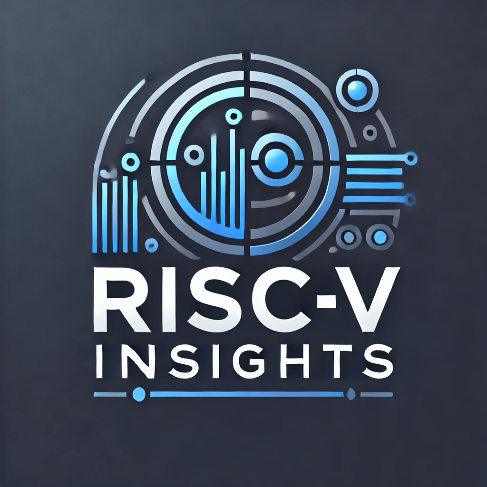

<div align="center">
  
  <h1>RV-Insights</h1>
  <span>中文 | <a href="./README.md">English</a></span>
</div>


## ⚡ 项目简介

`RV-Insights` 是一个面向RISC-V领域的智能问答系统。本系统实现了：RISC-V专用领域知识问答、本地私有知识库问答、实时联网搜索问答。此外，系统内置了完整的RAG评估方案和流程，同时支持Docker容器化部署，提供非常灵活和高效的应用部署方案。

本项目期望打造一个RISC-V领域的专家级Agent，他知晓 “有关 RISC-V 的一切”：

* RISC-V 领域实时动态
  * 关于 RISC-V 的国内外最新进展，主要聚焦于软硬件设计方面的信息
      - RISC-V RVI/RISE会议动态
      - RISC-V ISA/NON-ISA
  * 和 RISC-V 相关的开源软硬件项目的动态
    * `linux/qemu/opensbi-riscv` 邮件列表、upstream情况
  * 支持添加你感兴趣的其它RISC-V项目
* RISC-V 专业知识问答
  * 指令集架构解释：帮助用户理解 RISC-V 指令集，提供关于指令用法、功能以及最佳实践的建议
  * 技术问题解答：回答用户在开发中遇到的技术问题，包括应用/系统软件侧、编译器、汇编、硬件设计等各个方面
  * 错误排查与调试：协助用户分析编译错误、运行时错误以及调试过程中遇到的问题，提供可能的解决方案和参考资料。
  * 开发环境搭建指南：指导用户如何搭建 RISC-V 开发环境，包括 Linux、QEMU、KVM 等环境配置。
* RISC-V 私有资料接入
  * Markdown、PDF等类型的私有语料，从0到1构建和精细化处理流程。


### 技术架构
本项目使用了前后端分离的设计方案，后端全部使用Python开发语言，前端则采用了现代的Vue3框架。 

### 主要特点
- **主流功能覆盖**：涵盖RISC-V领域知识问答、热点项目实时消息推送、本地私有知识库问答、实时联网检索问答。
- **数据预处理**：百万级Wiki公有语料、Markdown、PDF等类型的私有语料从0到1构建和精细化处理流程。
- **用户权限管理**：实现细粒度的用户访问控制，高效保障数据安全与隐私。
- **灵活接入基座大模型**：支持接入主流的在线和开源大模型，确保系统的适应性和前瞻性。
- **数据库整合**：集成关系型数据库和向量数据库，优化数据存取效率和查询响应时间。
- **高效且完整的RAG评估系统**：内置完整的RAG评估Pipeline，为模型评估和优化提供强有力的支持。
- **Docker容器化部署**：支持Docker容器化部署，简化部署流程，提升系统的可移植性和可维护性。

## 👀 系统演示

- [ ] TODO


## 功能亮点

### 一、用户模块
`RV-Insights` 提供了一个完善的用户注册和登录机制，从而确保系统的安全性和用户的个性化体验。该模块的主要特点包括：

1. **用户注册**：允许新用户创建账户，注册后可通过前端登录界面进入系统。
2. **用户校验**：在前端进行初步的用户验证。非法用户将被阻止访问智能问答系统，确保系统的安全性。
3. **会话管理与知识库访问**：登录用户能够访问系统预置的会话及其个人创建的会话。同时，用户可使用自己的知识库进行问答，每位用户的数据访问被严格限定，用于保障个人数据的隐私性。

#### 核心逻辑流程：
  <div align="center">
  
  </div>


### 二、模型接入
`RV-Insights` 能够兼容多种高性能开源大模型、在线大模型API作为基座模型，该系统版本以 `ChatGLM3-6b`、`glm-4-9b-chat` 以及在线 `GLM-4 API` 接口为主。允许用户根据个人实际需求灵活接入其他模型，支持主流的 `OpenAI GPT`、`Qwen2` 等模型，以及 `Vllm`、`Ollama` 等接入框架。

#### 底层技术支持：
采用了👉 [FastChat](https://github.com/lm-sys/FastChat) 开源项目框架来部署模型，优化了对 `glm4-9b-chat` 模型的支持。尽管 FastChat 框架尚未兼容 `glm4-9b-chat`，目前已经手动修复了包括流式输出和自问自答重复循环等问题。现在，`glm4-9b-chat` 模型已经完全可用，并且表现稳定。

#### 扩展性：
为了方便用户扩展或测试新模型，提供了详细的代码示例。通过这些示例，用户可以理解如何将新的模型集成到系统中，进一步增强系统的功能性和灵活性。

### 三、核心问答功能说明
#### 3.1 通用知识问答

`RV-Insights` 的通用知识问答功能充分利用了大模型的原生对话能力。本功能直接以大模型作为基础，结合 LangChain 应用框架，创建了一个统一的大模型会话接口。通过实时读取 MySQL 数据库中指定用户和对话窗口的历史对话记录，赋予大模型会话记忆能力。

##### 功能特点：
- **多轮对话支持**：用户可以进行连续的对话，系统将保持对话的上下文，增强对话的连贯性。
- **会话历史记忆**：通过记忆用户的历史对话，系统能够提供更加个性化和准确的回答，极大地增强用户体验。

##### 核心逻辑流程：

  <div align="center">
  
  </div>

#### 3.2 本地私有知识库问答

在通用知识问答流程的基础上，引入了本地知识库的加载和检索功能，利用大模型 RAG 技术提升问答质量。此功能允许大模型接入私有数据，同时有效解决大模型知识局限性的问题。

##### 技术实现：
采用 Faiss 数据库存储向量索引，为系统提供了高效的检索能力。系统预置了包括百万级 Wiki 公共语料和私有语料（ PDF 格式）的知识库，用于提升数据的广泛性和深度。

##### 功能特点：
  - **多轮对话支持**：允许在多个连续交互中始终保持对话的连贯性。
  - **历史记忆功能**：通过历史会话记录增强对话的个性化和相关性。
  - **系统提示角色**：增添系统提示角色以引导用户对话，提供更为人性化的交互体验。
  - **实时 Faiss 向量数据检索召回**：利用 Faiss 向量数据库进行快速高效的数据检索，优化答案的精准度。

###### 核心逻辑流程：

  <div align="center">
  
  </div>

#### 3.3 联网实时检索 + 私有知识库检索问答
此功能链路中集成了实时联网检索，通过更加细节的流程处理去确保信息检索的效率和准确性，即便在国内网络环境下也能表现出色。

##### 实现流程：

1. **基于👉[Serper API](https://serper.dev/) 的 Google Search 信息检索**：使用 Serper API 构建的搜索能力，根据用户的查询（Query）实时检索网页信息。
2. **初步重排**：系统对初步检索结果进行筛选，选择与查询最相关的 Top N 网页信息。
3. **信息索引**：对筛选后的网页内容网页主题内容的规则化提取，而后进行索引处理，并存储到 Milvus 向量数据库中，为后续的检索操作做好准备。
4. **向量检索**：在 Milvus 向量数据库中执行检索，快速找到与用户查询最相关的信息块（Chunks）。
5. **回答生成**：将检索到的信息块整合成完整的提示（Prompt），并据此生成精确的回答，满足用户的查询需求。

##### 核心逻辑流程：

  <div align="center">
  
  </div>


## 🚀 开发

```shell
git clone git@github.com:zcxGGmu/RV-Chatchat.git
cd ./RV-Chatchat

conda create --name rv-chat python=3.10
conda activate rv-chat
pip install -r requirements.txt -i https://pypi.tuna.tsinghua.edu.cn/simple
```

