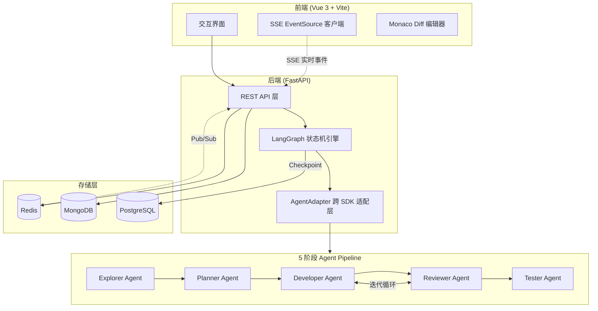
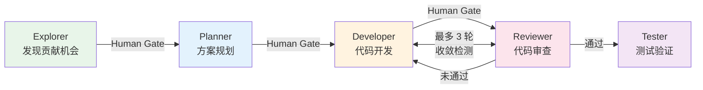

# RV-Insights: LLM 驱动的 RISC-V 开源贡献多 Agent 平台

## 项目简介

RV-Insights 是一个面向 RISC-V 开源软件生态的智能贡献平台，通过多 Agent 协作自动化完成从发现贡献机会、方案规划、代码开发、代码审查到测试验证的完整开源贡献工作流。

项目聚焦于 RISC-V 生态核心仓库：

| 目标仓库 | 路径/范围 |
|---------|----------|
| Linux Kernel | `arch/riscv/` |
| QEMU | `target/riscv/` |
| OpenSBI | `riscv-software-src/opensbi` |
| GCC | `gcc/config/riscv/` |
| LLVM | `llvm/lib/Target/RISCV/` |

面向的用户群体包括：希望高效参与上游贡献的 RISC-V 生态开发者、需要系统性向 RISC-V 工具链提交补丁的研究团队，以及需要自动化补丁质量管控的开源社区维护者。

项目经历了两个主要版本迭代。V1 版本是基于 RAG 的 RISC-V 领域知识问答系统，集成了 Faiss/Milvus 向量数据库、多模型支持（ChatGLM3-6b、GLM-4、GPT、Qwen2）及实时搜索能力。V2 版本（当前版本）完成了从"问答工具"到"贡献平台"的跃迁，引入了 5 阶段 Agent Pipeline 和双 SDK 混合架构。

---

## 系统架构设计

### 整体架构

系统采用前后端分离架构，前端基于 Vue 3 构建交互界面，后端以 FastAPI 为 API 层、LangGraph 为编排引擎，通过 SSE 事件总线实现实时状态推送。

### 5 阶段 Agent Pipeline

Pipeline 是系统的核心工作流，每个阶段由专门的 Agent 负责，阶段之间通过 Pydantic v2 数据契约通信，并设置 Human-in-the-Loop 审批门控。

各阶段职责与 SDK 选型：

| 阶段 | Agent | SDK 选型 | 核心职责 |
|------|-------|---------|---------|
| 发现 | Explorer | Claude Agent SDK | 通过 Patchwork API、邮件列表、代码分析发现贡献机会 |
| 规划 | Planner | OpenAI Agents SDK | 设计开发与测试方案，Guardrails 校验 |
| 开发 | Developer | Claude Agent SDK | 生成代码补丁，使用 Read/Write/Edit/Bash 工具链 |
| 审查 | Reviewer | OpenAI Agents SDK | 多视角审查，Handoff 至安全/正确性/风格子 Agent，集成 checkpatch.pl |
| 测试 | Tester | Claude Agent SDK | 交叉编译验证、QEMU 启动测试 |

### 双 SDK 混合架构选型逻辑

系统同时集成了 Claude Agent SDK 和 OpenAI Agents SDK，根据任务特性选择最优 SDK：

- Claude Agent SDK 负责执行密集型任务（Explorer / Developer / Tester），这类任务需要大量工具调用、文件操作和环境交互
- OpenAI Agents SDK 负责推理判断型任务（Planner / Reviewer），这类任务侧重多角色协作、结构化推理和 Handoff 机制

LangGraph StateGraph 作为统一编排层，屏蔽底层 SDK 差异，通过 AsyncPostgresSaver 实现 Checkpoint 持久化，保证工作流可暂停、可恢复、可重试。

