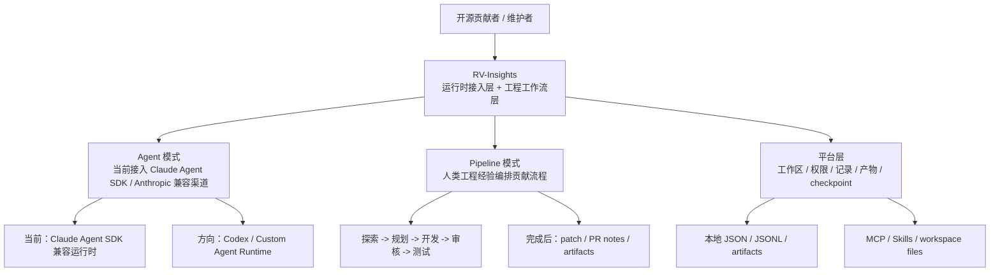
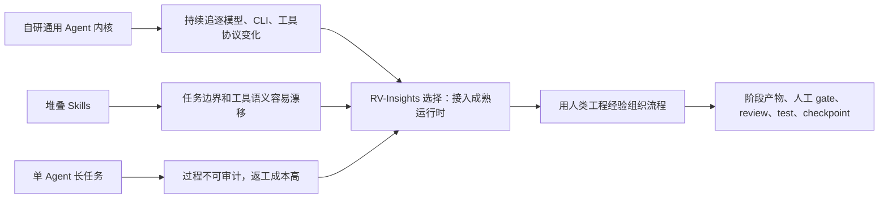
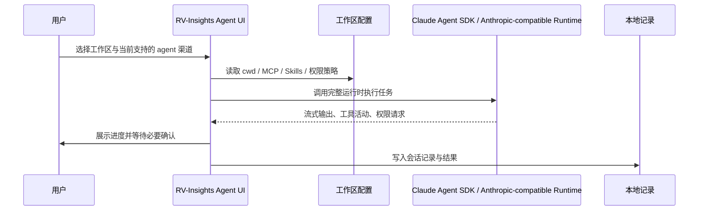
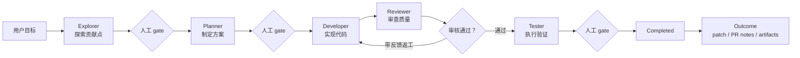
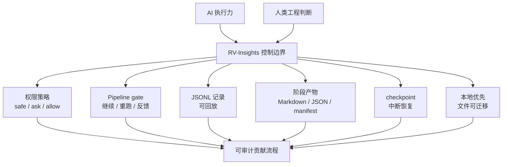

# RV-Insights 产品主页 Mermaid 素材

> 用途：可直接嵌入 Markdown 文档，也可转为 SVG 后用于首页视觉稿。

## 1. 产品定位图

```mermaid
flowchart TB
  User["开源贡献者 / 维护者"] --> RV["RV-Insights<br/>运行时接入层 + 工程工作流层"]

  RV --> AgentMode["Agent 模式<br/>当前接入 Claude Agent SDK / Anthropic 兼容渠道"]
  RV --> PipelineMode["Pipeline 模式<br/>人类工程经验编排贡献流程"]
  RV --> Platform["平台层<br/>工作区 / 权限 / 记录 / 产物 / checkpoint"]

  AgentMode --> Claude["当前：Claude Agent SDK 兼容运行时"]
  AgentMode --> Roadmap["方向：Codex / Custom Agent Runtime"]

  PipelineMode --> Flow["探索 -> 规划 -> 开发 -> 审核 -> 测试"]
  PipelineMode --> Outcome["完成后：patch / PR notes / artifacts"]
  Platform --> Local["本地 JSON / JSONL / artifacts"]
  Platform --> MCP["MCP / Skills / workspace files"]
```

## 2. 为什么不做通用 Agent 内核

```mermaid
flowchart LR
  Generic["自研通用 Agent 内核"] --> Drift["持续追逐模型、CLI、工具协议变化"]
  Skills["堆叠 Skills"] --> Fragile["任务边界和工具语义容易漂移"]
  OneShot["单 Agent 长任务"] --> Opaque["过程不可审计，返工成本高"]

  Drift --> Choice["RV-Insights 选择：接入成熟运行时"]
  Fragile --> Choice
  Opaque --> Choice

  Choice --> Workflow["用人类工程经验组织流程"]
  Workflow --> Reliable["阶段产物、人工 gate、review、test、checkpoint"]
```

## 3. Agent 模式运行时接入

```mermaid
sequenceDiagram
  participant User as 用户
  participant UI as RV-Insights Agent UI
  participant Workspace as 工作区配置
  participant Runtime as Claude Agent SDK / Anthropic-compatible Runtime
  participant Record as 本地记录

  User->>UI: 选择工作区与当前支持的 agent 渠道
  UI->>Workspace: 读取 cwd / MCP / Skills / 权限策略
  UI->>Runtime: 调用完整运行时执行任务
  Runtime-->>UI: 流式输出、工具活动、权限请求
  UI->>User: 展示进度并等待必要确认
  UI->>Record: 写入会话记录与结果
```

## 4. Pipeline 模式贡献闭环

```mermaid
flowchart LR
  Goal["用户目标"] --> Explorer["Explorer<br/>探索贡献点"]
  Explorer --> Gate1{"人工 gate"}
  Gate1 --> Planner["Planner<br/>制定方案"]
  Planner --> Gate2{"人工 gate"}
  Gate2 --> Developer["Developer<br/>实现代码"]
  Developer --> Reviewer["Reviewer<br/>审查质量"]
  Reviewer --> Gate3{"审核通过？"}
  Gate3 -- "带反馈返工" --> Developer
  Gate3 -- "通过" --> Tester["Tester<br/>执行验证"]
  Tester --> Gate4{"人工 gate"}
  Gate4 --> Done["Completed"]
  Done --> Outcome["Outcome<br/>patch / PR notes / artifacts"]
```

## 5. 平台信任层

```mermaid
flowchart TB
  AI["AI 执行力"] --> Boundary["RV-Insights 控制边界"]
  Human["人类工程判断"] --> Boundary

  Boundary --> Permission["权限策略<br/>safe / ask / allow"]
  Boundary --> Gate["Pipeline gate<br/>继续 / 重跑 / 反馈"]
  Boundary --> Records["JSONL 记录<br/>可回放"]
  Boundary --> Artifacts["阶段产物<br/>Markdown / JSON / manifest"]
  Boundary --> Checkpoint["checkpoint<br/>中断恢复"]
  Boundary --> Local["本地优先<br/>文件可迁移"]

  Permission --> Trust["可审计贡献流程"]
  Gate --> Trust
  Records --> Trust
  Artifacts --> Trust
  Checkpoint --> Trust
  Local --> Trust
```
