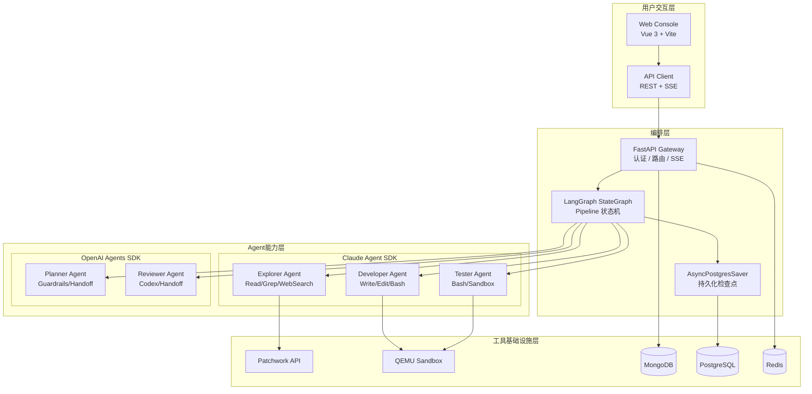
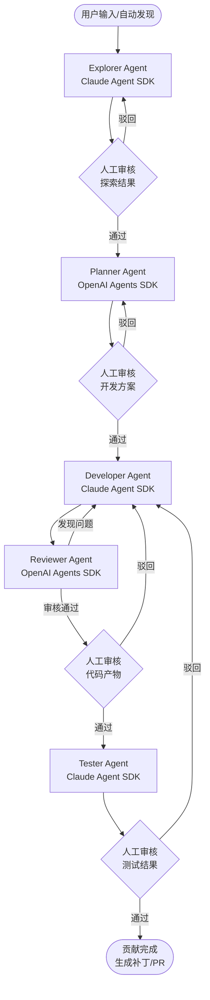
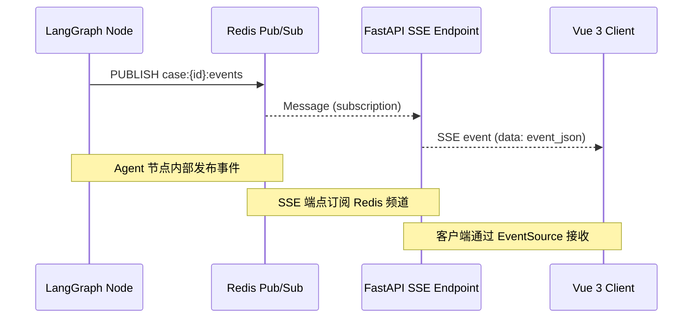

# RV-Insights -- 基于双 SDK 混合架构的多 Agent RISC-V 开源贡献平台

## 项目简介

RV-Insights 是一个面向 RISC-V 开源软件生态的 LLM 驱动多 Agent 贡献平台。平台通过五个专业化 AI Agent 的协作流水线，自动化完成从贡献点发现、方案规划、代码开发、代码审核到测试验证的完整开源贡献流程，最终输出符合上游社区标准的内核补丁。

目标用户：
- RISC-V 生态开发者：希望高效参与上游贡献但受限于时间和经验
- 研究团队：需要系统性地向 RISC-V 工具链提交补丁
- 开源社区维护者：需要自动化工具辅助补丁质量把控

目标代码库覆盖：
- Linux 内核 RISC-V 架构（`arch/riscv/`）
- QEMU RISC-V 目标（`target/riscv/`）
- OpenSBI（`riscv-software-src/opensbi`）
- GCC RISC-V 后端（`gcc/config/riscv/`）
- LLVM RISC-V 后端（`llvm/lib/Target/RISCV/`）

---

## 设计原则

| 编号 | 原则 | 说明 |
|------|------|------|
| P1 | Human-in-the-Loop | 每个阶段输出必须经人工审核确认，AI 不得自主推进到下一阶段 |
| P2 | Evidence-First | 所有 Agent 决策必须附带证据链（代码引用、邮件链接、测试日志） |
| P3 | Minimal Blast Radius | 每次贡献聚焦单一变更，避免大范围修改 |
| P4 | Recoverable | 任何阶段失败均可回退到上一阶段重新执行 |
| P5 | Auditable | 全流程操作日志可追溯，支持事后审计 |
| P6 | SDK Best-of-Both | 根据任务特性选择最合适的 SDK，而非强制统一 |
| P7 | Progressive Automation | 初期以人工审核为主，随着信任度提升逐步放宽自动化程度 |

---

## 系统架构设计

### 整体架构

系统采用四层架构：用户交互层、编排层、Agent 能力层、工具基础设施层。

### 五阶段 Agent Pipeline

平台核心是五阶段 Agent Pipeline，每个阶段由专业化 Agent 驱动，阶段之间设置人工审核门禁：

### 双 SDK 混合架构

根据任务特性选择最合适的 SDK，执行密集型任务使用 Claude Agent SDK，推理判断型任务使用 OpenAI Agents SDK：

| 阶段 | SDK | 关键理由 |
|------|-----|----------|
| Explorer | Claude Agent SDK | 需要内置 Read/Grep/Glob 进行深度代码库导航，WebSearch 搜索邮件列表 |
| Planner | OpenAI Agents SDK | 纯推理任务，Guardrails 验证方案完整性，Handoff 编排子 Agent |
| Developer | Claude Agent SDK | 核心优势 -- Write/Edit/Bash 内置工具直接支持代码生成和编译验证 |
| Reviewer | OpenAI Agents SDK | 多视角审核策略，Handoff 分发给 security/correctness/style 三个子审核 Agent |
| Tester | Claude Agent SDK | Bash 工具执行测试套件，Read 解析测试日志，沙箱隔离 |

两个 SDK 通过统一的 AgentAdapter 抽象层接入 LangGraph 编排层，以 Pydantic v2 数据契约作为跨 Agent 通信的唯一协议。

### SSE 事件总线

实时事件推送采用 Redis Pub/Sub + FastAPI SSE + Vue 3 EventSource 三层架构：

支持 Last-Event-ID 断线重连恢复，Redis Stream 持久化最近 500 条事件，心跳保活机制防止连接超时。

### Develop-Review 迭代循环

开发 Agent 和审核 Agent 之间进行多轮迭代，采用加权收敛检测算法：

- 审核发现按严重度加权评分（critical=10, major=5, minor=1）
- 追踪 finding 的文件+行号作为 ID，区分"旧问题未修复"和"新问题被发现"
- 连续 2 轮加权评分不下降且重复率超过 50% 时自动升级为人工处理
- 最大迭代 3 轮，超限自动触发 escalate 节点

审核 Agent 采用 LLM 审核 + 确定性工具双轨并行策略：先运行 checkpatch.pl / sparse 等静态分析工具获取确定性结果，再由 LLM 聚焦语义层面问题，最终合并生成 ReviewVerdict。

---

## 核心功能特性

### Pipeline 状态机

基于 LangGraph StateGraph 构建，支持：
- 10+ 状态节点，含 4 个人工审核门禁（interrupt/resume 机制）
- 条件边路由：人工决策路由、Review 迭代/通过/升级路由
- AsyncPostgresSaver 检查点持久化，支持断点续传
- 成本熔断器：按案例级别的成本追踪，超阈值自动暂停

### 幻觉验证机制

Explorer Agent 输出经过程序化验证层：
- URL 可达性验证（httpx HEAD 请求）
- 文件路径安全检查（防止路径遍历）
- ISA 扩展名对照已知 Ratified 列表校验
- 证据不足时自动降低可行性评分

### 产物存储架构

Agent 产物按案例/阶段/轮次组织：
- 小型结构化数据（< 64KB）嵌入 MongoDB 文档
- 中型文本数据（补丁文件、测试日志）存储到文件系统，MongoDB 保存路径引用
- 编排状态与产物引用分离，避免 LangGraph 检查点膨胀

### 前端交互

案例详情页采用三栏布局：
- 左栏：Pipeline 阶段导航，实时状态可视化
- 中栏：当前阶段产物展示（DiffViewer / ContributionCard / TestResult）
- 右栏：审核决策面板（approve/reject/abandon），历史审核记录

SSE 实时事件流驱动 UI 更新，支持 Agent 思考过程、工具调用、Pipeline 状态变更的实时展示。

### 数据源接入

- Patchwork API：轮询 linux-riscv 项目补丁状态，发现长期未处理的贡献机会
- lore.kernel.org：邮件列表全文搜索，提取讨论热点和未解决问题
- GitHub API：监控 OpenSBI/riscv-tests 等仓库的 Issue 和 PR

---

## 技术栈

| 层级 | 技术 |
|------|------|
| 前端框架 | Vue 3 + Vite + TypeScript + TailwindCSS |
| 前端状态管理 | Pinia + Vue Composables |
| 前端 SSE | @microsoft/fetch-event-source |
| 代码查看器 | Monaco Editor (Diff Viewer) |
| UI 组件库 | reka-ui + lucide-vue-next |
| 后端框架 | FastAPI + LangGraph |
| Agent SDK | Claude Agent SDK + OpenAI Agents SDK |
| 业务数据库 | MongoDB (Motor 异步驱动) |
| 检查点存储 | PostgreSQL (AsyncPostgresSaver) |
| 缓存/消息 | Redis (Pub/Sub + Stream) |
| 数据契约 | Pydantic v2 |
| 认证 | JWT (access_token + refresh_token) |
| 部署 | Docker Compose (nginx + backend + mongodb + postgres + redis) |
| 国际化 | vue-i18n (中英文双语) |

---

## 与现有工具对比

| 维度 | SWE-Agent | Aider | OpenDevin | RV-Insights |
|------|-----------|-------|-----------|-------------|
| 定位 | 通用 Issue 修复 | 交互式编程助手 | 通用 AI 开发平台 | RISC-V 专项贡献 |
| Agent 数量 | 单 Agent | 单 Agent | 多 Agent | 5 Agent Pipeline |
| 领域知识 | 无 | 无 | 无 | RISC-V 生态深度集成 |
| 贡献发现 | 需人工指定 Issue | 需人工指定 | 需人工指定 | 自主探索 + 人工输入 |
| 审核机制 | 无 | 无 | 基础 | 多轮迭代审核 + 确定性工具 |
| 测试验证 | 运行已有测试 | 无 | 基础沙箱 | QEMU + 交叉编译环境 |
| 人工介入 | 事后检查 | 实时交互 | 事后检查 | 阶段性门禁审核 |
| SDK 架构 | 自研 | 自研 | 自研 | Claude + OpenAI 双 SDK |

---

## 个人职责与贡献

- [待填写] 负责的模块/功能
- [待填写] 架构设计中的具体贡献
- [待填写] 解决的关键技术难题
- [待填写] 性能优化或质量改进成果
