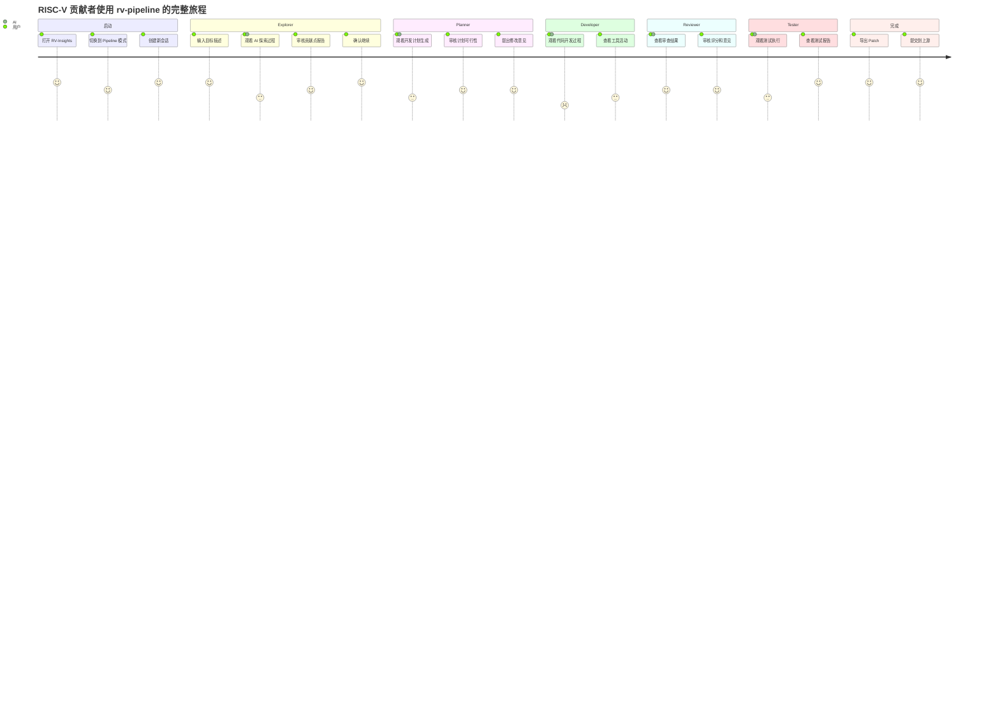
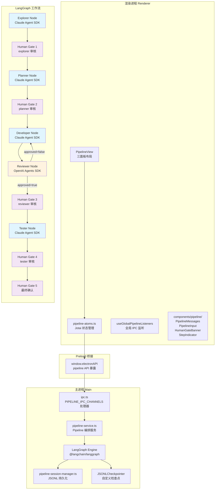
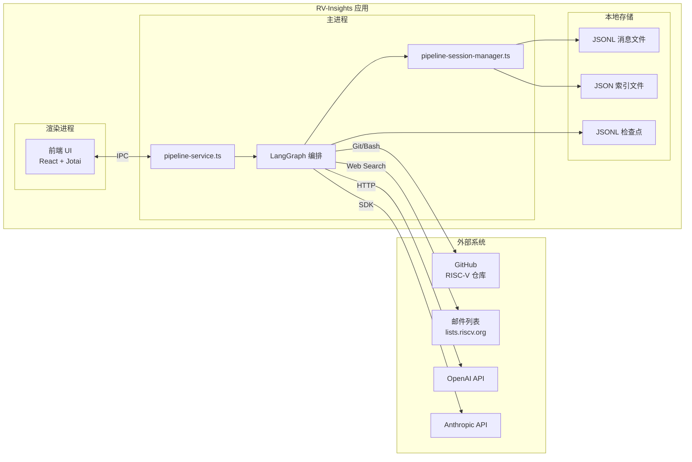
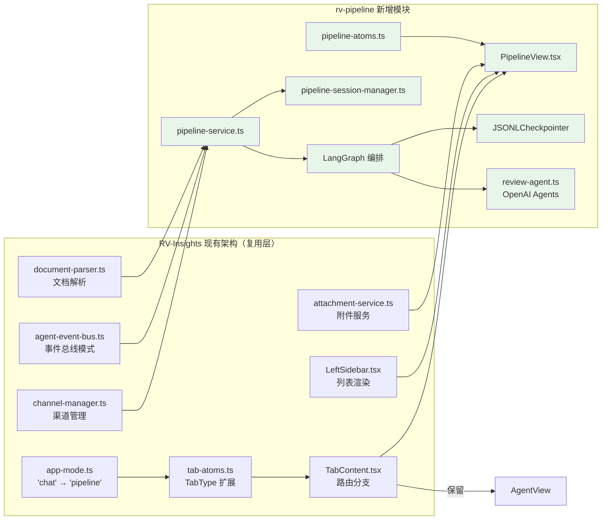
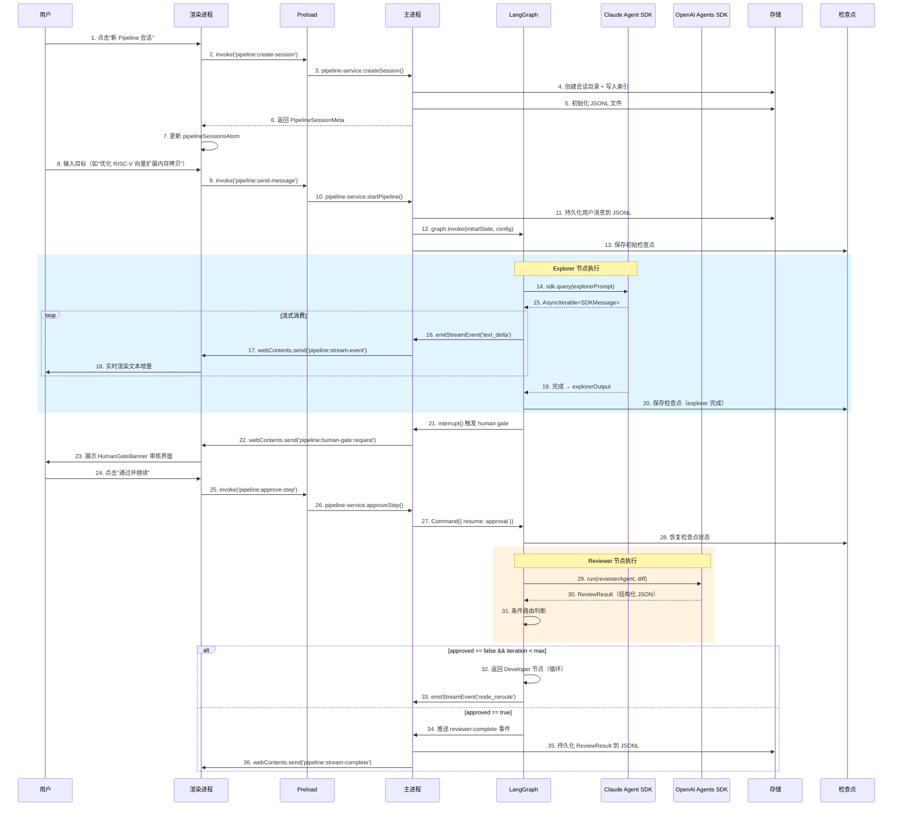
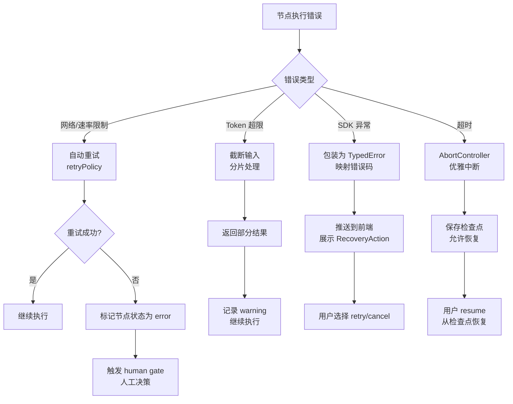
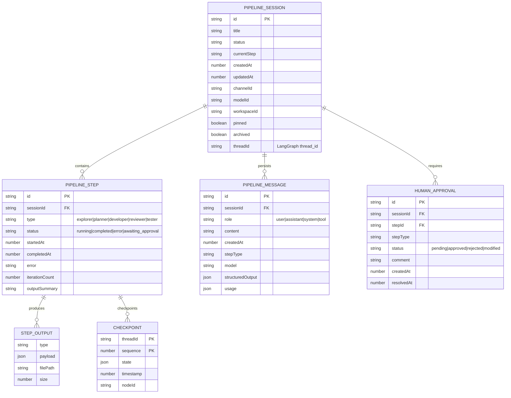
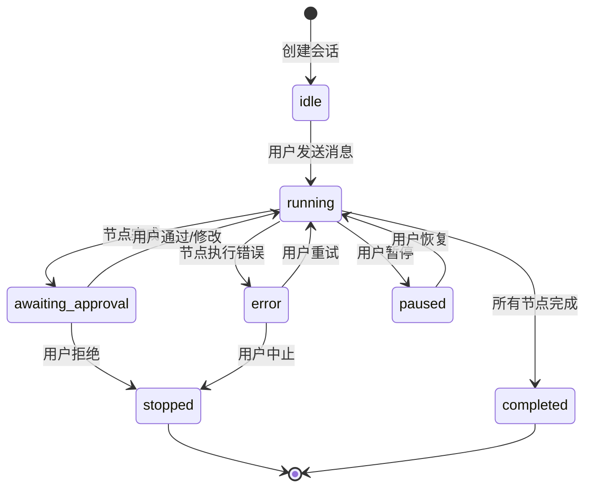
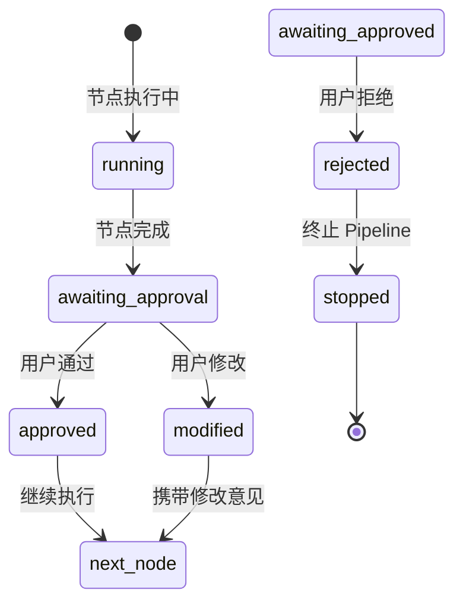
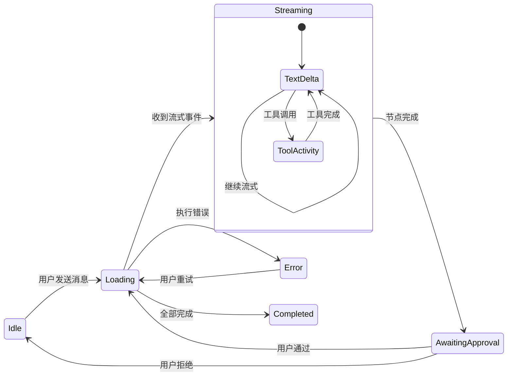

# RV-Pipeline 开发方案：面向 RISC-V 开源贡献的智能流水线

> 版本：v2.1（完整版）  
> 日期：2026-05-04  
> 状态：设计阶段  
> 作者：RV-Insights 技术团队

---

## 目录

- [1. 项目背景与目标](#1-项目背景与目标)
- [2. 整体架构设计](#2-整体架构设计)
- [3. 数据模型设计](#3-数据模型设计)
- [4. LangGraph 编排引擎](#4-langgraph-编排引擎)
- [5. 智能体节点详细设计](#5-智能体节点详细设计)
- [6. 人工审核机制](#6-人工审核机制)
- [7. 与现有 RV-Insights 系统集成](#7-与现有-rv-insights-系统集成)
- [8. 存储与持久化](#8-存储与持久化)
- [9. 前端 UI 设计](#9-前端-ui-设计)
- [10. 技术实现路线图](#10-技术实现路线图)
- [11. 风险分析与应对](#11-风险分析与应对)
- [12. 性能优化策略](#12-性能优化策略)
- [13. 安全设计](#13-安全设计)
- [14. 测试策略](#14-测试策略)
- [15. 部署与运维](#15-部署与运维)
- [16. 多语言与国际化支持](#16-多语言与国际化支持)
- [附录 A：关键类型定义](#附录-a关键类型定义)
- [附录 B：IPC 通道设计](#附录-bipc-通道设计)
- [附录 C：Reviewer Agent 完整实现](#附录-creviewer-agent-完整实现)
- [附录 D：LangGraph 自定义 JSONL 检查点](#附录-dlanggraph-自定义-jsonl-检查点)
- [附录 F：多会话并发控制](#附录-f多会话并发控制)
- [附录 E：前端 PipelineView 组件完整代码](#附录-e前端-pipelineview-组件完整代码)

---

## 1. 项目背景与目标

### 1.1 背景

#### 1.1.1 RISC-V 开源生态现状

RISC-V 作为开放指令集架构（ISA），近年来在开源软件生态中呈现爆发式增长：

| 指标 | 数据（截至 2026-Q1） | 来源 |
|------|---------------------|------|
| GitHub RISC-V 相关仓库 | 12,000+ | GitHub Search |
| Linux Kernel RISC-V 代码行数 | 180K+ | `git ls-files arch/riscv` |
| QEMU RISC-V 相关 Issue（Open） | 340+ | GitHub Issues |
| RISC-V 邮件列表月活跃度 | 2,500+ 封/月 | lists.riscv.org |
| RISC-V 软件移植缺口 | 约 30% 关键软件栈 | RISC-V Software Ecosystem |

**典型贡献场景**：
1. **编译器优化**：GCC/LLVM 的 RISC-V 后端指令选择优化、向量化支持
2. **操作系统移植**：Linux 内核驱动、BSD 系统调用适配、RTOS 移植
3. **模拟器/仿真器**：QEMU 的 RISC-V 扩展支持、Spike 功能增强
4. **库与运行时**：glibc/newlib 的 RISC-V 专用实现、OpenSSL 汇编优化
5. **工具链**：GDB 调试支持、perf 性能分析工具适配

#### 1.1.2 现有模式的局限性

| 模式 | 优势 | 局限性（针对 RISC-V 贡献） |
|------|------|---------------------------|
| **Chat** | 自由对话、快速问答 | 无结构化流程，无法追踪多阶段任务；无代码审查闭环 |
| **Agent** | 自主执行、工具调用 | 单 Agent 模式，无阶段分工；Reviewer/Developer 角色混杂 |
| **rv-pipeline** | 阶段明确、角色分离、人工审核 | 开发成本高，需要专门的编排引擎 |

**具体痛点**：
- 开发者在 Chat 模式中获得代码建议后，需要手动切换到终端执行、测试、审查
- Agent 模式虽然能自主执行，但缺乏结构化的代码审查和测试验证环节
- 缺乏对 RISC-V 领域知识的专门注入（邮件列表、特定代码库规范）

### 1.2 目标

构建 **rv-pipeline** 功能，平替现有 Chat 模式，提供面向 RISC-V 开源贡献的 5 阶段智能流水线：

| 阶段 | 节点 | 职责 | 技术栈 | 输出物 |
|------|------|------|--------|--------|
| 1 | **Explorer** | 自主探索 RISC-V 邮件列表和代码库，发现可行贡献点 | Claude Agent SDK | 贡献点报告（Markdown） |
| 2 | **Planner** | 设计完整的开发和测试方案 | Claude Agent SDK | 开发计划（JSON） |
| 3 | **Developer** | 根据方案进行代码开发 | Claude Agent SDK | git diff + 测试用例 |
| 4 | **Reviewer** | 对代码进行多维度审查（质量/安全/架构） | OpenAI Agents SDK | ReviewResult（结构化 JSON） |
| 5 | **Tester** | 搭建测试环境，执行测试并输出结果 | Claude Agent SDK | 测试报告（Markdown） |

**核心约束**：
1. 每个节点输出后必须停顿，接受人工审核确认后方可进入下一阶段
2. Developer-Reviewer 之间允许多轮迭代，直到 Reviewer 认定合理或达到最大迭代次数
3. 所有阶段的状态和输出必须持久化，支持断点续跑
4. 流式输出必须实时展示到前端，不阻塞用户交互

### 1.3 平替 Chat 模式的决策

#### 1.3.1 决策依据

**为什么不保留 Chat 而新增 Pipeline？**

| 维度 | 保留 Chat + 新增 Pipeline | 平替 Chat |
|------|--------------------------|-----------|
| 维护成本 | 高（需维护两套独立的消息系统） | 中（复用基础设施，替换业务逻辑） |
| 用户认知 | 复杂（用户需理解两种模式的区别） | 简单（专注一种核心工作流） |
| 代码复杂度 | 高（IPC 通道、atoms、组件翻倍） | 中（复用 UI 框架，替换核心逻辑） |
| 目标一致性 | 低（Chat 是通用对话，Pipeline 是专用工作流） | 高（专注 RISC-V 贡献场景） |

**决策**：平替 Chat，将 `'chat'` 改为 `'pipeline'`，但保留"回退到旧 Chat"的配置项（详见 [7.1.4 回退策略](#714-回退策略)）。

#### 1.3.2 对比矩阵

| 对比维度 | Chat 模式 | rv-pipeline |
|----------|-----------|-------------|
| 交互模式 | 自由对话 | 结构化阶段推进 |
| AI 调用 | Provider 适配器 + SSE 流式 | LangGraph 编排 + Agent SDK |
| 目标用户 | 通用 AI 对话 | RISC-V 开源贡献者 |
| 输出物 | 文本回复 | 代码 Patch + 测试报告 |
| 人工介入 | 实时对话 | 阶段节点审核 |
| 持久化 | 对话历史 | 阶段状态 + 检查点 |
| 多 Agent | 无 | 5 个角色 + 循环迭代 |
| 工具系统 | Chat Tool Registry | Agent SDK 内置工具 + MCP |

#### 1.3.3 平替策略详解

```
修改范围：
├── 类型层：AppMode = 'chat' | 'agent' → 'pipeline' | 'agent'
├── IPC 层：CHAT_IPC_CHANNELS → PIPELINE_IPC_CHANNELS（保留通道名前缀兼容）
├── 状态层：chat-atoms.ts → pipeline-atoms.ts（复用 Map 隔离架构）
├── 服务层：chat-service.ts → pipeline-service.ts（全新实现）
├── 组件层：ChatView/ChatMessages/ChatInput → PipelineView/PipelineMessages/PipelineInput
└── 入口层：useGlobalChatListeners → useGlobalPipelineListeners

保留不变：
├── 三面板布局（LeftSidebar | MainArea | RightSidePanel）
├── Tab 系统（tab-atoms.ts 的 TabType 扩展）
├── 渠道管理（channel-manager.ts）
├── 附件系统（attachment-service.ts）
├── 设置面板（SettingsPanel 新增 Pipeline Tab）
└── 全局快捷键和系统托盘
```

### 1.4 典型用户旅程



---

## 2. 整体架构设计

### 2.1 架构全景图



### 2.2 系统边界与接口定义

#### 2.2.1 系统边界



#### 2.2.2 核心接口定义

**pipeline-service.ts 对外接口**：

```typescript
interface PipelineService {
  // 会话管理
  createSession(input: CreateSessionInput): Promise<PipelineSessionMeta>
  listSessions(filter?: SessionFilter): Promise<PipelineSessionMeta[]>
  getMessages(sessionId: string, options?: MessageQueryOptions): Promise<PipelineMessage[]>
  deleteSession(sessionId: string): Promise<void>

  // Pipeline 执行
  startPipeline(input: PipelineSendInput): Promise<PipelineRunResult>
  stopPipeline(sessionId: string): Promise<void>

  // 人工审核
  approveStep(request: HumanApprovalResponse): Promise<void>
  rejectStep(request: HumanApprovalResponse): Promise<void>

  // 状态查询
  getPipelineState(sessionId: string): Promise<PipelineStateSnapshot>
  getCheckpoint(sessionId: string): Promise<CheckpointSnapshot | null>
}
```

### 2.3 与现有系统的集成架构



### 2.4 数据流图（详细版）



### 2.5 错误处理链路



### 2.6 性能瓶颈分析

| 瓶颈点 | 原因 | 影响 | 优化策略 |
|--------|------|------|----------|
| 大 Diff 传输 | Reviewer 接收完整 git diff（可能 >100KB） | Token 超限、延迟高 | 分文件审查 + diff 摘要 |
| 流式事件频率 | SDK 每秒推送 10-50 个事件 | IPC 通道拥塞 | 前端批量合并（16ms 节流） |
| 检查点序列化 | LangGraph 每次 super-step 后序列化状态 | I/O 阻塞 | 异步保存 + 仅保存 diff |
| JSONL 追加写入 | 多会话并发写入 | 文件锁竞争 | 每会话独立文件，无锁追加 |
| 内存占用 | 大代码库 clone 到工作目录 | 磁盘/内存压力 | 浅克隆 + 按需 fetch |

---

## 3. 数据模型设计

### 3.1 核心实体关系



### 3.2 完整类型定义

```typescript
// packages/shared/src/types/pipeline.ts

import type { ProviderType } from './channel'

// ===== 基础枚举 =====

/** Pipeline 节点类型 */
export type PipelineNodeType =
  | 'explorer'
  | 'planner'
  | 'developer'
  | 'reviewer'
  | 'tester'

/** Pipeline 会话状态 */
export type PipelineSessionStatus =
  | 'idle'           // 等待用户输入
  | 'running'        // 正在执行某节点
  | 'awaiting_approval' // 等待人工审核
  | 'completed'      // 全部完成
  | 'error'          // 执行出错
  | 'stopped'        // 用户中止
  | 'paused'         // 用户手动暂停（非审核暂停）

/** 人工审核状态 */
export type HumanApprovalStatus =
  | 'pending'
  | 'approved'
  | 'rejected'
  | 'modified'

// ===== 会话管理 =====

/** Pipeline 会话元数据 */
export interface PipelineSessionMeta {
  /** 会话唯一标识 */
  id: string
  /** 会话标题（自动生成或用户编辑） */
  title: string
  /** 当前会话状态 */
  status: PipelineSessionStatus
  /** 当前执行的节点类型 */
  currentStep?: PipelineNodeType
  /** 使用的渠道 ID */
  channelId?: string
  /** 使用的模型 ID */
  modelId?: string
  /** 所属工作区 ID */
  workspaceId?: string
  /** LangGraph thread_id（用于断点恢复） */
  threadId?: string
  /** 是否置顶 */
  pinned?: boolean
  /** 是否已归档 */
  archived?: boolean
  /** 创建时间戳 */
  createdAt: number
  /** 更新时间戳 */
  updatedAt: number
}

/** 创建会话输入 */
export interface CreatePipelineSessionInput {
  title?: string
  channelId: string
  modelId?: string
  workspaceId?: string
}

/** 会话过滤条件 */
export interface PipelineSessionFilter {
  archived?: boolean
  status?: PipelineSessionStatus
  limit?: number
  offset?: number
}

// ===== 步骤管理 =====

/** Pipeline 步骤 */
export interface PipelineStep {
  /** 步骤唯一标识 */
  id: string
  /** 所属会话 ID */
  sessionId: string
  /** 节点类型 */
  type: PipelineNodeType
  /** 步骤状态 */
  status: 'pending' | 'running' | 'completed' | 'error' | 'awaiting_approval'
  /** 开始时间戳 */
  startedAt?: number
  /** 完成时间戳 */
  completedAt?: number
  /** 错误信息 */
  error?: string
  /** 迭代计数（Developer-Reviewer 循环） */
  iterationCount?: number
  /** 步骤输出摘要（用于 UI 展示） */
  outputSummary?: string
  /** Token 用量统计 */
  usage?: PipelineUsage
}

/** Token 用量统计 */
export interface PipelineUsage {
  inputTokens: number
  outputTokens: number
  cacheReadTokens?: number
  cacheCreationTokens?: number
  costUsd?: number
}

// ===== 消息系统 =====

/** 消息角色 */
export type PipelineMessageRole = 'user' | 'assistant' | 'system' | 'tool'

/** Pipeline 消息（持久化到 JSONL） */
export interface PipelineMessage {
  /** 消息唯一标识 */
  id: string
  /** 所属会话 ID */
  sessionId: string
  /** 发送者角色 */
  role: PipelineMessageRole
  /** 消息内容（Markdown 或纯文本） */
  content: string
  /** 创建时间戳 */
  createdAt: number
  /** 关联的步骤类型 */
  stepType?: PipelineNodeType
  /** 使用的模型 */
  model?: string
  /** 结构化输出（Reviewer 等节点） */
  structuredOutput?: unknown
  /** 工具活动记录 */
  toolActivities?: PipelineToolActivity[]
  /** Token 用量 */
  usage?: PipelineUsage
}

/** 查询消息选项 */
export interface MessageQueryOptions {
  limit?: number
  before?: number // 时间戳，用于分页
  after?: number
  stepType?: PipelineNodeType
}

/** Pipeline 工具活动 */
export interface PipelineToolActivity {
  toolCallId: string
  toolName: string
  type: 'start' | 'result'
  result?: string
  isError?: boolean
  input?: Record<string, unknown>
}

// ===== 人工审核 =====

/** 人工审核请求（主进程 → 渲染进程） */
export interface HumanApprovalRequest {
  /** 请求唯一 ID */
  requestId: string
  /** 会话 ID */
  sessionId: string
  /** 步骤类型 */
  stepType: PipelineNodeType
  /** 步骤 ID */
  stepId: string
  /** 审核内容摘要（1-2 句话） */
  summary: string
  /** 详细内容（Markdown） */
  detail: string
  /** 建议操作 */
  suggestedAction: 'approve' | 'reject' | 'modify'
  /** 迭代计数（如果是循环中的审核） */
  iterationCount?: number
  /** 创建时间戳 */
  createdAt: number
  /** 超时时间（毫秒，默认 7 天） */
  timeoutMs?: number
}

/** 人工审核响应（渲染进程 → 主进程） */
export interface HumanApprovalResponse {
  /** 请求 ID */
  requestId: string
  /** 操作行为 */
  behavior: 'approve' | 'reject' | 'modify'
  /** 修改意见（behavior=modify 时必填） */
  comment?: string
  /** 响应时间戳 */
  respondedAt: number
}

/** 人工审核记录（持久化） */
export interface HumanApprovalRecord {
  requestId: string
  sessionId: string
  stepType: PipelineNodeType
  stepId: string
  status: HumanApprovalStatus
  comment?: string
  createdAt: number
  resolvedAt?: number
}

// ===== Pipeline 执行 =====

/** 发送消息输入（触发 Pipeline） */
export interface PipelineSendInput {
  /** 会话 ID */
  sessionId: string
  /** 用户消息内容 */
  userMessage: string
  /** 渠道 ID */
  channelId: string
  /** 模型 ID（可选，默认使用会话配置） */
  modelId?: string
  /** 工作区 ID（可选） */
  workspaceId?: string
  /** 附加目录（传递给 SDK additionalDirectories） */
  additionalDirectories?: string[]
}

/** Pipeline 执行结果 */
export interface PipelineRunResult {
  /** 执行状态 */
  status: 'started' | 'awaiting_approval' | 'completed' | 'error'
  /** 会话 ID */
  sessionId: string
  /** 当前节点 */
  currentNode?: PipelineNodeType
  /** 错误信息 */
  error?: string
  /** 中断信息（如需人工审核） */
  interrupt?: HumanApprovalRequest
}

/** Pipeline 状态快照 */
export interface PipelineStateSnapshot {
  sessionId: string
  status: PipelineSessionStatus
  currentNode?: PipelineNodeType
  steps: PipelineStep[]
  humanApproval?: HumanApprovalRecord
  reviewIteration: number
}

// ===== 检查点 =====

/** 检查点快照 */
export interface CheckpointSnapshot {
  threadId: string
  sequence: number
  state: Record<string, unknown>
  timestamp: number
  nodeId: string
}

// ===== IPC 通道常量 =====

export const PIPELINE_IPC_CHANNELS = {
  // 会话管理
  LIST_SESSIONS: 'pipeline:list-sessions',
  CREATE_SESSION: 'pipeline:create-session',
  GET_MESSAGES: 'pipeline:get-messages',
  UPDATE_TITLE: 'pipeline:update-title',
  DELETE_SESSION: 'pipeline:delete-session',
  TOGGLE_PIN: 'pipeline:toggle-pin',
  TOGGLE_ARCHIVE: 'pipeline:toggle-archive',

  // 消息发送
  SEND_MESSAGE: 'pipeline:send-message',
  STOP_PIPELINE: 'pipeline:stop',

  // 人工审核
  APPROVE_STEP: 'pipeline:approve-step',
  REJECT_STEP: 'pipeline:reject-step',

  // 流式事件（主进程 → 渲染进程推送）
  STREAM_EVENT: 'pipeline:stream:event',
  STREAM_COMPLETE: 'pipeline:stream:complete',
  STREAM_ERROR: 'pipeline:stream:error',

  // 人工审核通知（主进程 → 渲染进程推送）
  HUMAN_GATE_REQUEST: 'pipeline:human-gate:request',
  HUMAN_GATE_RESOLVED: 'pipeline:human-gate:resolved',

  // 状态查询
  GET_STATE: 'pipeline:get-state',
} as const
```

### 3.3 状态机设计



### 3.4 数据验证规则

| 实体 | 字段 | 规则 | 错误处理 |
|------|------|------|----------|
| PipelineSessionMeta | `id` | UUID v4，必填 | 自动生成 |
| PipelineSessionMeta | `title` | 1-200 字符 | 超长截断 |
| PipelineSessionMeta | `status` | 枚举值之一 | 默认为 'idle' |
| PipelineMessage | `content` | 最大 10MB | 超大内容存文件引用 |
| PipelineMessage | `role` | user/assistant/system/tool | 必填验证 |
| HumanApprovalRequest | `requestId` | UUID v4 | 自动生成 |
| HumanApprovalRequest | `timeoutMs` | 默认 7 天 | 最小 1 分钟 |
| PipelineStep | `iterationCount` | >= 0 | 默认 0 |

### 3.5 版本迁移策略

如果从未来版本升级数据格式：

```typescript
// pipeline-session-manager.ts
function migrateSessionData(data: unknown): PipelineSessionMeta {
  const version = (data as any).__version ?? 1

  switch (version) {
    case 1:
      // v1 → v2：添加 threadId 字段
      return { ...(data as PipelineSessionMeta), threadId: undefined, __version: 2 }
    case 2:
      return data as PipelineSessionMeta
    default:
      throw new Error(`不支持的会话数据版本: ${version}`)
  }
}
```

---

## 4. LangGraph 编排引擎

### 4.1 为什么选择 LangGraph

**版本选择**：`@langchain/langgraph@^1.2.9`（v1 稳定线，2026-04 发布，2.1M+ 周下载，被 Replit、Uber、LinkedIn 等使用）。

| 特性 | LangGraph 优势 | rv-pipeline 匹配度 |
|------|---------------|-------------------|
| **状态机编排** | 显式定义节点和状态转换 | ⭐⭐⭐⭐⭐ Pipeline 天然是状态机 |
| **Human-in-the-loop** | `interrupt()` + `Command({ resume })` | ⭐⭐⭐⭐⭐ 5 个人工审核点 |
| **循环/迭代** | 条件边支持任意循环 | ⭐⭐⭐⭐⭐ Developer↔Reviewer 迭代 |
| **持久化** | Checkpointer 自动保存 | ⭐⭐⭐⭐⭐ 支持断点续跑 |
| **TypeScript** | v1.2+ `StateSchema` + Zod v4 | ⭐⭐⭐⭐⭐ 项目已有 Zod |
| **Bun 兼容** | 官方明确支持 | ⭐⭐⭐⭐⭐ 项目使用 Bun |
| **流式输出** | `graph.stream()` 实时推送 | ⭐⭐⭐⭐⭐ 前端实时展示 |
| **错误重试** | `retryPolicy` 内置 | ⭐⭐⭐⭐ 节点级容错 |

### 4.2 LangGraph 状态定义（完整版）

```typescript
// pipeline-graph.ts
import { StateGraph, StateSchema, ReducedValue, UntrackedValue, START, END } from '@langchain/langgraph'
import { z } from 'zod/v4'
import type { ReviewResult } from './review-types'

/** LangGraph 状态 schema（v1.2+ 推荐 StateSchema + Zod v4） */
export const PipelineState = new StateSchema({
  // === 基础标识 ===
  sessionId: z.string(),
  threadId: z.string(),

  // === 用户输入 ===
  userInput: z.string().default(''),
  additionalDirectories: z.array(z.string()).default([]),

  // === 流程控制 ===
  currentNode: z.enum(['explorer', 'planner', 'developer', 'reviewer', 'tester']).optional(),
  phase: z.enum([
    'idle', 'running', 'awaiting_approval', 'completed', 'error', 'stopped'
  ]).default('idle'),

  // === 各节点输出 ===
  explorerOutput: z.string().optional(),
  plannerOutput: z.string().optional(),
  developerOutput: z.object({
    diff: z.string(),
    files: z.array(z.string()),
    description: z.string(),
    commitHash: z.string().optional(),
  }).optional(),
  reviewerOutput: z.custom<ReviewResult>().optional(),
  testerOutput: z.string().optional(),

  // === Developer-Reviewer 迭代控制 ===
  reviewIteration: z.number().default(0),
  maxReviewIterations: z.number().default(5),

  // === 错误与恢复 ===
  error: z.string().optional(),
  errorCode: z.string().optional(),

  // === 人工审核状态 ===
  humanApproval: z.object({
    requestId: z.string(),
    status: z.enum(['pending', 'approved', 'rejected', 'modified']),
    comment: z.string().optional(),
    respondedAt: z.number().optional(),
  }).optional(),

  // === 累积日志（Reducer）===
  stepLog: new ReducedValue(
    z.array(z.object({
      node: z.string(),
      message: z.string(),
      timestamp: z.number(),
      level: z.enum(['info', 'warn', 'error']).default('info'),
    })).default(() => []),
    {
      inputSchema: z.object({
        node: z.string(),
        message: z.string(),
        timestamp: z.number(),
        level: z.enum(['info', 'warn', 'error']).optional(),
      }),
      reducer: (acc, item) => [...acc, { level: 'info', ...item }],
    }
  ),

  // === Token 用量累积 ===
  totalUsage: new ReducedValue(
    z.object({
      inputTokens: z.number().default(0),
      outputTokens: z.number().default(0),
      costUsd: z.number().default(0),
    }),
    {
      inputSchema: z.object({
        inputTokens: z.number(),
        outputTokens: z.number(),
        costUsd: z.number(),
      }),
      reducer: (acc, item) => ({
        inputTokens: acc.inputTokens + item.inputTokens,
        outputTokens: acc.outputTokens + item.outputTokens,
        costUsd: acc.costUsd + item.costUsd,
      }),
    }
  ),

  // === 临时缓存（不保存到检查点）===
  tempCache: new UntrackedValue(z.record(z.string(), z.unknown()).default({})),
  streamBuffer: new UntrackedValue(z.string().default('')),
})

// 类型提取
type PipelineStateType = typeof PipelineState.State
type PipelineUpdateType = typeof PipelineState.Update
```

### 4.3 图结构定义（完整版）

```typescript
// pipeline-graph.ts
import { StateGraph, START, END, MemorySaver, Command } from '@langchain/langgraph'
import { PipelineState } from './pipeline-state'
import { explorerNode } from './nodes/explorer-node'
import { plannerNode } from './nodes/planner-node'
import { developerNode } from './nodes/developer-node'
import { reviewerNode } from './nodes/reviewer-node'
import { testerNode } from './nodes/tester-node'
import { humanGateNode } from './nodes/human-gate-node'

// 构建图
const builder = new StateGraph(PipelineState)
  // === 注册节点（带重试策略）===
  .addNode('explorer', explorerNode, {
    retryPolicy: {
      maxAttempts: 2,
      initialInterval: 1.0,
      retryOn: (error) => isRetryableError(error),
    },
  })
  .addNode('human_gate_1', humanGateNode)
  .addNode('planner', plannerNode, {
    retryPolicy: { maxAttempts: 2, initialInterval: 1.0 },
  })
  .addNode('human_gate_2', humanGateNode)
  .addNode('developer', developerNode, {
    retryPolicy: {
      maxAttempts: 3,
      initialInterval: 2.0,
      retryOn: (error) => isRetryableError(error),
    },
  })
  .addNode('reviewer', reviewerNode, {
    retryPolicy: { maxAttempts: 2, initialInterval: 1.0 },
  })
  .addNode('human_gate_3', humanGateNode)
  .addNode('tester', testerNode, {
    retryPolicy: { maxAttempts: 2, initialInterval: 1.0 },
  })
  .addNode('human_gate_4', humanGateNode)
  .addNode('human_gate_5', humanGateNode)

  // === 定义边 ===
  .addEdge(START, 'explorer')
  .addEdge('explorer', 'human_gate_1')
  .addEdge('human_gate_1', 'planner')
  .addEdge('planner', 'human_gate_2')
  .addEdge('human_gate_2', 'developer')
  .addEdge('developer', 'reviewer')

  // === 条件边：Reviewer → Developer（迭代）或 Human Gate ===
  .addConditionalEdges('reviewer', reviewRouter, {
    human_gate_3: 'human_gate_3',
    developer: 'developer',
  })

  .addEdge('human_gate_3', 'tester')
  .addEdge('tester', 'human_gate_4')
  .addEdge('human_gate_4', 'human_gate_5')
  .addEdge('human_gate_5', END)

// === 检查点配置 ===
// 开发环境：MemorySaver
// 生产环境：自定义 JSONLCheckpointer（详见附录 D）
const checkpointer = new MemorySaver()

export const pipelineGraph = builder.compile({
  checkpointer,
  interruptBefore: [
    'human_gate_1',
    'human_gate_2',
    'human_gate_3',
    'human_gate_4',
    'human_gate_5',
  ],
})

// === 路由函数 ===
function reviewRouter(state: PipelineStateType): 'human_gate_3' | 'developer' {
  // 如果有错误，直接跳到人工审核
  if (state.error) return 'human_gate_3'

  // 如果 reviewer 通过，跳到人工审核
  if (state.reviewerOutput?.approved) return 'human_gate_3'

  // 达到最大迭代次数，强制结束
  if (state.reviewIteration >= state.maxReviewIterations) {
    return 'human_gate_3'
  }

  // 继续迭代
  return 'developer'
}

function isRetryableError(error: unknown): boolean {
  if (error instanceof Error) {
    const retryableMessages = [
      'rate_limit',
      'network_error',
      'timeout',
      'ECONNRESET',
      'ETIMEDOUT',
    ]
    return retryableMessages.some(msg => error.message.toLowerCase().includes(msg))
  }
  return false
}
```

### 4.4 Human-in-the-loop 实现（完整版）

```typescript
// nodes/human-gate-node.ts
import { interrupt } from '@langchain/langgraph'
import type { PipelineStateType } from '../pipeline-state'
import { eventBus } from '../../main/lib/agent-event-bus'

/**
 * 人工审核节点
 *
 * 使用 LangGraph 的 interrupt() 函数暂停执行（v1 推荐方式）。
 * 与 Electron IPC 集成的关键：通过 EventBus 将审核请求推送到渲染进程，
 * 等待用户响应后通过 Command({ resume }) 恢复。
 */
export async function humanGateNode(
  state: PipelineStateType
): Promise<Partial<PipelineStateType>> {
  const requestId = crypto.randomUUID()
  const stepType = getPreviousNodeType(state)
  const stepId = `${state.sessionId}-${stepType}`

  // 构建审核请求
  const approvalRequest = {
    requestId,
    sessionId: state.sessionId,
    stepType,
    stepId,
    summary: buildStepSummary(state, stepType),
    detail: buildStepDetail(state, stepType),
    suggestedAction: 'approve' as const,
    iterationCount: stepType === 'reviewer' ? state.reviewIteration : undefined,
    createdAt: Date.now(),
    timeoutMs: 7 * 24 * 60 * 60 * 1000, // 7 天
  }

  // 通过 EventBus 推送审核请求到前端（不阻塞）
  eventBus.emit(state.sessionId, {
    kind: 'human_gate_request',
    request: approvalRequest,
  })

  // 记录待处理审核到持久化存储
  await savePendingApproval(approvalRequest)

  // ⭐ 核心：调用 interrupt 暂停 LangGraph 执行
  // LangGraph 会自动序列化当前状态到检查点
  const approval = await interrupt({
    type: 'human_gate',
    request: approvalRequest,
  })

  // === 恢复后处理 ===

  // 清理待处理审核
  await resolvePendingApproval(requestId, approval.behavior)

  if (approval.behavior === 'reject') {
    return {
      error: `用户拒绝了 ${stepType} 节点的输出：${approval.comment || '无原因'}`,
      phase: 'error',
      humanApproval: {
        requestId,
        status: 'rejected',
        comment: approval.comment,
        respondedAt: Date.now(),
      },
    }
  }

  if (approval.behavior === 'modify') {
    return {
      humanApproval: {
        requestId,
        status: 'modified',
        comment: approval.comment,
        respondedAt: Date.now(),
      },
      // 将修改意见注入 developerOutput，供下一轮使用
      developerOutput: state.developerOutput
        ? { ...state.developerOutput, description: `${state.developerOutput.description}\n\n用户修改意见：${approval.comment}` }
        : undefined,
    }
  }

  // approve
  return {
    humanApproval: {
      requestId,
      status: 'approved',
      respondedAt: Date.now(),
    },
  }
}

// 辅助函数
function getPreviousNodeType(state: PipelineStateType): string {
  // 根据当前路径推断上一步的节点类型
  const nodeMap: Record<string, string> = {
    human_gate_1: 'explorer',
    human_gate_2: 'planner',
    human_gate_3: 'reviewer',
    human_gate_4: 'tester',
    human_gate_5: 'final',
  }
  return nodeMap[state.currentNode ?? ''] ?? 'unknown'
}

function buildStepSummary(state: PipelineStateType, stepType: string): string {
  switch (stepType) {
    case 'explorer':
      return 'Explorer 已完成贡献点探索，请审核报告合理性'
    case 'planner':
      return 'Planner 已生成开发计划，请审核可行性'
    case 'reviewer':
      return `Reviewer 已完成代码审查（评分：${state.reviewerOutput?.score ?? 0}/100）`
    case 'tester':
      return 'Tester 已完成测试执行，请审核测试报告'
    default:
      return `${stepType} 节点已完成，请审核`
  }
}

function buildStepDetail(state: PipelineStateType, stepType: string): string {
  // 构建详细的 Markdown 审核内容
  const sections: string[] = []

  if (stepType === 'explorer' && state.explorerOutput) {
    sections.push('## 贡献点探索报告\n', state.explorerOutput)
  }

  if (stepType === 'planner' && state.plannerOutput) {
    sections.push('## 开发计划\n', state.plannerOutput)
  }

  if (stepType === 'reviewer' && state.reviewerOutput) {
    sections.push(
      '## 代码审查结果\n',
      `- **评分**: ${state.reviewerOutput.score}/100`,
      `- **状态**: ${state.reviewerOutput.approved ? '通过' : '未通过'}`,
      `- **问题数**: ${state.reviewerOutput.issues.length}`,
      '\n### 问题列表',
      ...state.reviewerOutput.issues.map(
        (i) => `- [${i.severity}] ${i.file}: ${i.description}`
      )
    )
  }

  if (stepType === 'tester' && state.testerOutput) {
    sections.push('## 测试报告\n', state.testerOutput)
  }

  return sections.join('\n')
}
```

### 4.5 流式输出与 IPC 集成

```typescript
// pipeline-service.ts — 流式输出核心逻辑
import { pipelineGraph } from './pipeline-graph'
import { eventBus } from './agent-event-bus'

export class PipelineService {
  private activeRuns = new Map<string, AbortController>()

  async startPipeline(input: PipelineSendInput): Promise<PipelineRunResult> {
    const threadId = `pipeline-${input.sessionId}`
    const config = {
      configurable: { thread_id: threadId },
      recursionLimit: 25,
    }

    const abortController = new AbortController()
    this.activeRuns.set(input.sessionId, abortController)

    try {
      // 流式执行
      for await (const chunk of await pipelineGraph.stream(
        {
          sessionId: input.sessionId,
          threadId,
          userInput: input.userMessage,
          phase: 'running',
        },
        {
          ...config,
          signal: abortController.signal,
          streamMode: 'updates',
        }
      )) {
        const [namespace, update] = chunk
        const nodeId = Object.keys(update)[0]
        const nodeState = update[nodeId]

        // 处理中断
        if (nodeState.__interrupt__) {
          const interrupt = nodeState.__interrupt__[0]
          return {
            status: 'awaiting_approval',
            sessionId: input.sessionId,
            interrupt: interrupt.value.request,
          }
        }

        // 推送流式事件到前端
        this.emitStreamEvent(input.sessionId, nodeId, nodeState)
      }

      return {
        status: 'completed',
        sessionId: input.sessionId,
      }
    } catch (error) {
      if (abortController.signal.aborted) {
        return { status: 'error', sessionId: input.sessionId, error: '用户中止' }
      }
      throw error
    } finally {
      this.activeRuns.delete(input.sessionId)
    }
  }

  private emitStreamEvent(
    sessionId: string,
    nodeId: string,
    state: Partial<PipelineStateType>
  ) {
    // 文本增量
    if (state.streamBuffer) {
      eventBus.emit(sessionId, {
        kind: 'stream_event',
        event: {
          type: 'text_delta',
          nodeType: nodeId,
          delta: state.streamBuffer,
        },
      })
    }

    // 节点完成
    if (state.phase === 'completed' || state.phase === 'error') {
      eventBus.emit(sessionId, {
        kind: 'stream_event',
        event: {
          type: 'node_complete',
          nodeType: nodeId,
          output: state.explorerOutput ?? state.plannerOutput ?? '',
        },
      })
    }
  }

  async approveStep(response: HumanApprovalResponse): Promise<void> {
    const threadId = `pipeline-${response.requestId.split('-')[0]}`
    const config = { configurable: { thread_id: threadId } }

    // 通过 Command({ resume }) 恢复 LangGraph 执行
    await pipelineGraph.invoke(
      new Command({
        resume: {
          behavior: response.behavior,
          comment: response.comment,
        },
      }),
      config
    )
  }

  stopPipeline(sessionId: string): void {
    const controller = this.activeRuns.get(sessionId)
    if (controller) {
      controller.abort()
    }
  }
}
```

### 4.6 并发控制

```typescript
// pipeline-session-manager.ts — 并发控制
import { Mutex } from 'async-mutex'

export class PipelineSessionManager {
  // 每会话一个互斥锁，防止同一会话的并行 Pipeline 执行
  private sessionLocks = new Map<string, Mutex>()

  private getSessionLock(sessionId: string): Mutex {
    if (!this.sessionLocks.has(sessionId)) {
      this.sessionLocks.set(sessionId, new Mutex())
    }
    return this.sessionLocks.get(sessionId)!
  }

  async withSessionLock<T>(
    sessionId: string,
    fn: () => Promise<T>
  ): Promise<T> {
    const lock = this.getSessionLock(sessionId)
    return lock.runExclusive(fn)
  }

  // 使用示例
  async appendMessage(message: PipelineMessage): Promise<void> {
    await this.withSessionLock(message.sessionId, async () => {
      const filePath = this.getMessageFilePath(message.sessionId)
      const line = JSON.stringify(message) + '\n'
      await Bun.write(filePath, line, { append: true })
    })
  }
}
```

---

## 5. 智能体节点详细设计

### 5.0 MCP 集成（新增）

#### 5.0.1 为什么需要 MCP

RV-Insights 已有成熟的 MCP（Model Context Protocol）基础设施（`agent-workspace-manager.ts` 中的 `mcp.json` 配置）。在 rv-pipeline 中引入 MCP 工具可以显著增强各节点的能力：

| 节点 | MCP 工具 | 增强能力 |
|------|----------|----------|
| **Explorer** | `github-search`、`web-search` | 自动搜索 RISC-V 相关 Issue/PR |
| **Planner** | `file-system`、`code-index` | 分析代码库结构，生成更精确的计划 |
| **Developer** | `git`、`bash`、`file-edit` | 复用现有 Agent SDK 工具链 |
| **Reviewer** | `static-analysis`、`linter` | 集成 ESLint、clang-tidy 等静态分析 |
| **Tester** | `test-runner`、`coverage` | 自动执行测试并收集覆盖率 |

#### 5.0.2 MCP 配置与加载

```typescript
// nodes/mcp-loader.ts
import { agentWorkspaceManager } from '../../main/lib/agent-workspace-manager'

/**
 * 加载 Pipeline 工作区的 MCP 配置
 *
 * 复用现有 agent-workspace-manager.ts 的 getWorkspaceMcpConfig() 方法，
 * 但过滤出仅适用于 Pipeline 节点的工具。
 */
export async function loadPipelineMcpConfig(workspaceId?: string): Promise<Record<string, unknown>> {
  if (!workspaceId) return {}

  const mcpConfig = await agentWorkspaceManager.getWorkspaceMcpConfig(workspaceId)

  // 过滤启用的服务器
  const enabledServers = Object.entries(mcpConfig.servers)
    .filter(([, config]) => config.enabled)
    .reduce((acc, [name, config]) => {
      acc[name] = {
        type: config.type,
        command: config.command,
        args: config.args,
        env: { PATH: process.env.PATH, ...config.env },
        required: false,
        startup_timeout_sec: config.timeout || 30,
      }
      return acc
    }, {} as Record<string, unknown>)

  return enabledServers
}
```

#### 5.0.3 节点级 MCP 工具注入

```typescript
// nodes/explorer-node.ts — MCP 增强版

export async function explorerNode(state: PipelineStateType): Promise<Partial<PipelineStateType>> {
  // 加载 MCP 配置
  const mcpServers = await loadPipelineMcpConfig(state.workspaceId)

  const queryOptions: SDK.QueryOptions = {
    prompt: buildExplorerPrompt(state.userInput),
    model: state.modelId || 'claude-sonnet-4',
    systemPrompt: {
      type: 'preset',
      preset: 'claude_code',
    },
    // 注入 MCP 工具
    mcpServers,
    tools: ['web_search', 'Read', 'Bash', 'Grep'],
    maxTurns: 25,
    env: buildNodeEnv(state),
  }

  // ... 其余逻辑不变
}
```

#### 5.0.4 推荐的 Pipeline MCP 服务器

| MCP 服务器 | 用途 | 安装命令 | 适用节点 |
|-----------|------|----------|----------|
| `@modelcontextprotocol/server-github` | GitHub Issue/PR 搜索 | `npx -y @modelcontextprotocol/server-github` | Explorer |
| `@modelcontextprotocol/server-filesystem` | 本地文件系统操作 | `npx -y @modelcontextprotocol/server-filesystem` | Planner, Developer |
| `@modelcontextprotocol/server-fetch` | HTTP 请求 | `npx -y @modelcontextprotocol/server-fetch` | Explorer |
| `mcp-server-git` | Git 操作增强 | `npx -y mcp-server-git` | Developer |
| `@anthropically/mcp-server-claude-code` | Claude Code 工具 | 内置 | Developer |

### 5.1 Explorer 节点

#### 5.1.1 职责与输入输出

**职责**：自主探索 RISC-V 邮件列表和代码库，发现潜在可行的贡献点，并自主验证可行性。

**输入**：
- `userInput`: 用户给定的目标描述
- `additionalDirectories`: 可选的本地代码库路径

**输出**：
- `explorerOutput`: Markdown 格式的贡献点报告

#### 5.1.2 完整提示词设计

```typescript
// nodes/explorer-prompt.ts

export function buildExplorerPrompt(userInput: string): string {
  return `你是一位 RISC-V 开源软件贡献专家。你的任务是探索潜在的开源贡献点，并输出结构化的贡献点报告。

## 用户目标
${userInput}

## 探索指南

请按以下步骤执行：

### 步骤 1：搜索相关资源
使用 web_search 工具搜索以下内容：
1. RISC-V 官方邮件列表（lists.riscv.org）中与该主题相关的讨论
2. GitHub 上相关仓库的 Open Issues 和 Recent PRs
3. RISC-V 软件生态缺口文档（如 riscv-software-src 组织的文档）

### 步骤 2：分析代码库（如有本地目录）
如果提供了本地代码库路径：
1. 使用 Read 工具浏览相关源代码
2. 使用 Bash 工具运行 grep/find 查找相关函数和文件
3. 分析现有实现，识别优化空间

### 步骤 3：评估可行性
对每个潜在贡献点，评估：
- **难度**：入门/简单/中等/困难/专家
- **影响面**：低/中/高/关键
- **所需技能**：C/汇编/编译器/内核/驱动/工具链
- **预计时间**：小时/天/周/月
- **上游接受度**：已有讨论（高）/ 全新想法（低）

### 步骤 4：验证可行性
使用 Bash 工具执行以下验证：
1. 尝试复现相关 Issue（如适用）
2. 检查代码库的最新 commit，确认问题是否已修复
3. 运行现有测试套件，确认基线状态

## 输出格式

请严格按以下 Markdown 格式输出报告：

\`\`\`markdown
# 贡献点探索报告：{主题}

## 1. 相关资源汇总
### 1.1 邮件列表讨论
- [列表名] "主题" (日期) — 状态：活跃/已关闭/无回应

### 1.2 GitHub Issues/PRs
- **仓库/项目** #编号: "标题"
  - 状态：Open/Closed/Merged
  - 标签：bug/enhancement/good-first-issue
  - 最后活动：日期

## 2. 潜在贡献点
| ID | 贡献点 | 难度 | 影响 | 推荐度 | 预计时间 |
|----|--------|------|------|--------|----------|
| 1 | xxx | 中 | 高 | ★★★★★ | 3-5 天 |

## 3. 可行性验证
### 3.1 验证结果
- [贡献点 ID]: 验证通过/部分通过/未验证
- 验证详情：...

## 4. 推荐行动
**首选贡献点**：ID X — {名称}
**理由**：...
**下一步**：...
\`\`\`

## 约束
- 只探索真实存在、可验证的贡献点
- 如果用户目标过于模糊，先提出澄清问题
- 不要虚构 Issue 编号或邮件列表主题
- 验证失败的贡献点要标记为"不可行"并说明原因`
}
```

#### 5.1.3 完整实现

```typescript
// nodes/explorer-node.ts
import { sdk } from '@anthropic-ai/claude-agent-sdk'
import type { PipelineStateType } from '../pipeline-state'
import { buildExplorerPrompt } from './explorer-prompt'
import { eventBus } from '../../main/lib/agent-event-bus'

export async function explorerNode(
  state: PipelineStateType
): Promise<Partial<PipelineStateType>> {
  const prompt = buildExplorerPrompt(state.userInput)

  // 构建 SDK 调用选项
  const queryOptions: SDK.QueryOptions = {
    prompt,
    model: state.modelId || 'claude-sonnet-4',
    systemPrompt: {
      type: 'preset',
      preset: 'claude_code',
      append: '你是 RISC-V 开源贡献探索专家。你只输出真实、可验证的信息。',
    },
    // 工具配置
    tools: ['web_search', 'Read', 'Bash', 'Grep'],
    maxTurns: 25,
    // 环境变量
    env: buildNodeEnv(state),
  }

  // 如果有附加目录，加入 additionalDirectories
  if (state.additionalDirectories.length > 0) {
    queryOptions.additionalDirectories = state.additionalDirectories
  }

  let output = ''
  let usage = { inputTokens: 0, outputTokens: 0 }

  try {
    const stream = sdk.query(queryOptions)

    for await (const message of stream) {
      switch (message.type) {
        case 'assistant': {
          const textBlocks = message.message.content
            .filter((b): b is SDKTextBlock => b.type === 'text')
          const text = textBlocks.map((b) => b.text).join('')
          output += text

          // 实时推送流式事件
          eventBus.emit(state.sessionId, {
            kind: 'stream_event',
            event: {
              type: 'text_delta',
              nodeType: 'explorer',
              delta: text,
            },
          })
          break
        }

        case 'system': {
          // 记录工具使用情况
          if (message.subtype === 'tool_use') {
            eventBus.emit(state.sessionId, {
              kind: 'stream_event',
              event: {
                type: 'tool_activity',
                nodeType: 'explorer',
                activity: {
                  toolCallId: message.tool_use_id || '',
                  toolName: message.last_tool_name || '',
                  type: 'start',
                },
              },
            })
          }
          break
        }

        case 'result': {
          // 记录用量
          usage = {
            inputTokens: message.usage.input_tokens,
            outputTokens: message.usage.output_tokens,
          }
          break
        }
      }
    }
  } catch (error) {
    return {
      error: `Explorer 节点执行失败: ${error instanceof Error ? error.message : String(error)}`,
      phase: 'error',
    }
  }

  return {
    explorerOutput: output,
    currentNode: 'explorer',
    phase: 'running',
    totalUsage: {
      inputTokens: usage.inputTokens,
      outputTokens: usage.outputTokens,
      costUsd: estimateCost(usage.inputTokens, usage.outputTokens, state.modelId),
    },
    stepLog: {
      node: 'explorer',
      message: `探索完成，输出长度 ${output.length} 字符`,
      timestamp: Date.now(),
      level: 'info',
    },
  }
}

// 辅助函数
function buildNodeEnv(state: PipelineStateType): Record<string, string> {
  return {
    ...process.env,
    RV_PIPELINE_SESSION_ID: state.sessionId,
    RV_PIPELINE_NODE: 'explorer',
  }
}

function estimateCost(input: number, output: number, model?: string): number {
  // 简化的成本估算（USD per 1K tokens）
  const rates: Record<string, { input: number; output: number }> = {
    'claude-sonnet-4': { input: 0.003, output: 0.015 },
    'claude-opus-4': { input: 0.015, output: 0.075 },
    default: { input: 0.003, output: 0.015 },
  }
  const rate = rates[model ?? 'default'] ?? rates.default
  return (input / 1000) * rate.input + (output / 1000) * rate.output
}
```

### 5.2 Planner 节点

#### 5.2.1 职责与输入输出

**职责**：根据 Explorer 的贡献点报告，设计完整的开发和测试方案。

**输入**：
- `userInput`: 用户原始目标
- `explorerOutput`: Explorer 的贡献点报告
- `humanApproval.comment`: 用户对 Explorer 输出的修改意见（如有）

**输出**：
- `plannerOutput`: JSON 格式的开发计划

#### 5.2.2 完整提示词设计

```typescript
// nodes/planner-prompt.ts

export function buildPlannerPrompt(state: PipelineStateType): string {
  return `你是一位 RISC-V 开源软件架构师。请基于探索报告设计完整的开发和测试方案。

## 用户目标
${state.userInput}

## 探索报告
${state.explorerOutput}

## 用户修改意见
${state.humanApproval?.comment || '无'}

## 设计指南

请按以下结构输出开发计划：

1. **任务分解（WBS）**：将开发工作分解为可独立执行的任务
2. **每个任务的预期输出**：文件、函数、测试用例
3. **验收标准**：如何判断任务完成
4. **测试策略**：单元测试、集成测试、性能测试
5. **环境准备**：依赖、工具、配置
6. **风险评估**：可能遇到的问题和应对方案
7. **预计工作量**：人天估算

## 输出格式

请输出严格的 JSON 格式（不要包含 Markdown 代码块标记）：

{
  "task": "任务名称",
  "targetRepository": "目标仓库（如 qemu/qemu）",
  "targetBranch": "建议基于的分支",
  "workBreakdown": [
    {
      "id": "1",
      "title": "任务标题",
      "description": "详细描述",
      "output": "预期输出文件/函数",
      "acceptance": "验收标准",
      "dependencies": ["前置任务ID"],
      "estimatedHours": 8
    }
  ],
  "testStrategy": {
    "unitTests": ["测试文件路径"],
    "integrationTests": ["集成测试命令"],
    "performanceTests": ["性能基准命令"],
    "regressionTests": ["回归测试命令"]
  },
  "environment": {
    "dependencies": ["依赖列表"],
    "setupCommands": ["设置命令"],
    "verificationCommand": "验证环境就绪的命令"
  },
  "risks": [
    {
      "description": "风险描述",
      "impact": "高/中/低",
      "mitigation": "缓解措施"
    }
  ],
  "estimatedTotalHours": 40,
  "codingGuidelines": ["代码规范要点"]
}`
}
```

#### 5.2.3 输出解析与验证

```typescript
// nodes/planner-node.ts
import { z } from 'zod/v4'

const PlannerOutputSchema = z.object({
  task: z.string(),
  targetRepository: z.string(),
  targetBranch: z.string(),
  workBreakdown: z.array(z.object({
    id: z.string(),
    title: z.string(),
    description: z.string(),
    output: z.string(),
    acceptance: z.string(),
    dependencies: z.array(z.string()).default([]),
    estimatedHours: z.number().min(0.5).max(160),
  })),
  testStrategy: z.object({
    unitTests: z.array(z.string()).default([]),
    integrationTests: z.array(z.string()).default([]),
    performanceTests: z.array(z.string()).default([]),
    regressionTests: z.array(z.string()).default([]),
  }),
  environment: z.object({
    dependencies: z.array(z.string()).default([]),
    setupCommands: z.array(z.string()).default([]),
    verificationCommand: z.string().optional(),
  }),
  risks: z.array(z.object({
    description: z.string(),
    impact: z.enum(['高', '中', '低']),
    mitigation: z.string(),
  })).default([]),
  estimatedTotalHours: z.number(),
  codingGuidelines: z.array(z.string()).default([]),
})

export type PlannerOutput = z.infer<typeof PlannerOutputSchema>

export async function plannerNode(
  state: PipelineStateType
): Promise<Partial<PipelineStateType>> {
  const prompt = buildPlannerPrompt(state)

  // 调用 Claude Agent SDK 生成计划
  const result = await callClaudeAgent(prompt, state)

  // 解析 JSON 输出
  let plan: PlannerOutput
  try {
    // 尝试提取 JSON（Agent 可能在 JSON 外包裹了 Markdown）
    const jsonMatch = result.match(/\{[\s\S]*\}/)
    const jsonStr = jsonMatch ? jsonMatch[0] : result
    plan = PlannerOutputSchema.parse(JSON.parse(jsonStr))
  } catch (error) {
    return {
      error: `Planner 输出解析失败: ${error instanceof Error ? error.message : String(error)}`,
      phase: 'error',
    }
  }

  // 验证计划完整性
  const validation = validatePlan(plan)
  if (!validation.valid) {
    return {
      error: `开发计划验证失败: ${validation.errors.join(', ')}`,
      phase: 'error',
    }
  }

  return {
    plannerOutput: JSON.stringify(plan, null, 2),
    currentNode: 'planner',
    phase: 'running',
    stepLog: {
      node: 'planner',
      message: `计划生成完成，共 ${plan.workBreakdown.length} 个任务，预计 ${plan.estimatedTotalHours} 小时`,
      timestamp: Date.now(),
    },
  }
}

function validatePlan(plan: PlannerOutput): { valid: boolean; errors: string[] } {
  const errors: string[] = []

  // 检查任务 ID 唯一性
  const ids = plan.workBreakdown.map(t => t.id)
  if (new Set(ids).size !== ids.length) {
    errors.push('任务 ID 存在重复')
  }

  // 检查依赖关系是否存在
  const idSet = new Set(ids)
  for (const task of plan.workBreakdown) {
    for (const dep of task.dependencies) {
      if (!idSet.has(dep)) {
        errors.push(`任务 ${task.id} 的依赖 ${dep} 不存在`)
      }
    }
  }

  // 检查循环依赖（简化版）
  // ...

  return { valid: errors.length === 0, errors }
}
```

### 5.3 Developer 节点

#### 5.3.1 职责与输入输出

**职责**：根据 Planner 的方案进行代码开发，复用现有 `agent-orchestrator.ts` 的 SDK 调用逻辑。

**输入**：
- `plannerOutput`: 开发计划（JSON）
- `humanApproval.comment`: 用户修改意见
- `reviewerOutput.issues`: Reviewer 提出的问题（迭代时）

**输出**：
- `developerOutput.diff`: git diff 文本
- `developerOutput.files`: 修改的文件列表
- `developerOutput.description`: 修改描述

#### 5.3.2 完整实现

```typescript
// nodes/developer-node.ts
import { agentOrchestrator } from '../../main/lib/agent-orchestrator'
import type { PipelineStateType } from '../pipeline-state'
import { eventBus } from '../../main/lib/agent-event-bus'

export async function developerNode(
  state: PipelineStateType
): Promise<Partial<PipelineStateType>> {
  // 构建 Developer 提示词
  const prompt = buildDeveloperPrompt(state)

  // 获取工作区路径
  const workspacePath = getWorkspacePath(state.workspaceId, state.sessionId)

  // 复用现有的 Agent Orchestrator 进行开发
  // 注意：这里使用 Agent 模式的底层能力，但由 LangGraph 控制生命周期
  try {
    const result = await agentOrchestrator.sendMessage({
      sessionId: state.sessionId,
      userMessage: prompt,
      channelId: state.channelId!,
      modelId: state.modelId,
      workspaceId: state.workspaceId,
      // 传递附加目录
      additionalDirectories: state.additionalDirectories,
    })

    // 等待 Agent 执行完成（Agent Orchestrator 会推送流式事件到 eventBus）
    // 这里需要等待 Agent 完成信号
    await waitForAgentCompletion(state.sessionId)

    // 从工作目录提取 git diff
    const diff = await extractGitDiff(workspacePath)
    const files = await listModifiedFiles(workspacePath)
    const commitHash = await getLatestCommitHash(workspacePath)

    return {
      developerOutput: {
        diff,
        files,
        description: `基于开发计划完成代码修改，共修改 ${files.length} 个文件`,
        commitHash,
      },
      currentNode: 'developer',
      phase: 'running',
      stepLog: {
        node: 'developer',
        message: `代码开发完成，修改 ${files.length} 个文件`,
        timestamp: Date.now(),
      },
    }
  } catch (error) {
    return {
      error: `Developer 节点执行失败: ${error instanceof Error ? error.message : String(error)}`,
      phase: 'error',
    }
  }
}

function buildDeveloperPrompt(state: PipelineStateType): string {
  const sections: string[] = []

  sections.push(`# 开发任务

请按照以下开发计划实现代码。你的工作区已初始化到正确的 git 仓库，请直接开始工作。`)

  // 开发计划
  if (state.plannerOutput) {
    sections.push(`## 开发计划
${state.plannerOutput}`)
  }

  // 用户修改意见
  if (state.humanApproval?.comment) {
    sections.push(`## 用户修改意见（Planner 阶段）
${state.humanApproval.comment}`)
  }

  // Reviewer 反馈（迭代时）
  if (state.reviewIteration > 0 && state.reviewerOutput) {
    sections.push(`## 上一轮审查反馈（第 ${state.reviewIteration} 轮迭代）

### 审查结果
- 评分: ${state.reviewerOutput.score}/100
- 状态: ${state.reviewerOutput.approved ? '通过' : '未通过'}

### 需要修复的问题
${state.reviewerOutput.issues
  .map((issue) => `- [${issue.severity}] ${issue.file}: ${issue.description}
    ${issue.suggestion ? `建议: ${issue.suggestion}` : ''}`)
  .join('\n')}`)
  }

  // 开发规范
  sections.push(`## 开发规范

1. 遵循目标代码库的代码风格（.clang-format、checkpatch.pl 等）
2. 每个修改都要附带对应的测试用例
3. 使用 git commit，commit message 遵循项目规范
4. 最终输出 git diff 供审查
5. 如果修改涉及多个文件，请分阶段 commit`)

  return sections.join('\n\n')
}

// 辅助函数
async function extractGitDiff(workspacePath: string): Promise<string> {
  const proc = Bun.$`cd ${workspacePath} && git diff HEAD`
  return proc.stdout.toString()
}

async function listModifiedFiles(workspacePath: string): Promise<string[]> {
  const proc = Bun.$`cd ${workspacePath} && git diff --name-only HEAD`
  return proc.stdout.toString().split('\n').filter(Boolean)
}

async function getLatestCommitHash(workspacePath: string): Promise<string> {
  const proc = Bun.$`cd ${workspacePath} && git rev-parse HEAD`
  return proc.stdout.toString().trim()
}

function getWorkspacePath(workspaceId?: string, sessionId?: string): string {
  // 返回 ~/.rv-insights/pipeline-workspaces/{workspaceId}/{sessionId}/
  const basePath = `${process.env.HOME}/.rv-insights/pipeline-workspaces`
  return workspaceId
    ? `${basePath}/${workspaceId}/${sessionId}`
    : `${basePath}/default/${sessionId}`
}

async function waitForAgentCompletion(sessionId: string): Promise<void> {
  // 监听 Agent 完成事件
  return new Promise((resolve, reject) => {
    const timeout = setTimeout(() => {
      reject(new Error('Agent 执行超时（30 分钟）'))
    }, 30 * 60 * 1000)

    const unsubscribe = eventBus.on(sessionId, (event) => {
      if (event.kind === 'agent_complete') {
        clearTimeout(timeout)
        unsubscribe()
        resolve()
      }
      if (event.kind === 'agent_error') {
        clearTimeout(timeout)
        unsubscribe()
        reject(new Error(event.error))
      }
    })
  })
}
```

#### 5.3.4 Git 工作流规范

Developer 节点在工作目录中遵循严格的 Git 工作流：

```typescript
// nodes/git-workflow.ts

/**
 * Pipeline Git 工作流管理
 *
 * 每个 Pipeline 会话的工作目录是一个独立的 git 仓库，
 * Developer 节点在此工作目录中执行所有代码修改。
 */
export class PipelineGitWorkflow {
  private workspacePath: string
  private sessionId: string

  constructor(workspacePath: string, sessionId: string) {
    this.workspacePath = workspacePath
    this.sessionId = sessionId
  }

  /** 初始化工作区（浅克隆目标仓库） */
  async init(repository: string, branch: string = 'main'): Promise<void> {
    // 清理旧工作区
    await Bun.$`rm -rf ${this.workspacePath}`
    await Bun.$`mkdir -p ${this.workspacePath}`

    // 浅克隆
    await Bun.$`cd ${this.workspacePath} && git clone --depth 1 --branch ${branch} ${repository} .`

    // 创建 pipeline 专用分支
    const pipelineBranch = `rv-pipeline/${this.sessionId}`
    await Bun.$`cd ${this.workspacePath} && git checkout -b ${pipelineBranch}`
  }

  /** 提交当前变更 */
  async commit(message: string): Promise<string> {
    await Bun.$`cd ${this.workspacePath} && git add -A`
    await Bun.$`cd ${this.workspacePath} && git commit -m ${message} --allow-empty`
    return this.getLatestCommitHash()
  }

  /** 生成格式化 diff */
  async generateDiff(): Promise<string> {
    // 使用统一的 diff 格式
    const diff = await Bun.$`cd ${this.workspacePath} && git diff --no-color --patch-with-stat HEAD~1 HEAD`
    return diff.stdout.toString()
  }

  /** 生成 PR 描述 */
  async generatePRDescription(): Promise<string> {
    const commits = await Bun.$`cd ${this.workspacePath} && git log --oneline HEAD~5..HEAD`
    const changedFiles = await Bun.$`cd ${this.workspacePath} && git diff --name-only HEAD~1 HEAD`

    return `# PR 描述

## 变更摘要
${commits.stdout.toString()}

## 修改文件
${changedFiles.stdout.toString().split('\n').map(f => `- ${f}`).join('\n')}

## 测试
- [ ] 单元测试通过
- [ ] 集成测试通过
- [ ] 性能测试通过

## 检查清单
- [ ] 遵循项目代码规范
- [ ] 提交信息符合规范
- [ ] 相关文档已更新
`
  }

  private async getLatestCommitHash(): Promise<string> {
    const result = await Bun.$`cd ${this.workspacePath} && git rev-parse HEAD`
    return result.stdout.toString().trim()
  }
}
```

**Git 提交规范**：

| 节点 | Commit 前缀 | 示例 |
|------|-------------|------|
| Explorer | `docs:` | `docs: add RISC-V vector extension analysis` |
| Planner | `plan:` | `plan: add memcpy optimization strategy` |
| Developer | `feat:` / `fix:` | `feat: optimize vmemcpy for small sizes` |
| Reviewer | `review:` | `review: fix style issues in vmemcpy` |
| Tester | `test:` | `test: add vector memcpy benchmarks` |

### 5.4 Reviewer 节点

#### 5.4.1 职责与输入输出

**职责**：对 Developer 产出的代码进行多维度审查，输出结构化的审查结果。

**输入**：
- `userInput`: 用户原始目标
- `plannerOutput`: 开发计划
- `developerOutput.diff`: git diff
- `developerOutput.files`: 修改的文件列表

**输出**：
- `reviewerOutput`: ReviewResult（结构化 JSON）

#### 5.4.2 技术选型理由

| 特性 | OpenAI Agents SDK | Claude Agent SDK |
|------|-------------------|-----------------|
| 结构化输出 | ✅ 原生 `outputType` + Zod | ❌ 需手动 prompt |
| 多 Agent 编排 | ✅ `asTool()` | ❌ 无原生支持 |
| Guardrails | ✅ 输入/输出校验 | ❌ 无 |
| 代码执行 | ❌ 无文件系统访问 | ✅ 内置工具 |
| **适用角色** | **Reviewer（纯分析）** | **Developer（需执行）** |

#### 5.4.3 领域特定审查规则（新增）

针对 RISC-V 生态中不同类型的代码库，Reviewer 应采用差异化的审查标准：

**1. Linux Kernel 代码审查标准**

```typescript
const kernelReviewRules = `
## Linux Kernel RISC-V 代码审查标准

### 必须检查项
- [ ] 遵循 kernel 编码风格（scripts/checkpatch.pl 通过）
- [ ] 每个函数有文档注释（kernel-doc 格式）
- [ ] 错误路径正确处理（goto 模式、资源释放）
- [ ] 内存分配检查（kmalloc 返回值检查）
- [ ] 锁的正确使用（spin_lock_irqsave / spin_unlock_irqrestore 配对）
- [ ] 大小端处理（le32_to_cpu / cpu_to_le32）
- [ ] 兼容 32/64 位 RISC-V（riscv32 / riscv64）

### RISC-V 特定检查
- [ ] 向量扩展使用符合 RVV 1.0 规范
- [ ] 汇编代码有详细的注释说明指令行为
- [ ] CSR 访问使用正确的头文件定义
- [ ] 中断处理遵循 RISC-V PLIC/CLINT 规范
`
```

**2. QEMU 代码审查标准**

```typescript
const qemuReviewRules = `
## QEMU RISC-V 代码审查标准

### 必须检查项
- [ ] 遵循 QEMU 编码风格（checkpatch 或自定义脚本）
- [ ] 使用 QEMU 内存 API（memory_region_init_ram 等）
- [ ] CPU 状态访问使用 correct_cpu 宏
- [ ] TCG 代码生成遵循 target/riscv 规范
- [ ] 设备模型使用 QOM（QEMU Object Model）
- [ ] 测试用例覆盖新功能（tests/tcg/riscv64/）

### RISC-V 特定检查
- [ ] 指令实现与 RISC-V ISA 手册一致
- [ ] 特权级转换正确处理（M/S/U mode）
- [ ] PMP（Physical Memory Protection）配置正确
- [ ] 时钟和定时器行为符合规范
`
```

**3. 编译器（GCC/LLVM）代码审查标准**

```typescript
const compilerReviewRules = `
## 编译器 RISC-V 后端审查标准

### 必须检查项
- [ ] 遵循 LLVM/GCC 编码规范
- [ ] 新指令有对应的测试用例（test/CodeGen/RISCV/）
- [ ] 指令选择模式（SelectionDAG/GlobalISel）正确
- [ ] 成本模型（Cost Model）已更新
- [ ] 不影响其他 target 的代码

### RISC-V 特定检查
- [ ] 指令编码符合 RISC-V ISA 规范
- [ ] 压缩指令（RVC）处理正确
- [ ] ABI 约定遵循（寄存器使用、栈布局）
- [ ] 向量扩展代码生成符合 RVV 规范
`
```

**4. 库（glibc/newlib）代码审查标准**

```typescript
const libcReviewRules = `
## C 库 RISC-V 审查标准

### 必须检查项
- [ ] 遵循项目编码风格
- [ ] 汇编代码有 C 等价实现（可读性）
- [ ] 线程安全（TLS 访问正确）
- [ ] 浮点 ABI 兼容（soft-float / hard-float）
- [ ] 性能不低于现有实现（有基准测试）

### RISC-V 特定检查
- [ ] 使用正确的 RISC-V 汇编指令（非伪指令优先）
- [ ] 原子操作使用标准原子指令（lr/sc）
- [ ] 内存屏障（fence）使用最小化且正确
- [ ] 考虑不同扩展组合（RV64GC、RV64IMAC 等）
`
```

**动态规则加载**：

```typescript
// 根据目标仓库自动选择审查规则
function getReviewRules(targetRepository: string): string {
  if (targetRepository.includes('linux')) return kernelReviewRules
  if (targetRepository.includes('qemu')) return qemuReviewRules
  if (targetRepository.includes('llvm') || targetRepository.includes('gcc')) return compilerReviewRules
  if (targetRepository.includes('glibc') || targetRepository.includes('newlib')) return libcReviewRules
  return genericReviewRules
}
```

#### 5.4.4 完整实现

```typescript
// nodes/reviewer-node.ts
import { run, Agent } from '@openai/agents'
import { z } from 'zod/v4'
import type { PipelineStateType } from '../pipeline-state'

// ReviewResult Zod Schema
export const ReviewIssueSchema = z.object({
  severity: z.enum(['critical', 'major', 'minor', 'suggestion']),
  category: z.enum(['security', 'performance', 'quality', 'architecture', 'style']),
  file: z.string(),
  startLine: z.number().optional(),
  endLine: z.number().optional(),
  description: z.string(),
  suggestion: z.string().optional(),
  suggestedCode: z.string().optional(),
})

export const ReviewResultSchema = z.object({
  approved: z.boolean(),
  summary: z.string(),
  issues: z.array(ReviewIssueSchema),
  score: z.number().min(0).max(100),
  dimensions: z.object({
    security: z.number().min(0).max(100),
    performance: z.number().min(0).max(100),
    quality: z.number().min(0).max(100),
    architecture: z.number().min(0).max(100),
  }),
})

export type ReviewIssue = z.infer<typeof ReviewIssueSchema>
export type ReviewResult = z.infer<typeof ReviewResultSchema>

// 子 Agent 定义
const securityReviewer = new Agent({
  name: 'Security Reviewer',
  instructions: `你是 RISC-V 代码安全审查专家。分析代码中的安全漏洞：
- 缓冲区溢出、整数溢出
- 不正确的内存访问
- 竞态条件
- 不安全的系统调用使用
- 硬编码密钥或敏感信息
输出发现的安全问题列表。`,
  model: 'gpt-4.1-mini',
  outputType: z.object({
    issues: z.array(z.object({
      severity: z.enum(['critical', 'major', 'minor']),
      file: z.string(),
      line: z.number().optional(),
      description: z.string(),
      suggestion: z.string(),
    })),
    score: z.number().min(0).max(100),
  }),
})

const qualityReviewer = new Agent({
  name: 'Quality Reviewer',
  instructions: `你是代码质量审查专家。关注：
- 代码重复、过长函数
- 错误处理完整性
- 类型安全（避免 void* 滥用）
- 命名规范和注释
- 边界条件处理`,
  model: 'gpt-4.1-mini',
  outputType: z.object({
    issues: z.array(z.object({
      severity: z.enum(['major', 'minor', 'suggestion']),
      file: z.string(),
      line: z.number().optional(),
      description: z.string(),
      suggestion: z.string().optional(),
    })),
    score: z.number().min(0).max(100),
  }),
})

// 总 Reviewer Agent
export const reviewerAgent = new Agent({
  name: 'Code Review Orchestrator',
  instructions: `你是首席代码审查员。综合各专项审查结果，给出最终判断。

规则：
1. 存在任何 critical 问题 → approved: false
2. major 问题 >= 3 → approved: false
3. 总评分 < 60 → approved: false
4. 其他情况 → approved: true

你的 summary 需要面向 developer 友好，用 1-3 句话概括。`,
  model: 'gpt-4.1',
  tools: [
    securityReviewer.asTool({
      toolName: 'security_review',
      toolDescription: '对代码进行安全漏洞审查',
    }),
    qualityReviewer.asTool({
      toolName: 'quality_review',
      toolDescription: '对代码进行质量审查',
    }),
  ],
  outputType: ReviewResultSchema,
  outputGuardrails: [{
    name: 'review_consistency_check',
    execute: async ({ agentOutput }) => {
      if (!agentOutput) {
        return { outputInfo: null, tripwireTriggered: true }
      }
      const inconsistent =
        (agentOutput.approved && agentOutput.score < 60) ||
        (!agentOutput.approved && agentOutput.issues.length === 0)
      return { outputInfo: { inconsistent }, tripwireTriggered: inconsistent }
    },
  }],
})

export async function reviewerNode(
  state: PipelineStateType
): Promise<Partial<PipelineStateType>> {
  const devOutput = state.developerOutput!

  // 如果 diff 过大（>50KB），先进行摘要
  const diff = devOutput.diff.length > 50_000
    ? await summarizeDiff(devOutput.diff)
    : devOutput.diff

  const reviewInput = `## 任务描述
${state.userInput}

## 开发计划
${state.plannerOutput}

## 代码 Diff
\`\`\`diff
${diff}
\`\`\``

  try {
    const result = await run(reviewerAgent, reviewInput, {
      maxTurns: 8,
    })

    const reviewResult = result.finalOutput as ReviewResult

    return {
      reviewerOutput: reviewResult,
      reviewIteration: state.reviewIteration + 1,
      currentNode: 'reviewer',
      phase: 'running',
      stepLog: {
        node: 'reviewer',
        message: `审查完成: ${reviewResult.approved ? '通过' : '未通过'} (${reviewResult.score}/100, ${reviewResult.issues.length} 个问题)`,
        timestamp: Date.now(),
      },
    }
  } catch (error) {
    return {
      error: `Reviewer 节点执行失败: ${error instanceof Error ? error.message : String(error)}`,
      phase: 'error',
    }
  }
}

async function summarizeDiff(diff: string): Promise<string> {
  // 对超大 diff 进行摘要：保留文件列表和关键变更
  const lines = diff.split('\n')
  const files = new Set<string>()
  const keyChanges: string[] = []

  for (const line of lines) {
    if (line.startsWith('diff --git')) {
      files.add(line.split(' ')[2].replace('a/', ''))
    }
    if (line.startsWith('+') && !line.startsWith('+++') && line.length > 10) {
      keyChanges.push(line.slice(0, 100))
    }
  }

  return `## 变更摘要（原始 diff ${(diff.length / 1024).toFixed(1)}KB，已摘要）

### 修改文件 (${files.size} 个)
${Array.from(files).map(f => `- ${f}`).join('\n')}

### 关键变更
${keyChanges.slice(0, 50).join('\n')}

### 说明
由于 diff 过大，仅展示摘要。完整 diff 可在工作区查看。`
}
```

### 5.5 Tester 节点

#### 5.5.1 职责与输入输出

**职责**：根据 Planner 的测试方案搭建环境并执行测试，输出测试报告。

**输入**：
- `plannerOutput`: 开发计划（含 testStrategy）
- `developerOutput.diff`: 代码变更
- `developerOutput.files`: 修改的文件列表

**输出**：
- `testerOutput`: Markdown 格式的测试报告

#### 5.5.2 完整实现

```typescript
// nodes/tester-node.ts
import type { PipelineStateType } from '../pipeline-state'

export async function testerNode(
  state: PipelineStateType
): Promise<Partial<PipelineStateType>> {
  const prompt = buildTesterPrompt(state)

  try {
    const result = await callClaudeAgent(prompt, state)

    return {
      testerOutput: result,
      currentNode: 'tester',
      phase: 'running',
      stepLog: {
        node: 'tester',
        message: '测试执行完成',
        timestamp: Date.now(),
      },
    }
  } catch (error) {
    return {
      error: `Tester 节点执行失败: ${error instanceof Error ? error.message : String(error)}`,
      phase: 'error',
    }
  }
}

function buildTesterPrompt(state: PipelineStateType): string {
  const devOutput = state.developerOutput!
  const plan = state.plannerOutput ? JSON.parse(state.plannerOutput) : null

  const sections: string[] = []

  sections.push(`# 测试执行任务

请根据开发计划执行测试，并输出完整的测试报告。`)

  // 测试策略
  if (plan?.testStrategy) {
    sections.push(`## 测试策略

### 单元测试
${plan.testStrategy.unitTests?.join('\n') || '无'}

### 集成测试
${plan.testStrategy.integrationTests?.join('\n') || '无'}

### 性能测试
${plan.testStrategy.performanceTests?.join('\n') || '无'}

### 回归测试
${plan.testStrategy.regressionTests?.join('\n') || '无'}`)
  }

  // 代码变更
  sections.push(`## 代码变更

### 修改文件
${devOutput.files.map((f) => `- ${f}`).join('\n')}

### Diff 摘要
\`\`\`diff
${devOutput.diff.slice(0, 10_000)}
${devOutput.diff.length > 10_000 ? '\n... (diff 过长，已截断)' : ''}
\`\`\``)

  // 测试要求
  sections.push(`## 测试要求

1. 按照测试策略逐一执行测试
2. 如果测试不存在，先编写测试再执行
3. 收集性能基准数据（如有性能测试）
4. 对比修改前后的测试结果
5. 输出结构化的测试报告

## 输出格式

请按以下格式输出测试报告：

\`\`\`markdown
# 测试报告

## 测试环境
- OS: xxx
- Compiler: xxx
- Target: xxx

## 测试结果汇总
| 测试类型 | 通过 | 失败 | 跳过 | 总计 |
|----------|------|------|------|------|
| 单元测试 | x | x | x | x |

## 详细结果
### 单元测试
- test_name: PASS/FAIL (耗时 ms)
  - 输出: ...

## 性能基准（如有）
| 指标 | 修改前 | 修改后 | 变化 |
|------|--------|--------|------|
| xxx | x | x | +x% |

## 结论
- 是否通过所有测试: 是/否
- 建议: ...
\`\`\``)

  return sections.join('\n\n')
}
```

---

## 6. 人工审核机制

### 6.1 审核触发时机与状态机

每个节点完成后，LangGraph 的 `interruptBefore` 配置会自动暂停执行，触发人工审核。



| 审核点 | 触发条件 | 审核内容 | 超时处理 |
|--------|----------|----------|----------|
| Gate 1 | Explorer 完成后 | 贡献点报告是否合理 | 7 天后自动归档 |
| Gate 2 | Planner 完成后 | 开发计划是否可行 | 7 天后自动归档 |
| Gate 3 | Reviewer 通过后 | 代码审查结果是否可接受 | 7 天后自动归档 |
| Gate 4 | Tester 完成后 | 测试报告是否通过 | 7 天后自动归档 |
| Gate 5 | 全部完成后 | 最终确认是否提交 Patch | 7 天后自动归档 |

### 6.2 审核超时处理

```typescript
// pipeline-service.ts — 超时检查定时器
export class PipelineService {
  private approvalTimeouts = new Map<string, NodeJS.Timeout>()

  private scheduleApprovalTimeout(requestId: string, sessionId: string, timeoutMs: number): void {
    const timeout = setTimeout(async () => {
      // 超时处理：自动拒绝
      await this.resolveApproval(requestId, {
        behavior: 'reject',
        comment: '审核超时（7 天未响应），自动拒绝',
        respondedAt: Date.now(),
      })

      // 通知前端
      eventBus.emit(sessionId, {
        kind: 'human_gate_timeout',
        requestId,
      })
    }, timeoutMs)

    this.approvalTimeouts.set(requestId, timeout)
  }

  private clearApprovalTimeout(requestId: string): void {
    const timeout = this.approvalTimeouts.get(requestId)
    if (timeout) {
      clearTimeout(timeout)
      this.approvalTimeouts.delete(requestId)
    }
  }
}
```

### 6.3 前端审核 UI（完整版）

```typescript
// renderer/components/pipeline/HumanGateBanner.tsx
import { useState, useCallback } from 'react'
import { useAtom } from 'jotai'
import { pendingHumanApprovalAtom } from '../../atoms/pipeline-atoms'
import { Markdown } from '@rv-insights/ui'
import { UserCheck, Clock, AlertTriangle } from 'lucide-react'

interface HumanGateBannerProps {
  onApprove: (requestId: string) => void
  onReject: (requestId: string) => void
  onModify: (requestId: string, comment: string) => void
}

export function HumanGateBanner({ onApprove, onReject, onModify }: HumanGateBannerProps) {
  const [request] = useAtom(pendingHumanApprovalAtom)
  const [comment, setComment] = useState('')
  const [isSubmitting, setIsSubmitting] = useState(false)

  if (!request) return null

  const handleApprove = useCallback(() => {
    setIsSubmitting(true)
    onApprove(request.requestId)
  }, [request.requestId, onApprove])

  const handleReject = useCallback(() => {
    setIsSubmitting(true)
    onReject(request.requestId)
  }, [request.requestId, onReject])

  const handleModify = useCallback(() => {
    if (!comment.trim()) {
      // 修改意见不能为空
      return
    }
    setIsSubmitting(true)
    onModify(request.requestId, comment)
  }, [request.requestId, comment, onModify])

  const isOverdue = Date.now() - request.createdAt > 6 * 24 * 60 * 60 * 1000 // 6 天后显示警告

  return (
    <div className={`rounded-lg border p-4 ${
      isOverdue ? 'border-amber-200 bg-amber-50' : 'border-purple-200 bg-purple-50'
    }`}>
      {/* Header */}
      <div className="flex items-center justify-between">
        <div className="flex items-center gap-2">
          <UserCheck className={`h-5 w-5 ${isOverdue ? 'text-amber-600' : 'text-purple-600'}`} />
          <h3 className={`font-semibold ${isOverdue ? 'text-amber-900' : 'text-purple-900'}`}>
            人工审核：{request.stepType} 节点
          </h3>
        </div>
        {isOverdue && (
          <div className="flex items-center gap-1 text-amber-700 text-sm">
            <AlertTriangle className="h-4 w-4" />
            <span>即将超时</span>
          </div>
        )}
      </div>

      {/* 迭代计数（如果是 Developer-Reviewer 循环） */}
      {request.iterationCount !== undefined && request.iterationCount > 0 && (
        <div className="mt-2 text-sm text-purple-700">
          第 {request.iterationCount} 轮迭代
        </div>
      )}

      {/* 摘要 */}
      <div className={`mt-3 text-sm ${isOverdue ? 'text-amber-800' : 'text-purple-800'}`}>
        {request.summary}
      </div>

      {/* 详细内容 */}
      <div className="mt-3 max-h-96 overflow-auto rounded bg-white p-3 text-sm shadow-sm">
        <Markdown content={request.detail} />
      </div>

      {/* 修改意见输入 */}
      <div className="mt-4">
        <label className="text-sm font-medium text-gray-700">修改意见（可选）</label>
        <textarea
          value={comment}
          onChange={(e) => setComment(e.target.value)}
          placeholder="如果需要修改，请在此输入具体意见..."
          className="mt-1 w-full rounded-md border border-gray-300 px-3 py-2 text-sm focus:border-purple-500 focus:outline-none focus:ring-1 focus:ring-purple-500"
          rows={3}
          disabled={isSubmitting}
        />
      </div>

      {/* 操作按钮 */}
      <div className="mt-4 flex gap-2">
        <button
          onClick={handleApprove}
          disabled={isSubmitting}
          className="rounded-md bg-purple-600 px-4 py-2 text-sm font-medium text-white hover:bg-purple-700 disabled:opacity-50"
        >
          {isSubmitting ? '处理中...' : '✅ 通过并继续'}
        </button>
        <button
          onClick={handleModify}
          disabled={isSubmitting || !comment.trim()}
          className="rounded-md border border-purple-300 bg-white px-4 py-2 text-sm font-medium text-purple-700 hover:bg-purple-50 disabled:opacity-50"
        >
          ✏️ 修改后继续
        </button>
        <button
          onClick={handleReject}
          disabled={isSubmitting}
          className="rounded-md border border-red-300 bg-white px-4 py-2 text-sm font-medium text-red-700 hover:bg-red-50 disabled:opacity-50"
        >
          ❌ 拒绝并停止
        </button>
      </div>

      {/* 超时提示 */}
      <div className="mt-3 flex items-center gap-1 text-xs text-gray-500">
        <Clock className="h-3 w-3" />
        <span>创建于 {new Date(request.createdAt).toLocaleString()}，7 天后自动超时</span>
      </div>
    </div>
  )
}
```

### 6.4 审核状态管理

```typescript
// renderer/atoms/pipeline-atoms.ts
import { atom } from 'jotai'
import type { HumanApprovalRequest, HumanApprovalResponse } from '@rv-insights/shared'

/** 当前待处理的人工审核请求 */
export const pendingHumanApprovalAtom = atom<HumanApprovalRequest | null>(null)

/** 所有历史审核记录 */
export const humanApprovalHistoryAtom = atom<HumanApprovalResponse[]>([])

/** 审核统计 */
export const approvalStatsAtom = atom((get) => {
  const history = get(humanApprovalHistoryAtom)
  return {
    total: history.length,
    approved: history.filter((h) => h.behavior === 'approve').length,
    modified: history.filter((h) => h.behavior === 'modify').length,
    rejected: history.filter((h) => h.behavior === 'reject').length,
  }
})
```

---

## 7. 与现有 RV-Insights 系统集成

### 7.1 修改清单（完整版）

#### 7.1.1 P0 级修改（阻塞上线）

| 优先级 | 层级 | 文件 | 修改内容 | 工作量 | 验证方式 |
|--------|------|------|----------|--------|----------|
| P0 | 类型 | `packages/shared/src/types/pipeline.ts`（新建） | 定义所有 Pipeline 类型和 IPC 通道常量 | 1d | TypeScript 编译通过 |
| P0 | 类型 | `packages/shared/src/index.ts` | 导出新类型 | 0.5d | 编译通过 |
| P0 | 主进程 | `apps/electron/src/main/lib/pipeline-service.ts`（新建） | Pipeline 核心编排服务 | 3d | 单元测试 |
| P0 | 主进程 | `apps/electron/src/main/lib/pipeline-session-manager.ts`（新建） | Pipeline 会话 CRUD + JSONL 持久化 | 2d | 单元测试 |
| P0 | 主进程 | `apps/electron/src/main/ipc.ts` | 注册 PIPELINE_IPC_CHANNELS 处理器 | 2d | IPC 测试 |
| P0 | Preload | `apps/electron/src/preload/index.ts` | 暴露 Pipeline API | 2d | 类型检查 |
| P0 | 状态 | `apps/electron/src/renderer/atoms/pipeline-atoms.ts`（新建） | Pipeline 状态管理 | 2d | 单元测试 |
| P0 | 状态 | `apps/electron/src/renderer/atoms/app-mode.ts` | `'chat' \| 'agent' → 'pipeline' \| 'agent'` | 0.5d | 编译通过 |

#### 7.1.2 P1 级修改（功能完整）

| 优先级 | 层级 | 文件 | 修改内容 | 工作量 |
|--------|------|------|----------|--------|
| P1 | 组件 | `apps/electron/src/renderer/components/pipeline/`（新建目录） | PipelineView、PipelineMessages、PipelineInput、HumanGateBanner、StepIndicator | 5d |
| P1 | 组件 | `apps/electron/src/renderer/components/tabs/TabContent.tsx` | `type='pipeline' → <PipelineView />` | 1d |
| P1 | 组件 | `apps/electron/src/renderer/components/app-shell/ModeSwitcher.tsx` | 替换 Chat 为 Pipeline | 1d |
| P1 | Hook | `apps/electron/src/renderer/hooks/useGlobalPipelineListeners.ts`（新建） | 全局 Pipeline IPC 监听 | 2d |
| P1 | 入口 | `apps/electron/src/renderer/main.tsx` | 挂载 PipelineListenersInitializer | 1d |

#### 7.1.3 P2 级修改（体验优化）

| 优先级 | 层级 | 文件 | 修改内容 | 工作量 |
|--------|------|------|----------|--------|
| P2 | 设置 | `apps/electron/src/renderer/components/settings/SettingsPanel.tsx` | 新增 Pipeline 设置 Tab | 1d |
| P2 | 侧边栏 | `apps/electron/src/renderer/components/app-shell/LeftSidebar.tsx` | Pipeline 会话列表渲染 | 2d |
| P2 | 设置 | `apps/electron/src/renderer/components/settings/PipelineSettings.tsx`（新建） | Pipeline 专属设置 | 2d |

#### 7.1.4 回退策略

为确保平滑过渡，保留 Chat 模式的回退机制：

```typescript
// renderer/atoms/app-mode.ts
export type AppMode = 'pipeline' | 'agent'

// settings.json 中添加配置
interface AppSettings {
  // ... 现有配置
  /** 是否启用旧 Chat 模式（默认 false） */
  enableLegacyChat?: boolean
}

// ModeSwitcher.tsx
function ModeSwitcher() {
  const [settings] = useAtom(settingsAtom)
  const modes: AppMode[] = settings.enableLegacyChat
    ? ['pipeline', 'agent', 'chat']
    : ['pipeline', 'agent']

  return (
    <div>
      {modes.map((mode) => (
        <ModeButton key={mode} mode={mode} />
      ))}
    </div>
  )
}
```

### 7.2 可复用的现有组件

| 组件 | 路径 | 复用方式 | 适配点 |
|------|------|----------|--------|
| ChatInput | `components/chat/ChatInput.tsx` | 作为 PipelineInput，复用 TipTap + 附件 | 替换 onSend 回调 |
| ChatMessageItem | `components/chat/ChatMessageItem.tsx` | 作为 PipelineMessageItem | 增加 stepType 徽章 |
| ModelSelector | `components/chat/ModelSelector.tsx` | 直接复用 | 无 |
| CopyButton | `components/chat/CopyButton.tsx` | 直接复用 | 无 |
| DeleteMessageDialog | `components/chat/DeleteMessageDialog.tsx` | 直接复用 | 无 |
| StickToBottom | `components/chat/ChatMessages.tsx` | 复用自动滚动逻辑 | 无 |
| channel-manager.ts | `main/lib/channel-manager.ts` | 直接复用 API Key 管理 | 无 |
| attachment-service.ts | `main/lib/attachment-service.ts` | 直接复用 | 路径适配 |
| AgentEventBus | `main/lib/agent-event-bus.ts` | 复用事件总线模式 | 无 |
| document-parser.ts | `main/lib/document-parser.ts` | 直接复用 | 无 |

### 7.3 需要替换的组件

| 组件 | 替换为 | 原因 | 复用度 |
|------|--------|------|--------|
| ChatView | PipelineView | 完全不同的业务逻辑 | 10% |
| chat-service.ts | pipeline-service.ts | 从 Provider SSE 改为 LangGraph 编排 | 5% |
| chat-atoms.ts | pipeline-atoms.ts | 从对话模型改为 Pipeline 状态模型 | 30% |
| useGlobalChatListeners | useGlobalPipelineListeners | 流式事件类型不同 | 40% |
| conversation-manager.ts | pipeline-session-manager.ts | 存储结构不同 | 60% |

---

## 8. 存储与持久化

### 8.1 完整目录结构

```
~/.rv-insights/
├── channels.json                          # 渠道配置（复用）
├── settings.json                          # 应用设置（复用）
├── user-profile.json                      # 用户档案（复用）
├── pipeline-sessions.json                 # Pipeline 会话索引（新增）
├── pipeline-sessions/                     # Pipeline 消息存储（新增）
│   └── {uuid}.jsonl                       # 每会话一个 JSONL 文件
├── pipeline-workspaces/                   # Pipeline 工作区（新增）
│   └── {workspace-slug}/
│       ├── config.json                    # 工作区配置
│       ├── skills/                        # 工作区 Skills
│       └── {session-id}/                  # 会话工作目录
│           ├── .git/                      # Git 仓库
│           ├── src/                       # 源代码
│           └── tests/                     # 测试代码
├── pipeline-checkpoints/                  # LangGraph 检查点（新增）
│   └── {thread-id}.jsonl                  # 每线程 JSONL 检查点序列
├── agent-workspaces/                      # Agent 工作区（保留）
├── attachments/                           # 附件（复用）
└── sdk-config/                            # SDK 配置（复用）
```

### 8.2 JSONL 消息格式规范

```typescript
// pipeline-session-manager.ts — 消息序列化

interface JsonlMessage {
  /** 消息 ID */
  id: string
  /** 会话 ID */
  sessionId: string
  /** 角色 */
  role: 'user' | 'assistant' | 'system' | 'tool'
  /** 内容 */
  content: string
  /** 创建时间戳 */
  createdAt: number
  /** 关联步骤 */
  stepType?: string
  /** 模型 */
  model?: string
  /** 结构化输出 */
  structuredOutput?: unknown
  /** Token 用量 */
  usage?: { inputTokens: number; outputTokens: number }
}

/** 写入消息 */
async function appendMessage(filePath: string, message: JsonlMessage): Promise<void> {
  const line = JSON.stringify(message) + '\n'
  await Bun.write(filePath, line, { append: true })
}

/** 读取消息（支持分页） */
async function readMessages(
  filePath: string,
  options: { limit?: number; offset?: number } = {}
): Promise<JsonlMessage[]> {
  const file = Bun.file(filePath)
  if (!(await file.exists())) return []

  const text = await file.text()
  const lines = text.split('\n').filter(Boolean)

  const messages = lines.map((line) => JSON.parse(line) as JsonlMessage)

  if (options.offset || options.limit) {
    const start = options.offset ?? 0
    const end = options.limit ? start + options.limit : undefined
    return messages.slice(start, end)
  }

  return messages
}

/** 读取最近 N 条消息（用于快速加载） */
async function readRecentMessages(
  filePath: string,
  limit: number
): Promise<JsonlMessage[]> {
  const file = Bun.file(filePath)
  if (!(await file.exists())) return []

  // 对于大文件，从末尾读取
  const stats = await file.stat()
  const fileSize = stats.size

  // 读取末尾 64KB
  const chunkSize = Math.min(64 * 1024, fileSize)
  const buffer = await file.slice(fileSize - chunkSize, fileSize).text()

  const lines = buffer.split('\n').filter(Boolean)
  const messages = lines.map((line) => JSON.parse(line) as JsonlMessage)

  return messages.slice(-limit)
}
```

### 8.3 检查点持久化

```typescript
// main/lib/pipeline-checkpointer.ts

import type { Checkpoint, CheckpointMetadata } from '@langchain/langgraph'

/** 自定义 JSONL 检查点（与现有存储模式一致） */
export class JsonlCheckpointer {
  private checkpointDir: string

  constructor(baseDir: string = `${process.env.HOME}/.rv-insights/pipeline-checkpoints`) {
    this.checkpointDir = baseDir
    // 确保目录存在
    Bun.$`mkdir -p ${this.checkpointDir}`
  }

  private getCheckpointPath(threadId: string): string {
    return `${this.checkpointDir}/${threadId}.jsonl`
  }

  /** 保存检查点 */
  async put(
    config: { configurable: { thread_id: string } },
    checkpoint: Checkpoint,
    metadata: CheckpointMetadata
  ): Promise<void> {
    const path = this.getCheckpointPath(config.configurable.thread_id)
    const record = {
      sequence: checkpoint.id,
      state: checkpoint.channel_values,
      metadata,
      timestamp: Date.now(),
    }
    await Bun.write(path, JSON.stringify(record) + '\n', { append: true })
  }

  /** 获取最新检查点 */
  async get(config: { configurable: { thread_id: string } }): Promise<Checkpoint | undefined> {
    const path = this.getCheckpointPath(config.configurable.thread_id)
    const file = Bun.file(path)
    if (!(await file.exists())) return undefined

    const lines = (await file.text()).split('\n').filter(Boolean)
    if (lines.length === 0) return undefined

    const lastRecord = JSON.parse(lines[lines.length - 1])
    return {
      id: lastRecord.sequence,
      channel_values: lastRecord.state,
    } as Checkpoint
  }

  /** 列出检查点历史 */
  async list(config: { configurable: { thread_id: string } }): Promise<Checkpoint[]> {
    const path = this.getCheckpointPath(config.configurable.thread_id)
    const file = Bun.file(path)
    if (!(await file.exists())) return []

    const lines = (await file.text()).split('\n').filter(Boolean)
    return lines.map((line) => {
      const record = JSON.parse(line)
      return {
        id: record.sequence,
        channel_values: record.state,
      } as Checkpoint
    })
  }
}
```

### 8.4 并发写入处理

```typescript
// main/lib/pipeline-session-manager.ts

import { Mutex } from 'async-mutex'

export class PipelineSessionManager {
  // 每会话一个互斥锁
  private sessionLocks = new Map<string, Mutex>()
  // 全局索引锁（防止索引文件竞争）
  private indexLock = new Mutex()

  private getSessionLock(sessionId: string): Mutex {
    if (!this.sessionLocks.has(sessionId)) {
      this.sessionLocks.set(sessionId, new Mutex())
    }
    return this.sessionLocks.get(sessionId)!
  }

  /** 线程安全地追加消息 */
  async appendMessage(message: PipelineMessage): Promise<void> {
    const lock = this.getSessionLock(message.sessionId)
    await lock.runExclusive(async () => {
      const filePath = this.getMessageFilePath(message.sessionId)
      const line = JSON.stringify(message) + '\n'
      await Bun.write(filePath, line, { append: true })
    })
  }

  /** 线程安全地更新会话索引 */
  async updateSessionIndex(meta: PipelineSessionMeta): Promise<void> {
    await this.indexLock.runExclusive(async () => {
      const indexPath = this.getIndexPath()
      const index = await this.readIndex()

      const existingIndex = index.sessions.findIndex((s) => s.id === meta.id)
      if (existingIndex >= 0) {
        index.sessions[existingIndex] = meta
      } else {
        index.sessions.push(meta)
      }

      await Bun.write(indexPath, JSON.stringify(index, null, 2))
    })
  }
}
```

---

## 8.5 数据保留与清理策略

```typescript
// pipeline-session-manager.ts — 数据清理

/** 数据保留配置 */
const RETENTION_POLICY = {
  // 活跃会话保留时间（天）
  activeSessionDays: 90,
  // 归档会话保留时间（天）
  archivedSessionDays: 365,
  // 检查点保留数量（每线程）
  maxCheckpointsPerThread: 50,
  // 自动归档阈值（天未活动）
  autoArchiveDays: 30,
}

export class PipelineDataRetention {
  /** 自动清理过期数据 */
  async cleanup(): Promise<CleanupReport> {
    const report: CleanupReport = {
      sessionsRemoved: 0,
      checkpointsRemoved: 0,
      bytesFreed: 0,
    }

    const index = await this.readIndex()
    const now = Date.now()

    for (const session of index.sessions) {
      const ageDays = (now - session.updatedAt) / (24 * 60 * 60 * 1000)

      // 归档长期未活动的会话
      if (!session.archived && ageDays > RETENTION_POLICY.autoArchiveDays) {
        session.archived = true
        await this.updateSessionIndex(session)
      }

      // 删除过期的归档会话
      if (session.archived && ageDays > RETENTION_POLICY.archivedSessionDays) {
        await this.deleteSessionData(session.id)
        report.sessionsRemoved++
      }
    }

    // 清理过多的检查点
    await this.cleanupCheckpoints()

    return report
  }

  private async cleanupCheckpoints(): Promise<void> {
    const checkpointDir = `${process.env.HOME}/.rv-insights/pipeline-checkpoints`
    const files = await Array.fromAsync(Bun.file(checkpointDir).stream())

    for (const file of files) {
      const checkpoints = await this.readCheckpoints(file)
      if (checkpoints.length > RETENTION_POLICY.maxCheckpointsPerThread) {
        // 保留最新的 N 个检查点
        const toKeep = checkpoints.slice(-RETENTION_POLICY.maxCheckpointsPerThread)
        await this.writeCheckpoints(file, toKeep)
      }
    }
  }
}
```

---

## 8.6 Token 预算与成本控制（新增）

### 8.6.1 成本模型

| 模型 | 输入 ($/1M tokens) | 输出 ($/1M tokens) | 适用节点 |
|------|-------------------|-------------------|----------|
| claude-sonnet-4 | $3.00 | $15.00 | Explorer, Planner, Developer, Tester |
| claude-opus-4 | $15.00 | $75.00 | 复杂任务（可选） |
| gpt-4.1 | $2.00 | $8.00 | Reviewer（总 Agent） |
| gpt-4.1-mini | $0.40 | $1.60 | Reviewer（子 Agent） |

**单 Pipeline 预估成本**：
- Explorer: ~$0.50-2.00
- Planner: ~$0.20-0.50
- Developer: ~$1.00-5.00（取决于代码复杂度）
- Reviewer: ~$0.30-1.00（每轮）
- Tester: ~$0.50-2.00
- **总计**: ~$3.00-15.00 / Pipeline

### 8.6.2 预算控制机制

```typescript
// pipeline-service.ts — 预算控制

interface BudgetConfig {
  maxTotalCostUsd: number        // 单 Pipeline 总预算（默认 $20）
  maxNodeCostUsd: number         // 单节点预算（默认 $10）
  maxReviewIterations: number     // 最大审查轮次（默认 5）
  warningThresholdPercent: number // 预警阈值（默认 80%）
}

export class PipelineBudgetController {
  private budgets = new Map<string, number>() // sessionId -> remainingBudget

  constructor(private defaultBudget: BudgetConfig) {}

  /** 初始化会话预算 */
  initBudget(sessionId: string, customBudget?: Partial<BudgetConfig>): void {
    const budget = { ...this.defaultBudget, ...customBudget }
    this.budgets.set(sessionId, budget.maxTotalCostUsd)
  }

  /** 消费预算 */
  consumeBudget(sessionId: string, costUsd: number): boolean {
    const remaining = this.budgets.get(sessionId)
    if (remaining === undefined) return false

    const newRemaining = remaining - costUsd
    this.budgets.set(sessionId, newRemaining)

    // 检查是否超支
    if (newRemaining <= 0) {
      eventBus.emit(sessionId, {
        kind: 'budget_exceeded',
        message: `Pipeline 预算已超支（原预算: $${this.defaultBudget.maxTotalCostUsd}）`,
      })
      return false
    }

    // 检查预警阈值
    const spentPercent = (this.defaultBudget.maxTotalCostUsd - newRemaining) / this.defaultBudget.maxTotalCostUsd * 100
    if (spentPercent >= this.defaultBudget.warningThresholdPercent) {
      eventBus.emit(sessionId, {
        kind: 'budget_warning',
        message: `Pipeline 预算已使用 ${spentPercent.toFixed(0)}%，剩余 $${newRemaining.toFixed(2)}`,
      })
    }

    return true
  }

  /** 获取剩余预算 */
  getRemainingBudget(sessionId: string): number {
    return this.budgets.get(sessionId) ?? 0
  }
}
```

### 8.6.3 成本告警

```typescript
// 前端预算提示组件
function BudgetWarning({ sessionId }: { sessionId: string }) {
  const [budget] = useAtom(pipelineBudgetAtom)

  if (!budget || budget.remaining / budget.total > 0.2) return null

  return (
    <div className={`rounded-md p-3 ${
      budget.remaining / budget.total < 0.05 ? 'bg-red-50 text-red-700' : 'bg-amber-50 text-amber-700'
    }`}>
      <div className="flex items-center gap-2">
        <AlertTriangle className="h-4 w-4" />
        <span className="text-sm font-medium">
          预算告警：剩余 ${budget.remaining.toFixed(2)} / ${budget.total.toFixed(2)}
          （{((1 - budget.remaining / budget.total) * 100).toFixed(0)}% 已使用）
        </span>
      </div>
    </div>
  )
}
```

---

## 8.7 前端状态管理完整设计（新增）

### 8.7.1 Atoms 架构

```typescript
// renderer/atoms/pipeline-atoms.ts

import { atom } from 'jotai'
import { atomWithStorage } from 'jotai/utils'
import type {
  PipelineSessionMeta,
  PipelineMessage,
  HumanApprovalRequest,
  PipelineNodeType,
  PipelineSessionStatus,
} from '@rv-insights/shared'

// === 会话列表状态 ===

/** 所有 Pipeline 会话列表 */
export const pipelineSessionsAtom = atom<PipelineSessionMeta[]>([])

/** 当前选中的会话 ID */
export const currentPipelineSessionIdAtom = atom<string | null>(null)

/** 当前会话（派生 atom） */
export const currentPipelineSessionAtom = atom((get) => {
  const sessions = get(pipelineSessionsAtom)
  const currentId = get(currentPipelineSessionIdAtom)
  return sessions.find((s) => s.id === currentId) ?? null
})

/** 会话加载状态 */
export const pipelineSessionsLoadingAtom = atom<boolean>(false)

// === 消息状态 ===

/** 当前会话的消息列表 */
export const pipelineMessagesAtom = atom<PipelineMessage[]>([])

/** 消息加载状态 */
export const pipelineMessagesLoadingAtom = atom<boolean>(false)

/** 是否有更多历史消息 */
export const hasMoreMessagesAtom = atom<boolean>(false)

// === Pipeline 执行状态 ===

export interface PipelineStatus {
  status: PipelineSessionStatus
  currentStep?: PipelineNodeType
  reviewIteration: number
  isStreaming: boolean
  error?: string
}

export const pipelineStatusAtom = atom<PipelineStatus>({
  status: 'idle',
  reviewIteration: 0,
  isStreaming: false,
})

// === 流式状态 ===

/** 当前流式输出内容 */
export const streamingContentAtom = atom<string>('')

/** 流式推理内容 */
export const streamingReasoningAtom = atom<string>('')

/** 流式工具活动 */
export const streamingToolActivitiesAtom = atom<PipelineToolActivity[]>([])

// === 人工审核状态 ===

export const pendingHumanApprovalAtom = atom<HumanApprovalRequest | null>(null)

export const humanApprovalHistoryAtom = atom<HumanApprovalResponse[]>([])

// === 预算状态 ===

export interface PipelineBudget {
  total: number
  remaining: number
  spent: number
  warning: boolean
}

export const pipelineBudgetAtom = atom<PipelineBudget | null>(null)

// === UI 状态 ===

/** 侧边栏折叠状态 */
export const pipelineSidebarCollapsedAtom = atomWithStorage<boolean>(
  'rv-insights-pipeline-sidebar-collapsed',
  false
)

/** 当前输入框内容（草稿） */
export const pipelineInputDraftAtom = atomWithStorage<Record<string, string>>(
  'rv-insights-pipeline-input-drafts',
  {}
)

/** 显示设置 */
export const pipelineDisplaySettingsAtom = atomWithStorage({
  showTimestamps: true,
  showTokenUsage: true,
  compactMode: false,
})
```

### 8.7.2 状态流转图



### 8.7.3 派生 Atoms

```typescript
// renderer/atoms/pipeline-derived-atoms.ts

import { atom } from 'jotai'

/** 当前会话是否活跃 */
export const isPipelineActiveAtom = atom((get) => {
  const status = get(pipelineStatusAtom)
  return status.status === 'running' || status.status === 'awaiting_approval'
})

/** 是否可以发送消息 */
export const canSendMessageAtom = atom((get) => {
  const status = get(pipelineStatusAtom)
  return status.status === 'idle' || status.status === 'error'
})

/** 会话统计 */
export const pipelineSessionStatsAtom = atom((get) => {
  const sessions = get(pipelineSessionsAtom)
  return {
    total: sessions.length,
    active: sessions.filter((s) => s.status === 'running').length,
    awaiting: sessions.filter((s) => s.status === 'awaiting_approval').length,
    completed: sessions.filter((s) => s.status === 'completed').length,
    pinned: sessions.filter((s) => s.pinned).length,
  }
})

/** 审核统计 */
export const approvalStatsAtom = atom((get) => {
  const history = get(humanApprovalHistoryAtom)
  return {
    total: history.length,
    approved: history.filter((h) => h.behavior === 'approve').length,
    modified: history.filter((h) => h.behavior === 'modify').length,
    rejected: history.filter((h) => h.behavior === 'reject').length,
  }
})

/** 流式状态统计 */
export const streamingStatsAtom = atom((get) => {
  const content = get(streamingContentAtom)
  const activities = get(streamingToolActivitiesAtom)
  return {
    contentLength: content.length,
    activeTools: activities.filter((a) => a.type === 'start').length,
    completedTools: activities.filter((a) => a.type === 'result').length,
  }
})
```

### 8.7.4 全局监听器

```typescript
// renderer/hooks/useGlobalPipelineListeners.ts

import { useEffect } from 'react'
import { useStore } from 'jotai'
import {
  pipelineMessagesAtom,
  pipelineStatusAtom,
  streamingContentAtom,
  pendingHumanApprovalAtom,
  pipelineBudgetAtom,
} from '../atoms/pipeline-atoms'

export function useGlobalPipelineListeners() {
  const store = useStore()

  useEffect(() => {
    // 流式事件监听
    const unsubscribeStream = window.electronAPI.onPipelineStreamEvent((event) => {
      const { type, nodeType, delta, result, error } = event

      switch (type) {
        case 'text_delta':
          store.set(streamingContentAtom, (prev) => prev + delta)
          break
        case 'node_complete':
          store.set(streamingContentAtom, '')
          store.set(pipelineStatusAtom, (prev) => ({
            ...prev,
            isStreaming: false,
          }))
          break
        case 'review_complete':
          // 处理 Reviewer 完成事件
          break
        case 'error':
          store.set(pipelineStatusAtom, (prev) => ({
            ...prev,
            status: 'error',
            error,
            isStreaming: false,
          }))
          break
      }
    })

    // 人工审核请求监听
    const unsubscribeHumanGate = window.electronAPI.onPipelineHumanGateRequest((request) => {
      store.set(pendingHumanApprovalAtom, request)
      store.set(pipelineStatusAtom, (prev) => ({
        ...prev,
        status: 'awaiting_approval',
      }))
    })

    // 预算告警监听
    const unsubscribeBudget = window.electronAPI.onPipelineBudgetWarning((warning) => {
      store.set(pipelineBudgetAtom, (prev) =>
        prev ? { ...prev, warning: true } : null
      )
    })

    return () => {
      unsubscribeStream()
      unsubscribeHumanGate()
      unsubscribeBudget()
    }
  }, [store])
}
```

---

## 9. 前端 UI 设计

### 9.1 Pipeline 视图布局（详细版）

```
┌─────────────────────────────────────────────────────────────┐
│ PipelineHeader                                              │
│ ├── 标题: "RISC-V 向量扩展 memcpy 优化"                      │
│ ├── 当前阶段: Developer (3/5)                              │
│ ├── 状态指示器: ● Running                                   │
│ ├── Token 用量: 12.5K / 45.2K                              │
│ └── 操作: [暂停] [中止] [设置]                              │
├─────────────────────────────────────────────────────────────┤
│ StepIndicator                                               │
│ Explorer → Planner → Developer ↔ Reviewer → Tester → Done   │
│    ✅        ✅        🔄          ⏳         ○      ○       │
├─────────────────────────────────────────────────────────────┤
│                                                             │
│  PipelineMessages (StickToBottom 滚动区域)                   │
│  ┌─────────────────────────────────────────────────────┐   │
│  │ [用户] 优化 RISC-V 向量扩展内存拷贝                    │   │
│  │                                                     │   │
│  │ [Explorer] 📋 贡献点探索报告                           │   │
│  │ ├── 相关邮件列表讨论...                               │   │
│  │ └── 推荐行动：QEMU #1234                             │   │
│  │                                                     │   │
│  │ [人工审核 Gate 1] ✅ 已通过                            │   │
│  │ 审核人: user  时间: 2026-05-04 10:30                  │   │
│  │                                                     │   │
│  │ [Planner] 📐 开发计划                                  │   │
│  │ ├── 任务分解: 5 个任务                                │   │
│  │ └── 预计工作量：3-5 天                                │   │
│  │                                                     │   │
│  │ [人工审核 Gate 2] ✅ 已通过（带修改意见）               │   │
│  │ 意见: "增加性能测试覆盖"                               │   │
│  │                                                     │   │
│  │ [Developer] 💻 代码开发中...                           │   │
│  │ ├── 修改文件: target/optimize/memcpy.c                │   │
│  │ ├── 新增测试: tests/tcg/riscv64/test-memcpy.c        │   │
│  │ └── 工具活动: Bash(git status), Read, Edit, Write    │   │
│  │                                                     │   │
│  │ [Reviewer] 🔍 代码审查（第 1 轮）                       │   │
│  │ ├── 评分: 78/100                                     │   │
│  │ ├── 问题: 2 minor (style, quality)                   │   │
│  │ └── ❌ approved: false                               │   │
│  │                                                     │   │
│  │ [Developer] 💻 代码修复（第 2 轮迭代）                  │   │
│  │ ├── 修复: style 问题                                  │   │
│  │ └── 工具活动: Read, Edit                             │   │
│  │                                                     │   │
│  │ [Reviewer] 🔍 代码审查（第 2 轮）                       │   │
│  │ ├── 评分: 92/100                                     │   │
│  │ └── ✅ approved: true                                │   │
│  │                                                     │   │
│  │ [人工审核 Gate 3] ⏳ 等待审核                          │   │
│  │ 审查结果: 92/100，2 个 minor 问题已修复                 │   │
│  └─────────────────────────────────────────────────────┘   │
│                                                             │
├─────────────────────────────────────────────────────────────┤
│ PipelineInput                                               │
│ ┌─────────────────────────────────────────────────────┐    │
│ │ TipTap 编辑器...                                     │    │
│ │ [附件: test-plan.pdf]                                │    │
│ └─────────────────────────────────────────────────────┘    │
│ [发送] [中止] [添加附件]                                    │
└─────────────────────────────────────────────────────────────┘
```

### 9.2 StepIndicator 组件

```typescript
// renderer/components/pipeline/StepIndicator.tsx

interface Step {
  id: PipelineNodeType
  label: string
  icon: string
}

const STEPS: Step[] = [
  { id: 'explorer', label: '探索', icon: '🔍' },
  { id: 'planner', label: '规划', icon: '📐' },
  { id: 'developer', label: '开发', icon: '💻' },
  { id: 'reviewer', label: '审查', icon: '🔍' },
  { id: 'tester', label: '测试', icon: '🧪' },
]

interface StepIndicatorProps {
  currentStep: PipelineNodeType
  completedSteps: PipelineNodeType[]
  reviewIteration: number
  isIterating: boolean
}

export function StepIndicator({
  currentStep,
  completedSteps,
  reviewIteration,
  isIterating,
}: StepIndicatorProps) {
  return (
    <div className="flex items-center gap-1 px-4 py-2">
      {STEPS.map((step, index) => {
        const isCompleted = completedSteps.includes(step.id)
        const isCurrent = step.id === currentStep
        const isPending = !isCompleted && !isCurrent

        return (
          <div key={step.id} className="flex items-center">
            {/* Step node */}
            <div
              className={`flex items-center gap-1 rounded-full px-3 py-1 text-sm font-medium ${
                isCompleted
                  ? 'bg-green-100 text-green-800'
                  : isCurrent
                  ? 'bg-blue-100 text-blue-800 ring-2 ring-blue-300'
                  : 'bg-gray-100 text-gray-500'
              }`}
            >
              <span>{step.icon}</span>
              <span>{step.label}</span>
              {step.id === 'reviewer' && reviewIteration > 0 && (
                <span className="ml-1 rounded-full bg-orange-100 px-1.5 text-xs text-orange-700">
                  {reviewIteration}
                </span>
              )}
            </div>

            {/* Connector */}
            {index < STEPS.length - 1 && (
              <div className="mx-1 flex items-center">
                {step.id === 'developer' && isIterating ? (
                  <span className="text-orange-400">⇄</span>
                ) : (
                  <span className="text-gray-300">→</span>
                )}
              </div>
            )}
          </div>
        )
      })}
    </div>
  )
}
```

---

## 10. 技术实现路线图

### 10.1 里程碑定义

| 里程碑 | 目标 | 验收标准 | 预计时间 |
|--------|------|----------|----------|
| M1 | 基础设施就绪 | IPC 通道、状态管理、存储层可用 | Week 2 |
| M2 | LangGraph 编排 | Explorer + Planner + Human Gate 跑通 | Week 3 |
| M3 | Developer + Reviewer | 迭代循环可用，结构化审查输出 | Week 4 |
| M4 | 前端 UI 完整 | PipelineView、审核 UI、阶段指示器可用 | Week 5 |
| M5 | 集成测试通过 | 完整 Pipeline 流程端到端测试通过 | Week 6 |
| M6 | 生产就绪 | 打包、性能优化、回退策略完成 | Week 7 |

### 10.2 详细任务分解

#### Phase 1：基础设施（Week 1-2）

| 任务 | 工作量 | 依赖 | 负责人 | 验收标准 |
|------|--------|------|--------|----------|
| 1.1 创建 `packages/shared/src/types/pipeline.ts` | 1d | 无 | 后端 | 所有类型编译通过 |
| 1.2 创建 `pipeline-session-manager.ts` | 2d | 1.1 | 后端 | JSONL 读写测试通过 |
| 1.3 创建 `pipeline-service.ts` 框架 | 3d | 1.2 | 后端 | 服务接口可实例化 |
| 1.4 注册 IPC 通道 + Preload 桥接 | 2d | 1.1 | 全栈 | IPC 调用测试通过 |
| 1.5 创建 `pipeline-atoms.ts` + Listeners | 2d | 1.4 | 前端 | Jotai 状态更新测试通过 |

#### Phase 2：LangGraph 编排（Week 2-3）

| 任务 | 工作量 | 依赖 | 验收标准 |
|------|--------|------|----------|
| 2.1 安装 `@langchain/langgraph@^1.2.9` | 0.5d | 无 | `bun install` 成功 |
| 2.2 定义 PipelineState + Graph | 2d | 无 | StateSchema 类型推导正确 |
| 2.3 Explorer 节点实现 | 3d | 2.2 | 可输出贡献点报告 |
| 2.4 Planner 节点实现 | 2d | 2.3 | 可输出 JSON 开发计划 |
| 2.5 Human Gate + IPC 集成 | 2d | 2.3 | 前端可接收审核请求 |

#### Phase 3：Developer + Reviewer（Week 3-4）

| 任务 | 工作量 | 依赖 | 验收标准 |
|------|--------|------|----------|
| 3.1 安装 `@openai/agents@^0.8.5` | 0.5d | 无 | 安装成功 |
| 3.2 Reviewer Agent + Zod Schema | 2d | 无 | 可输出结构化 ReviewResult |
| 3.3 Developer 节点集成 | 2d | 2.4 | 可生成 git diff |
| 3.4 Developer↔Reviewer 迭代循环 | 2d | 3.2, 3.3 | 可自动迭代修复 |
| 3.5 Tester 节点实现 | 2d | 3.4 | 可输出测试报告 |

#### Phase 4：前端 UI（Week 4-5）

| 任务 | 工作量 | 依赖 | 验收标准 |
|------|--------|------|----------|
| 4.1 替换 app-mode.ts | 0.5d | 无 | 模式切换正常 |
| 4.2 PipelineView 容器 | 3d | 4.1 | 布局正确 |
| 4.3 PipelineMessages + StepIndicator | 3d | 4.2 | 消息渲染正确 |
| 4.4 HumanGateBanner 审核 UI | 2d | 4.3 | 审核流程可交互 |
| 4.5 集成到 TabContent + LeftSidebar | 2d | 4.4 | 侧边栏列表正确 |

#### Phase 5：测试与优化（Week 5-6）

| 任务 | 工作量 | 依赖 | 验收标准 |
|------|--------|------|----------|
| 5.1 端到端测试 | 3d | Phase 1-4 | 完整 Pipeline 流程通过 |
| 5.2 错误处理与边界 case | 2d | 5.1 | 异常场景 graceful degradation |
| 5.3 性能优化 | 2d | 5.2 | 大 diff 不卡顿 |
| 5.4 打包配置 | 1d | 5.3 | `bun run dist:fast` 成功 |

### 10.3 团队分工建议

| 角色 | 人数 | 职责 | 主要涉及 |
|------|------|------|----------|
| 后端工程师 | 1.5 | LangGraph 编排、节点实现、IPC | Phase 1-3 |
| 前端工程师 | 1 | UI 组件、状态管理、交互设计 | Phase 4 |
| 全栈工程师 | 0.5 | 集成测试、性能优化、打包 | Phase 5 |

---

## 11. 风险分析与应对

### 11.1 技术风险

| 风险 | 影响 | 概率 | 应对策略 | 缓解措施 |
|------|------|------|----------|----------|
| LangGraph TypeScript 类型与 Bun 兼容性问题 | 高 | 低 | 官方明确支持 Bun，已在 v1.2.9 验证 | 上线前在 CI 中跑 Bun 测试 |
| OpenAI Agents SDK Zod v4 与项目现有 Zod v3 冲突 | 中 | 高 | 在 pipeline 包中单独安装 Zod v4（Bun workspace 支持包级隔离），或通过 peerDependencies 统一升级 | 评估统一升级到 Zod v4 的可行性 |
| Claude Agent SDK 在 LangGraph 节点内调用异常 | 高 | 中 | 封装 `runClaudeAgent()` 适配器，处理环境变量和路径解析 | 复用现有 `agent-orchestrator.ts` 的适配层 |
| 大代码 Diff 导致 Reviewer Token 超限 | 中 | 高 | 分文件审查策略 + diff 大小 Guardrail（>50KB 自动摘要） | 实现 diff 摘要算法 |
| 人工审核阻塞导致会话长时间挂起 | 低 | 高 | 支持会话序列化/反序列化，允许关闭应用后恢复 | 7 天超时自动拒绝 |
| LangGraph 检查点序列化性能瓶颈 | 中 | 低 | 仅序列化必要状态，大输出（如 diff）存文件系统引用 | 使用 UntrackedValue |
| Developer-Reviewer 迭代次数不可控 | 中 | 中 | `maxReviewIterations` 硬限制（默认 5 次）+ 人工介入终止 | 每轮迭代增加成本提醒 |
| Pipeline 工作目录与 Agent 工作区冲突 | 中 | 低 | 使用独立的 `pipeline-workspaces/` 目录 | 路径隔离 |

### 11.2 架构风险

| 风险 | 影响 | 概率 | 应对策略 |
|------|------|------|----------|
| 平替 Chat 模式影响现有用户 | 高 | 中 | 提供"回退到旧 Chat"配置项，渐进式迁移 |
| LangGraph 状态序列化性能瓶颈 | 中 | 低 | 仅序列化必要状态，大输出存文件系统 |
| Developer-Reviewer 迭代次数不可控 | 中 | 中 | `maxReviewIterations` 硬限制 + 人工介入终止 |
| Pipeline 工作目录与 Agent 工作区冲突 | 中 | 低 | 使用独立的 `pipeline-workspaces/` 目录 |

### 11.3 外部依赖风险

| 风险 | 影响 | 概率 | 应对策略 |
|------|------|------|----------|
| LangGraph API Breaking Change | 中 | 低 | 锁定版本 `^1.2.9`，升级前充分测试 |
| OpenAI Agents SDK 版本迭代 | 中 | 低 | 锁定版本 `^0.8.5`，关注官方迁移指南 |
| Claude Agent SDK 版本升级 | 高 | 中 | 复用现有适配层，升级时统一处理 |

### 11.4 监控与告警

```typescript
// 关键指标监控
interface PipelineMetrics {
  // 执行指标
  totalPipelines: number
  completedPipelines: number
  failedPipelines: number
  averageDurationMs: number

  // 迭代指标
  averageReviewIterations: number
  maxReviewIterationsReached: number

  // 审核指标
  averageApprovalTimeMs: number
  approvalRate: number
  modificationRate: number

  // 成本指标
  averageCostUsd: number
  totalCostUsd: number
}

// 告警阈值
const ALERT_THRESHOLDS = {
  // 单 Pipeline 执行超过 2 小时
  pipelineTimeoutMs: 2 * 60 * 60 * 1000,
  // 审核等待超过 3 天
  approvalTimeoutMs: 3 * 24 * 60 * 60 * 1000,
  // 单会话成本超过 $10
  costLimitUsd: 10,
  // 迭代次数超过 3 次
  iterationWarning: 3,
}
```

---

## 11.5 可观测性设计（新增）

### 11.5.1 日志体系

```typescript
// main/lib/pipeline-logger.ts

import { createLogger, transports, format } from 'winston'

const pipelineLogger = createLogger({
  level: process.env.NODE_ENV === 'production' ? 'info' : 'debug',
  format: format.combine(
    format.timestamp(),
    format.errors({ stack: true }),
    format.json()
  ),
  transports: [
    // 控制台输出（开发环境）
    new transports.Console({
      format: format.combine(format.colorize(), format.simple()),
    }),
    // 文件输出（按日期轮转）
    new transports.File({
      filename: `${process.env.HOME}/.rv-insights/logs/pipeline-error.log`,
      level: 'error',
    }),
    new transports.File({
      filename: `${process.env.HOME}/.rv-insights/logs/pipeline-combined.log`,
    }),
  ],
})

// 结构化日志接口
interface PipelineLogEntry {
  sessionId: string
  nodeType?: string
  event: string
  durationMs?: number
  tokenUsage?: PipelineUsage
  costUsd?: number
  error?: string
  metadata?: Record<string, unknown>
}

export function logPipelineEvent(entry: PipelineLogEntry): void {
  pipelineLogger.info('pipeline_event', entry)
}
```

### 11.5.2 追踪（Tracing）

```typescript
// 使用 LangGraph 内置追踪 + 自定义事件

export async function tracedNodeExecution<T>(
  nodeName: string,
  sessionId: string,
  fn: () => Promise<T>
): Promise<T> {
  const startTime = Date.now()

  try {
    const result = await fn()
    const duration = Date.now() - startTime

    logPipelineEvent({
      sessionId,
      nodeType: nodeName,
      event: 'node_complete',
      durationMs: duration,
    })

    return result
  } catch (error) {
    logPipelineEvent({
      sessionId,
      nodeType: nodeName,
      event: 'node_error',
      durationMs: Date.now() - startTime,
      error: error instanceof Error ? error.message : String(error),
    })
    throw error
  }
}
```

### 11.5.3 指标（Metrics）

```typescript
// 关键指标定义
interface PipelineMetrics {
  // 执行指标
  totalPipelines: Counter
  completedPipelines: Counter
  failedPipelines: Counter
  pipelineDuration: Histogram

  // 节点指标
  nodeDuration: Histogram<{ nodeType: string }>
  nodeTokenUsage: Counter<{ nodeType: string }>

  // 迭代指标
  reviewIterations: Histogram

  // 审核指标
  approvalDuration: Histogram
  approvalRate: Gauge

  // 成本指标
  pipelineCost: Histogram
  totalCost: Counter
}

// 指标收集示例
export function recordNodeMetrics(
  nodeType: string,
  durationMs: number,
  usage: PipelineUsage
): void {
  metrics.nodeDuration.observe({ nodeType }, durationMs)
  metrics.nodeTokenUsage.inc({ nodeType }, usage.inputTokens + usage.outputTokens)
}
```

### 11.5.4 前端可观测性

```typescript
// renderer/atoms/pipeline-metrics-atoms.ts

import { atom } from 'jotai'

export interface PipelineMetricsState {
  totalCost: number
  currentNodeDuration: number
  estimatedRemainingCost: number
  tokenUsage: { input: number; output: number }
  nodeStats: Record<string, { count: number; avgDuration: number }>
}

export const pipelineMetricsAtom = atom<PipelineMetricsState>({
  totalCost: 0,
  currentNodeDuration: 0,
  estimatedRemainingCost: 0,
  tokenUsage: { input: 0, output: 0 },
  nodeStats: {},
})
```

---

## 12. 性能优化策略

### 12.1 流式输出优化

```typescript
// 前端批量合并（16ms 节流）
function useThrottledStream() {
  const buffer = useRef<string>('')
  const timer = useRef<NodeJS.Timeout>()

  const flush = useCallback(() => {
    if (buffer.current) {
      updateMessage(buffer.current)
      buffer.current = ''
    }
  }, [])

  const append = useCallback((delta: string) => {
    buffer.current += delta
    if (!timer.current) {
      timer.current = setTimeout(() => {
        flush()
        timer.current = undefined
      }, 16) // 约 60fps
    }
  }, [flush])

  return { append, flush }
}
```

### 12.2 大 Diff 处理

```typescript
// Diff 分片策略
function splitDiff(diff: string, maxChunkSize: number = 10_000): string[] {
  if (diff.length <= maxChunkSize) return [diff]

  const chunks: string[] = []
  let currentChunk = ''

  // 按文件边界分割
  const fileBoundaries = diff.split(/(?=diff --git)/)

  for (const fileDiff of fileBoundaries) {
    if (currentChunk.length + fileDiff.length > maxChunkSize) {
      if (currentChunk) chunks.push(currentChunk)
      currentChunk = fileDiff
    } else {
      currentChunk += fileDiff
    }
  }

  if (currentChunk) chunks.push(currentChunk)
  return chunks
}
```

### 12.3 内存优化

```typescript
// 使用 UntrackedValue 避免大对象进入检查点
const PipelineState = new StateSchema({
  // 小对象：保存到检查点
  summary: z.string(),

  // 大对象：不保存到检查点
  fullDiff: new UntrackedValue(z.string()),
  tempBuffer: new UntrackedValue(z.string()),
})
```

---

## 13. 安全设计

### 13.1 API Key 安全

- 复用现有 `channel-manager.ts` 的 AES-256-GCM 加密
- OpenAI API Key 同样使用 safeStorage 加密存储
- 运行时通过 `buildSdkEnv()` 注入，不持久化到配置

### 13.2 代码执行安全

- Developer 节点在隔离的工作目录中执行
- 禁止访问 `~/.rv-insights/` 之外的敏感目录
- Bash 工具执行前进行命令白名单检查

### 13.3 数据安全

- 所有会话数据本地存储，不上传云端
- 检查点文件包含敏感信息（API Key 等），需加密存储
- 支持会话数据导出/导入（加密归档）

---

## 14. 测试策略

### 14.1 单元测试

```typescript
// tests/pipeline-state.test.ts
import { describe, test, expect } from 'bun:test'
import { PipelineState } from '../src/pipeline-graph'

describe('PipelineState', () => {
  test('默认值正确', () => {
    const state = PipelineState.default()
    expect(state.reviewIteration).toBe(0)
    expect(state.phase).toBe('idle')
  })

  test('reducer 累积日志', () => {
    let state = PipelineState.default()
    state = PipelineState.reduce(state, {
      stepLog: { node: 'explorer', message: 'test', timestamp: 0 },
    })
    expect(state.stepLog).toHaveLength(1)
  })
})
```

### 14.2 集成测试

```typescript
// tests/pipeline-e2e.test.ts
describe('Pipeline E2E', () => {
  test('完整 Pipeline 流程', async () => {
    const session = await pipelineService.createSession({
      title: '测试会话',
      channelId: 'test-channel',
    })

    // 启动 Pipeline
    const result = await pipelineService.startPipeline({
      sessionId: session.id,
      userMessage: '测试目标',
      channelId: 'test-channel',
    })

    expect(result.status).toBe('awaiting_approval')

    // 模拟人工审核
    await pipelineService.approveStep({
      requestId: result.interrupt!.requestId,
      behavior: 'approve',
      respondedAt: Date.now(),
    })

    // 验证状态
    const finalState = await pipelineService.getPipelineState(session.id)
    expect(finalState.status).toBe('completed')
  }, 120000)
})
```

### 14.3 验收标准

| 测试项 | 标准 | 优先级 |
|--------|------|--------|
| 完整 Pipeline 流程 | 5 个节点全部执行通过 | P0 |
| Developer↔Reviewer 迭代 | 最多 5 轮迭代，自动终止 | P0 |
| 人工审核流程 | 每个 Gate 可正常通过/修改/拒绝 | P0 |
| 流式输出 | 前端实时渲染，无卡顿 | P1 |
| 大 Diff 处理 | 100KB+ diff 正常处理 | P1 |
| 断点恢复 | 进程重启后可恢复执行 | P1 |
| 并发会话 | 3 个会话同时执行无冲突 | P2 |

---

## 15. 部署与运维

### 15.1 打包配置更新

```yaml
# electron-builder.yml 更新
files:
  - dist/**/*
  - package.json
  - node_modules/@anthropic-ai/claude-agent-sdk/**/*
  - node_modules/@anthropic-ai/claude-agent-sdk-darwin-arm64/**/*
  - node_modules/@anthropic-ai/claude-agent-sdk-darwin-x64/**/*
  - node_modules/@anthropic-ai/claude-agent-sdk-win32-x64/**/*
  - node_modules/@langchain/langgraph/**/*
  - node_modules/@langchain/core/**/*
  - node_modules/@openai/agents/**/*
  - "!node_modules/@rv-insights/**"
```

### 15.2 版本升级策略

```typescript
// pipeline-session-manager.ts — 数据迁移
const CURRENT_DATA_VERSION = 2

async function migrateSessionData(data: unknown): Promise<PipelineSessionMeta> {
  const version = (data as any).__version ?? 1

  if (version === CURRENT_DATA_VERSION) {
    return data as PipelineSessionMeta
  }

  // v1 → v2
  if (version === 1) {
    const migrated = {
      ...(data as PipelineSessionMeta),
      threadId: undefined,
      __version: 2,
    }
    return migrated
  }

  throw new Error(`不支持的会话数据版本: ${version}`)
}
```

---

## 16. 多语言与国际化支持

### 16.1 设计目标

RISC-V 是国际开放架构，贡献者遍布全球。Pipeline UI 需要支持多语言，降低非英语母语者的使用门槛。

**支持语言（第一阶段）**：
| 语言 | 代码 | 优先级 |
|------|------|--------|
| 简体中文 | zh-CN | P0（默认） |
| 英语 | en-US | P0 |
| 日语 | ja-JP | P1 |
| 韩语 | ko-KR | P1 |
| 德语 | de-DE | P2 |

### 16.2 技术方案

**选型**：`i18next` + `react-i18next`（轻量、成熟、支持 ICU 消息格式）

```typescript
// packages/shared/src/i18n/pipeline-keys.ts

export const pipelineI18nKeys = {
  // 节点名称
  node: {
    explorer: 'pipeline.node.explorer',
    planner: 'pipeline.node.planner',
    developer: 'pipeline.node.developer',
    reviewer: 'pipeline.node.reviewer',
    tester: 'pipeline.node.tester',
  },
  // 状态
  status: {
    idle: 'pipeline.status.idle',
    running: 'pipeline.status.running',
    awaitingApproval: 'pipeline.status.awaitingApproval',
    completed: 'pipeline.status.completed',
    error: 'pipeline.status.error',
    rejected: 'pipeline.status.rejected',
  },
  // 操作
  action: {
    approve: 'pipeline.action.approve',
    reject: 'pipeline.action.reject',
    modify: 'pipeline.action.modify',
    retry: 'pipeline.action.retry',
    viewDiff: 'pipeline.action.viewDiff',
  },
  // 审核相关
  review: {
    title: 'pipeline.review.title',
    description: 'pipeline.review.description',
    severity: {
      critical: 'pipeline.review.severity.critical',
      major: 'pipeline.review.severity.major',
      minor: 'pipeline.review.severity.minor',
      suggestion: 'pipeline.review.severity.suggestion',
    },
  },
  // 错误信息
  error: {
    budgetExceeded: 'pipeline.error.budgetExceeded',
    timeout: 'pipeline.error.timeout',
    nodeFailed: 'pipeline.error.nodeFailed',
  },
} as const
```

```typescript
// apps/electron/src/renderer/i18n/index.ts

import i18n from 'i18next'
import { initReactI18next } from 'react-i18next'

import zhCN from './locales/zh-CN.json'
import enUS from './locales/en-US.json'

i18n
  .use(initReactI18next)
  .init({
    resources: {
      'zh-CN': { translation: zhCN },
      'en-US': { translation: enUS },
    },
    lng: 'zh-CN',
    fallbackLng: 'en-US',
    interpolation: { escapeValue: false },
  })

export default i18n
```

```json
// apps/electron/src/renderer/i18n/locales/zh-CN.json（节选）
{
  "pipeline": {
    "node": {
      "explorer": "探索",
      "planner": "规划",
      "developer": "开发",
      "reviewer": "审核",
      "tester": "调试"
    },
    "status": {
      "idle": "空闲",
      "running": "执行中...",
      "awaitingApproval": "等待审核",
      "completed": "已完成",
      "error": "发生错误",
      "rejected": "已拒绝"
    },
    "action": {
      "approve": "通过",
      "reject": "拒绝",
      "modify": "修改建议",
      "retry": "重试",
      "viewDiff": "查看差异"
    },
    "review": {
      "title": "人工审核",
      "description": "请审核 {{nodeType}} 节点的输出结果",
      "severity": {
        "critical": "严重",
        "major": "重要",
        "minor": "轻微",
        "suggestion": "建议"
      }
    }
  }
}
```

### 16.3 动态语言切换

```typescript
// renderer/components/settings/PipelineSettings.tsx

import { useTranslation } from 'react-i18next'

export function PipelineLanguageSelector() {
  const { i18n } = useTranslation()

  const languages = [
    { code: 'zh-CN', label: '简体中文' },
    { code: 'en-US', label: 'English' },
    { code: 'ja-JP', label: '日本語' },
  ]

  return (
    <select
      value={i18n.language}
      onChange={(e) => i18n.changeLanguage(e.target.value)}
    >
      {languages.map((lang) => (
        <option key={lang.code} value={lang.code}>
          {lang.label}
        </option>
      ))}
    </select>
  )
}
```

### 16.4 Agent 提示词多语言

**关键设计**：Agent 提示词默认使用英语（LLM 对英语理解最佳），但 UI 展示和人工审核界面使用用户选择的语言。

```typescript
// 提示词模板中保留英文，但变量内容可本地化
const reviewPromptTemplate = `
You are a code reviewer for RISC-V open source projects.

Review the following changes and output in structured JSON format.
All comments should be in {{reviewLanguage}} for the human reviewer.

Source language: {{sourceLanguage}}
Review language: {{reviewLanguage}}

Changes:
{{diffContent}}
`
```

### 16.5 区域格式

```typescript
// 日期、数字、货币本地化
import { useTranslation } from 'react-i18next'

export function useLocalizedFormat() {
  const { i18n } = useTranslation()

  return {
    date: (timestamp: number) =>
      new Intl.DateTimeFormat(i18n.language).format(new Date(timestamp)),
    number: (n: number) =>
      new Intl.NumberFormat(i18n.language).format(n),
    currency: (amount: number, currency = 'USD') =>
      new Intl.NumberFormat(i18n.language, {
        style: 'currency',
        currency,
      }).format(amount),
  }
}
```

---

## 附录 A：关键类型定义

### A.1 Pipeline IPC 通道常量

```typescript
// packages/shared/src/types/pipeline.ts

export const PIPELINE_IPC_CHANNELS = {
  // 会话管理
  LIST_SESSIONS: 'pipeline:list-sessions',
  CREATE_SESSION: 'pipeline:create-session',
  GET_MESSAGES: 'pipeline:get-messages',
  UPDATE_TITLE: 'pipeline:update-title',
  DELETE_SESSION: 'pipeline:delete-session',
  TOGGLE_PIN: 'pipeline:toggle-pin',
  TOGGLE_ARCHIVE: 'pipeline:toggle-archive',

  // 消息发送
  SEND_MESSAGE: 'pipeline:send-message',
  STOP_PIPELINE: 'pipeline:stop',

  // 人工审核
  APPROVE_STEP: 'pipeline:approve-step',
  REJECT_STEP: 'pipeline:reject-step',

  // 流式事件（主进程 → 渲染进程推送）
  STREAM_EVENT: 'pipeline:stream:event',
  STREAM_COMPLETE: 'pipeline:stream:complete',
  STREAM_ERROR: 'pipeline:stream:error',

  // 人工审核通知（主进程 → 渲染进程推送）
  HUMAN_GATE_REQUEST: 'pipeline:human-gate:request',
  HUMAN_GATE_RESOLVED: 'pipeline:human-gate:resolved',
  HUMAN_GATE_TIMEOUT: 'pipeline:human-gate:timeout',

  // 状态查询
  GET_STATE: 'pipeline:get-state',
} as const
```

### A.2 流式事件类型

```typescript
export type PipelineStreamEvent =
  | { type: 'node_start'; nodeType: PipelineNodeType }
  | { type: 'node_complete'; nodeType: PipelineNodeType; output: string }
  | { type: 'node_reroute'; from: PipelineNodeType; to: PipelineNodeType }
  | { type: 'text_delta'; nodeType: PipelineNodeType; delta: string }
  | { type: 'tool_activity'; nodeType: PipelineNodeType; activity: PipelineToolActivity }
  | { type: 'review_complete'; result: ReviewResult }
  | { type: 'error'; nodeType: PipelineNodeType; error: string }
  | { type: 'usage_update'; usage: PipelineUsage }
```

---

## 附录 B：IPC 通道设计

### B.1 请求-响应通道

| 通道 | 输入 | 输出 | 说明 |
|------|------|------|------|
| `CREATE_SESSION` | `CreatePipelineSessionInput` | `PipelineSessionMeta` | 创建新 Pipeline 会话 |
| `LIST_SESSIONS` | `PipelineSessionFilter` | `PipelineSessionMeta[]` | 获取会话列表 |
| `GET_MESSAGES` | `{ sessionId, limit?, offset? }` | `PipelineMessage[]` | 获取会话消息 |
| `SEND_MESSAGE` | `PipelineSendInput` | `PipelineRunResult` | 发送用户输入，触发 Pipeline |
| `STOP_PIPELINE` | `{ sessionId }` | `void` | 中止当前 Pipeline |
| `APPROVE_STEP` | `HumanApprovalResponse` | `void` | 人工审核通过 |
| `REJECT_STEP` | `HumanApprovalResponse` | `void` | 人工审核拒绝 |
| `GET_STATE` | `{ sessionId }` | `PipelineStateSnapshot` | 获取 Pipeline 状态 |

### B.2 主进程推送事件

| 事件 | 载荷 | 说明 |
|------|------|------|
| `STREAM_EVENT` | `PipelineStreamEvent` | 流式输出增量 |
| `STREAM_COMPLETE` | `{ sessionId, nodeType }` | 节点执行完成 |
| `STREAM_ERROR` | `{ sessionId, error }` | 执行错误 |
| `HUMAN_GATE_REQUEST` | `HumanApprovalRequest` | 请求人工审核 |
| `HUMAN_GATE_RESOLVED` | `{ requestId, behavior }` | 审核已处理 |
| `HUMAN_GATE_TIMEOUT` | `{ requestId }` | 审核超时 |

---

## 附录 C：Reviewer Agent 完整实现

```typescript
// main/lib/review/reviewer-agent.ts
import { Agent, run, tool } from '@openai/agents'
import { z } from 'zod/v4'

// === Zod Schema 定义 ===

export const ReviewIssueSchema = z.object({
  severity: z.enum(['critical', 'major', 'minor', 'suggestion']),
  category: z.enum(['security', 'performance', 'quality', 'architecture', 'style']),
  file: z.string(),
  startLine: z.number().optional(),
  endLine: z.number().optional(),
  description: z.string(),
  suggestion: z.string().optional(),
  suggestedCode: z.string().optional(),
})

export const ReviewResultSchema = z.object({
  approved: z.boolean(),
  summary: z.string(),
  issues: z.array(ReviewIssueSchema),
  score: z.number().min(0).max(100),
  dimensions: z.object({
    security: z.number().min(0).max(100),
    performance: z.number().min(0).max(100),
    quality: z.number().min(0).max(100),
    architecture: z.number().min(0).max(100),
  }),
})

export type ReviewIssue = z.infer<typeof ReviewIssueSchema>
export type ReviewResult = z.infer<typeof ReviewResultSchema>

// === 子 Agent 定义 ===

const securityReviewer = new Agent({
  name: 'SecurityReviewer',
  instructions: `你是 RISC-V 代码安全审查专家。分析代码 diff 中的安全漏洞：
- 缓冲区溢出、整数溢出、格式化字符串漏洞
- 不正确的内存访问（use-after-free、double-free）
- 竞态条件
- 不安全的系统调用使用
- 硬编码密钥或敏感信息
- 不安全的反序列化
输出发现的安全问题列表。`,
  model: 'gpt-4.1-mini',
  outputType: z.object({
    issues: z.array(z.object({
      severity: z.enum(['critical', 'major', 'minor']),
      file: z.string(),
      line: z.number().optional(),
      description: z.string(),
      suggestion: z.string(),
    })),
    score: z.number().min(0).max(100),
  }),
})

const qualityReviewer = new Agent({
  name: 'QualityReviewer',
  instructions: `你是代码质量审查专家。关注：
- 代码重复、过长函数（>50 行警告）
- 错误处理完整性（每个 malloc 是否有对应 free）
- 类型安全（避免 void* 滥用、隐式转换）
- 命名规范和注释
- 边界条件处理
- 资源泄漏`,
  model: 'gpt-4.1-mini',
  outputType: z.object({
    issues: z.array(z.object({
      severity: z.enum(['major', 'minor', 'suggestion']),
      file: z.string(),
      line: z.number().optional(),
      description: z.string(),
      suggestion: z.string().optional(),
    })),
    score: z.number().min(0).max(100),
  }),
})

const architectureReviewer = new Agent({
  name: 'ArchitectureReviewer',
  instructions: `你是软件架构审查专家。关注：
- 设计模式是否符合项目规范
- 模块耦合度
- API 兼容性（是否破坏现有接口）
- 可维护性和可扩展性
- 是否符合 RISC-V 架构规范`,
  model: 'gpt-4.1-mini',
  outputType: z.object({
    issues: z.array(z.object({
      severity: z.enum(['major', 'minor', 'suggestion']),
      file: z.string(),
      description: z.string(),
      suggestion: z.string().optional(),
    })),
    score: z.number().min(0).max(100),
  }),
})

// === 总 Reviewer Agent ===

export const reviewerAgent = new Agent({
  name: 'CodeReviewOrchestrator',
  instructions: `你是首席代码审查员，负责综合各专项审查结果，给出最终判断。

规则（按优先级）：
1. 存在任何 critical 问题 → approved: false
2. major 问题 >= 3 → approved: false
3. 总评分 < 60 → approved: false
4. 其他情况 → approved: true

你的 summary 需要：
- 用 1-3 句话概括审查结论
- 面向 developer 友好
- 如果未通过，给出最关键的原因
- 如果通过，给出可以改进的建议

issues 列表按 severity 降序排列（critical > major > minor > suggestion）。`,

  model: 'gpt-4.1',

  tools: [
    securityReviewer.asTool({
      toolName: 'security_review',
      toolDescription: '对代码 diff 进行安全漏洞审查',
    }),
    qualityReviewer.asTool({
      toolName: 'quality_review',
      toolDescription: '对代码 diff 进行代码质量审查',
    }),
    architectureReviewer.asTool({
      toolName: 'architecture_review',
      toolDescription: '对代码 diff 进行架构审查',
    }),
  ],

  outputType: ReviewResultSchema,

  outputGuardrails: [{
    name: 'review_quality_check',
    execute: async ({ agentOutput }) => {
      if (!agentOutput) {
        return { outputInfo: null, tripwireTriggered: true }
      }
      const inconsistent =
        (agentOutput.approved && agentOutput.score < 60) ||
        (!agentOutput.approved && agentOutput.issues.length === 0)
      return { outputInfo: { inconsistent }, tripwireTriggered: inconsistent }
    },
  }],
})

// === 执行函数 ===

export async function executeReview(
  diff: string,
  taskDescription: string,
  options: { maxTurns?: number } = {}
): Promise<ReviewResult> {
  const input = `## 任务描述
${taskDescription}

## 代码 Diff
\`\`\`diff
${diff}
\`\`\``

  const result = await run(reviewerAgent, input, {
    maxTurns: options.maxTurns ?? 8,
  })

  return result.finalOutput as ReviewResult
}
```

---

## 附录 D：LangGraph 自定义 JSONL 检查点

```typescript
// main/lib/pipeline-checkpointer.ts

import type { Checkpointer, Checkpoint, CheckpointMetadata } from '@langchain/langgraph'

/**
 * 自定义 JSONL 检查点实现
 *
 * 特点：
 * 1. 与现有 JSON/JSONL 存储模式一致
 * 2. 每线程独立文件，避免锁竞争
 * 3. 异步追加写入，性能优秀
 * 4. 支持检查点历史回溯
 */
export class JsonlCheckpointer implements Checkpointer {
  private checkpointDir: string

  constructor(baseDir: string = `${process.env.HOME}/.rv-insights/pipeline-checkpoints`) {
    this.checkpointDir = baseDir
    Bun.$`mkdir -p ${this.checkpointDir}`.quiet()
  }

  private getCheckpointPath(threadId: string): string {
    return `${this.checkpointDir}/${threadId}.jsonl`
  }

  async put(
    config: { configurable: { thread_id: string } },
    checkpoint: Checkpoint,
    metadata: CheckpointMetadata
  ): Promise<void> {
    const path = this.getCheckpointPath(config.configurable.thread_id)
    const record = {
      sequence: checkpoint.id,
      state: checkpoint.channel_values,
      metadata,
      timestamp: Date.now(),
    }
    await Bun.write(path, JSON.stringify(record) + '\n', { append: true })
  }

  async get(config: { configurable: { thread_id: string } }): Promise<Checkpoint | undefined> {
    const path = this.getCheckpointPath(config.configurable.thread_id)
    const file = Bun.file(path)
    if (!(await file.exists())) return undefined

    const lines = (await file.text()).split('\n').filter(Boolean)
    if (lines.length === 0) return undefined

    const lastRecord = JSON.parse(lines[lines.length - 1])
    return {
      id: lastRecord.sequence,
      channel_values: lastRecord.state,
    } as Checkpoint
  }

  async list(config: { configurable: { thread_id: string } }): Promise<Checkpoint[]> {
    const path = this.getCheckpointPath(config.configurable.thread_id)
    const file = Bun.file(path)
    if (!(await file.exists())) return []

    const lines = (await file.text()).split('\n').filter(Boolean)
    return lines.map((line) => {
      const record = JSON.parse(line)
      return {
        id: record.sequence,
        channel_values: record.state,
      } as Checkpoint
    })
  }
}
```

---

## 附录 E：前端 PipelineView 组件完整代码

```typescript
// renderer/components/pipeline/PipelineView.tsx
import { useEffect, useCallback } from 'react'
import { useAtom, useAtomValue } from 'jotai'
import {
  pipelineMessagesAtom,
  pipelineStatusAtom,
  pendingHumanApprovalAtom,
  currentPipelineSessionAtom,
} from '../../atoms/pipeline-atoms'
import { PipelineHeader } from './PipelineHeader'
import { StepIndicator } from './StepIndicator'
import { PipelineMessages } from './PipelineMessages'
import { PipelineInput } from './PipelineInput'
import { HumanGateBanner } from './HumanGateBanner'

interface PipelineViewProps {
  sessionId: string
}

export function PipelineView({ sessionId }: PipelineViewProps) {
  const [messages, setMessages] = useAtom(pipelineMessagesAtom)
  const status = useAtomValue(pipelineStatusAtom)
  const [pendingApproval, setPendingApproval] = useAtom(pendingHumanApprovalAtom)
  const session = useAtomValue(currentPipelineSessionAtom)

  // 加载消息
  useEffect(() => {
    loadMessages(sessionId)
  }, [sessionId])

  // 发送消息
  const handleSend = useCallback(
    async (content: string) => {
      await window.electronAPI.sendPipelineMessage({
        sessionId,
        userMessage: content,
        channelId: session?.channelId || '',
      })
    },
    [sessionId, session]
  )

  // 审核操作
  const handleApprove = useCallback(
    async (requestId: string) => {
      await window.electronAPI.approvePipelineStep({
        requestId,
        behavior: 'approve',
        respondedAt: Date.now(),
      })
      setPendingApproval(null)
    },
    [setPendingApproval]
  )

  const handleReject = useCallback(
    async (requestId: string) => {
      await window.electronAPI.rejectPipelineStep({
        requestId,
        behavior: 'reject',
        respondedAt: Date.now(),
      })
      setPendingApproval(null)
    },
    [setPendingApproval]
  )

  const handleModify = useCallback(
    async (requestId: string, comment: string) => {
      await window.electronAPI.approvePipelineStep({
        requestId,
        behavior: 'modify',
        comment,
        respondedAt: Date.now(),
      })
      setPendingApproval(null)
    },
    [setPendingApproval]
  )

  const completedSteps = messages
    .filter((m) => m.stepType && m.role === 'system')
    .map((m) => m.stepType!)

  return (
    <div className="flex h-full flex-col">
      {/* Header */}
      <PipelineHeader
        title={session?.title || '新 Pipeline'}
        currentStep={status.currentStep}
        status={status.status}
      />

      {/* Step Indicator */}
      <StepIndicator
        currentStep={status.currentStep || 'explorer'}
        completedSteps={completedSteps}
        reviewIteration={status.reviewIteration || 0}
        isIterating={status.currentStep === 'developer' && (status.reviewIteration ?? 0) > 0}
      />

      {/* Messages */}
      <div className="flex-1 overflow-hidden">
        <PipelineMessages messages={messages} sessionId={sessionId} />
      </div>

      {/* Human Gate */}
      {pendingApproval && (
        <div className="border-t bg-white p-4">
          <HumanGateBanner
            onApprove={handleApprove}
            onReject={handleReject}
            onModify={handleModify}
          />
        </div>
      )}

      {/* Input */}
      <div className="border-t bg-white p-4">
        <PipelineInput
          onSend={handleSend}
          disabled={status.status === 'running' || status.status === 'awaiting_approval'}
        />
      </div>
    </div>
  )
}
```

---

## 附录 F：多会话并发控制

### E.1 问题背景

用户可能同时运行多个 Pipeline 会话（例如：一个修复 Linux Kernel bug，一个优化 glibc 性能）。需要确保：
1. 各会话资源隔离（Token 预算、文件系统、Git 仓库）
2. 避免 API 速率限制被触发
3. 前端能同时显示多个会话状态

### E.2 资源隔离策略

```typescript
// main/lib/pipeline-resource-manager.ts

interface ResourceQuota {
  maxConcurrentExecutions: number    // 默认 3
  maxTokensPerMinute: number         // 默认 100,000
  maxCostPerHourUsd: number          // 默认 $5.00
  maxFileDescriptors: number         // 默认 256
}

export class PipelineResourceManager {
  private activeSessions = new Map<string, ResourceUsage>()
  private rateLimiter = new TokenBucketRateLimiter()

  constructor(private quota: ResourceQuota) {}

  /** 申请资源 */
  async acquireResources(sessionId: string): Promise<boolean> {
    // 1. 检查并发数
    if (this.activeSessions.size >= this.quota.maxConcurrentExecutions) {
      return false
    }

    // 2. 检查 Token 速率
    if (!this.rateLimiter.tryConsume(1000)) { // 预估初始消耗
      return false
    }

    // 3. 分配资源
    this.activeSessions.set(sessionId, {
      startTime: Date.now(),
      tokensUsed: 0,
      costAccrued: 0,
    })

    return true
  }

  /** 释放资源 */
  releaseResources(sessionId: string): void {
    this.activeSessions.delete(sessionId)
  }

  /** 更新使用量 */
  recordUsage(sessionId: string, tokens: number, cost: number): void {
    const usage = this.activeSessions.get(sessionId)
    if (usage) {
      usage.tokensUsed += tokens
      usage.costAccrued += cost

      // 检查是否超出配额
      if (usage.costAccrued > this.quota.maxCostPerHourUsd) {
        eventBus.emit(sessionId, {
          kind: 'quota_exceeded',
          message: `会话成本超出小时配额（$${this.quota.maxCostPerHourUsd}）`,
        })
      }
    }
  }
}
```

### E.3 令牌桶限流器

```typescript
// main/lib/rate-limiters/token-bucket.ts

export class TokenBucketRateLimiter {
  private tokens: number
  private lastRefill: number

  constructor(
    private capacity: number = 100000,    // 桶容量
    private refillRate: number = 100000 / 60, // 每秒补充速率
  ) {
    this.tokens = capacity
    this.lastRefill = Date.now()
  }

  tryConsume(amount: number): boolean {
    this.refill()

    if (this.tokens >= amount) {
      this.tokens -= amount
      return true
    }
    return false
  }

  private refill(): void {
    const now = Date.now()
    const elapsedMs = now - this.lastRefill
    const tokensToAdd = (elapsedMs / 1000) * this.refillRate

    this.tokens = Math.min(this.capacity, this.tokens + tokensToAdd)
    this.lastRefill = now
  }
}
```

### E.4 文件系统隔离

```typescript
// 每个会话独立工作目录
function getSessionWorkspace(sessionId: string): string {
  return `${process.env.HOME}/.rv-insights/pipeline-workspaces/${sessionId}`
}

// 会话启动时创建隔离目录
async function initializeSessionWorkspace(sessionId: string): Promise<void> {
  const workspace = getSessionWorkspace(sessionId)
  await Bun.write(`${workspace}/.gitignore`, '*')
  // 限制单个会话磁盘使用（软限制）
}
```

### E.5 前端并发展示

```typescript
// renderer/atoms/pipeline-sessions-atoms.ts

import { atom } from 'jotai'

export interface ActivePipelineSession {
  sessionId: string
  title: string
  currentNode: PipelineNodeType
  status: PipelineSessionStatus
  progress: number
}

/** 所有活跃会话 */
export const activePipelineSessionsAtom = atom<ActivePipelineSession[]>([])

/** 后台会话通知 */
export const backgroundSessionNotificationsAtom = atom<{
  sessionId: string
  message: string
  timestamp: number
}[]>([])
```

```typescript
// renderer/components/pipeline/PipelineSessionTabs.tsx

export function PipelineSessionTabs() {
  const [activeSessions] = useAtom(activePipelineSessionsAtom)
  const [currentId, setCurrentId] = useAtom(currentPipelineSessionIdAtom)

  return (
    <div className="flex gap-2 border-b p-2">
      {activeSessions.map((session) => (
        <button
          key={session.sessionId}
          onClick={() => setCurrentId(session.sessionId)}
          className={`rounded-md px-3 py-1 text-sm ${
            currentId === session.sessionId
              ? 'bg-blue-100 text-blue-700'
              : 'hover:bg-gray-100'
          }`}
        >
          <span className="mr-2">{session.title}</span>
          {session.status === 'running' && (
            <span className="inline-block h-2 w-2 animate-pulse rounded-full bg-green-500" />
          )}
          {session.status === 'awaiting_approval' && (
            <span className="inline-block h-2 w-2 rounded-full bg-amber-500" />
          )}
        </button>
      ))}
    </div>
  )
}
```

### E.6 优雅降级策略

```typescript
// pipeline-service.ts — 降级处理

export class PipelineDegradationHandler {
  /** 当资源不足时的降级策略 */
  async handleResourceExhaustion(sessionId: string): Promise<void> {
    const session = await this.getSession(sessionId)

    // 1. 暂停非关键会话
    if (session.status === 'running') {
      await this.pauseSession(sessionId)
      eventBus.emit(sessionId, {
        kind: 'degradation_paused',
        message: '系统资源不足，当前会话已暂停。请等待其他会话完成或手动恢复。',
      })
    }
  }

  /** 当 API 速率限制时的退避策略 */
  async handleRateLimit(sessionId: string, retryAfterMs: number): Promise<void> {
    await delay(retryAfterMs)
    // 指数退避
    const backoffMs = Math.min(retryAfterMs * 2, 60000)
    eventBus.emit(sessionId, {
      kind: 'rate_limited',
      message: `遇到 API 速率限制，${backoffMs / 1000} 秒后重试...`,
    })
  }

  /** 当 Token 预算耗尽时的紧急处理 */
  async handleBudgetExhaustion(sessionId: string): Promise<void> {
    // 保存当前状态
    await this.saveCheckpoint(sessionId)

    // 通知用户
    eventBus.emit(sessionId, {
      kind: 'budget_exhausted',
      message: 'Token 预算已耗尽。当前进度已保存，可增加预算后继续。',
    })

    // 自动归档
    await this.archiveSession(sessionId)
  }
}
```

---

*本文档基于 RV-Insights v0.9.11 代码库设计，技术细节截至 2026-05-04。*
*文档版本：v2.1（完整版）*
