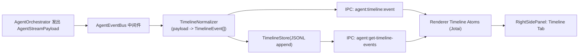

# RV-Insights 迁移 Shannon 右侧 Timeline 方案（前后端深度版）

> 目标项目：`/Users/zq/Desktop/ai-projs/posp/RV-Insights`  
> 参考实现：`/Users/zq/Desktop/ai-projs/posp/template/Shannon`  
> 产出日期：2026-05-05

---

## 1. 先讲结论（通俗版）

可以把 Shannon 的 timeline 理解成三件事：

1. 持续接收执行事件（谁开始了、谁完成了、哪里失败了）。
2. 把原始事件翻译成“人能看懂”的时间线节点。
3. 把节点落盘，刷新后还能还原。

RV-Insights 其实已经有第 1 步的大部分能力（事件流、IPC、Jotai 流式状态），缺的是第 2/3 步的“独立 timeline 领域模型 + 持久化回放 + 专门 UI 面板”。

所以最稳妥方案不是“重写一套流式系统”，而是：
- 复用现有 `AgentEventBus -> IPC -> useGlobalAgentListeners` 主干；
- 在主进程新增 `TimelineNormalizer + TimelineStore(JSONL)`；
- 在右侧面板新增 `Files / Timeline` 双模式；
- 先做列表版 timeline（MVP），雷达动画放二期。

---

## 2. RV-Insights 当前能力盘点（为什么能低风险迁移）

### 2.1 已有事件主干（可直接复用）

- EventBus 支持中间件链：`apps/electron/src/main/lib/agent-event-bus.ts:24-93`
- 事件已从主进程推给渲染进程：`apps/electron/src/main/lib/agent-service.ts:53-63`
- IPC 已有完整 Agent 通道体系：`apps/electron/src/main/ipc.ts:861-875`
- preload 已暴露事件订阅接口：`apps/electron/src/preload/index.ts:452-459`

这说明你不需要像 Shannon 那样再搭 Redis/SSE；RV 的“本地 IPC 流”已经是可用的实时管道。

### 2.2 已有事件语义基础（可直接映射 timeline）

- `AgentEvent` 类型已经覆盖 tool/task/retry/permission 等语义：`packages/shared/src/types/agent.ts:460-524`
- 渲染层已把 `AgentStreamPayload` 转成可用事件：`apps/electron/src/renderer/hooks/useGlobalAgentListeners.ts:77-200`
- `applyAgentEvent` 已实现完整状态机：`apps/electron/src/renderer/atoms/agent-atoms.ts:504-760`

这说明 timeline 的“语义原料”已经在项目里，只是还没形成独立的 timeline 数据域。

### 2.3 已有本地持久化范式（符合项目原则）

- 会话消息已按 JSONL 追加落盘：`apps/electron/src/main/lib/agent-session-manager.ts`
- 路径管理集中在 `config-paths.ts`：`apps/electron/src/main/lib/config-paths.ts:205-240`
- 删除会话时会清理消息文件：`apps/electron/src/main/lib/agent-session-manager.ts:339-381`

这与 Shannon 的数据库 event_logs 思路等价，只是 RV 的“持久层”应该保持 JSON/JSONL，不引入本地数据库（符合 RV 约束）。

### 2.4 当前缺口（必须补）

1. 右侧面板当前是文件面板，没有 timeline 入口：`RightSidePanel.tsx:14-28`、`SidePanel.tsx:37+`
2. 没有独立 `TimelineEvent` 结构，历史回放时无法按时间线视角读取。
3. 没有 timeline 专用 IPC 查询（例如 `get timeline events by session`）。
4. 没有 timeline 去噪策略（高频 `tool_progress`、文本片段会污染时间线）。

---

## 3. 目标架构（迁移后）



设计原则：

- 单一事实来源：**主进程标准化 + 持久化**（前端只做展示和轻量筛选）。
- 本地优先：JSONL 持久化，不引入 DB。
- 渐进迁移：先 MVP 时间线列表，再上雷达可视化。

---

## 4. 后端（主进程）实现方案

> 在 RV 里，“后端”就是 Electron 主进程层（`main/`）。

### 4.1 新增 Timeline 领域模型（shared）

建议在 `packages/shared/src/types/agent.ts`（或拆新文件）新增：

```ts
export type TimelineStatus = 'running' | 'completed' | 'failed' | 'waiting'
export type TimelineCategory = 'workflow' | 'agent' | 'tool' | 'task' | 'system'

export interface TimelineEvent {
  id: string            // `${sessionId}:${seq}`
  sessionId: string
  seq: number           // 主进程单调递增
  ts: number            // ms timestamp
  category: TimelineCategory
  type: string          // 原子类型，如 TOOL_INVOKED / TASK_COMPLETED
  status: TimelineStatus
  title: string         // 给 UI 的短文案
  detail?: string       // 可展开详情
  source: 'sdk_message' | 'rv_event'
  dedupeKey?: string    // 去重/合并键
  raw?: Record<string, unknown> // 可选，调试用
}
```

### 4.2 新增标准化器（Normalizer）

建议新增：
- `apps/electron/src/main/lib/agent-timeline-normalizer.ts`

输入：`AgentStreamPayload`  
输出：`TimelineEvent[]`（一次 payload 可能映射多个节点）。

建议映射规则（核心）：

1. `sdk_message.assistant` 中 `tool_use` -> `TOOL_INVOKED`（running）
2. `sdk_message.user` 中 `tool_result` -> `TOOL_COMPLETED/TOOL_FAILED`
3. `sdk_message.system.task_started` -> `TASK_STARTED`
4. `sdk_message.system.task_notification` -> `TASK_COMPLETED/FAILED/STOPPED`
5. `sdk_message.result(subtype=success)` -> `WORKFLOW_COMPLETED`
6. `sdk_message.result(subtype!=success)` -> `WORKFLOW_FAILED`
7. `rv_insights_event.permission_request` -> `WAITING_PERMISSION`
8. `rv_insights_event.ask_user_request` -> `WAITING_USER_INPUT`
9. `rv_insights_event.retry` -> `RETRYING/RETRY_FAILED`

去噪建议：

- 丢弃 `prompt_suggestion`
- `tool_progress` 按 `toolUseId` 做 1s 节流（仅保留最新）
- 文本类 `text_complete` 不逐条入 timeline，只在必要时合并成“Agent 正在思考/输出”

### 4.3 新增持久化存储（TimelineStore）

建议新增：
- `apps/electron/src/main/lib/agent-timeline-store.ts`

路径方案（推荐，便于统一清理）：

- 在 `config-paths.ts` 新增：
  - `getAgentSessionTimelinePath(sessionId): ~/.rv-insights/agent-sessions/{sessionId}.timeline.jsonl`

写入策略：

- 追加写 JSONL（单行一个 `TimelineEvent`）
- 主进程维护 `Map<sessionId, seq>` 保证顺序
- 每次写入前做轻量去重（`id` 或 `dedupeKey+status`）

读取策略：

- 支持 `limit`（默认 300，最大 2000）
- 支持倒序读取（UI 默认最新在下或在上均可配置）

### 4.4 接入 EventBus 中间件

改造点：
- `apps/electron/src/main/lib/agent-service.ts:53-63`

在现有 `eventBus.use(...)` 中间件里追加：

1. 调用 `normalize(payload)` 生成 timeline events
2. 持久化 timeline events
3. 用新的 IPC 事件通道推送给 renderer（见 4.5）

这样做的好处：不改 Orchestrator 主循环，风险最小。

### 4.5 增加 Timeline IPC 通道

改造点：
- `packages/shared/src/types/agent.ts`：新增 IPC 常量  
  - `AGENT_IPC_CHANNELS.GET_TIMELINE_EVENTS = 'agent:get-timeline-events'`
  - `AGENT_IPC_CHANNELS.TIMELINE_EVENT = 'agent:timeline:event'`
- `apps/electron/src/main/ipc.ts`：注册 `GET_TIMELINE_EVENTS`
- `apps/electron/src/preload/index.ts`：暴露
  - `getAgentTimelineEvents(sessionId, opts?)`
  - `onAgentTimelineEvent(cb)`

### 4.6 生命周期一致性

改造点：
- `apps/electron/src/main/lib/agent-session-manager.ts:339-381`

删除会话时一并删除 `{sessionId}.timeline.jsonl`，避免孤儿 timeline 文件。

---

## 5. 前端（渲染进程）实现方案

### 5.1 新增 Timeline Atoms（Jotai）

改造点建议：
- `apps/electron/src/renderer/atoms/agent-atoms.ts`

新增：

1. `agentTimelineEventsMapAtom: Map<sessionId, TimelineEvent[]>`
2. `currentAgentTimelineEventsAtom`（派生）
3. `agentTimelinePanelTabMapAtom: Map<sessionId, 'files' | 'timeline'>`
4. `agentTimelineFilterAtom`（可选：all/tool/task/system）

状态规则：

- 同 session 以 `id` 去重。
- 默认只保留最近 N 条（如 1000）防止内存膨胀。

### 5.2 全局监听注入点

当前监听器位置：
- `apps/electron/src/renderer/hooks/useGlobalAgentListeners.ts:338+`

新增两段逻辑：

1. 订阅 `onAgentTimelineEvent`，实时 append 到 `agentTimelineEventsMapAtom`
2. 在切换 session 或初次打开时，调用 `getAgentTimelineEvents` 做历史回放

注意：timeline 历史加载建议和消息加载解耦，避免互相阻塞。

### 5.3 右侧面板改造

当前入口：
- `apps/electron/src/renderer/components/app-shell/RightSidePanel.tsx:14-28`

当前容器：
- `apps/electron/src/renderer/components/agent/SidePanel.tsx:37+`

改造建议：

1. 保留 `SidePanel` 现有文件能力。
2. 在面板顶部增加二级切换：`Files | Timeline`。
3. `Files` 走现有逻辑，`Timeline` 渲染新组件。

建议新增组件：
- `apps/electron/src/renderer/components/agent/timeline/TimelinePanel.tsx`
- `TimelineList.tsx`
- `TimelineItem.tsx`
- `TimelineEventDetails.tsx`

### 5.4 Timeline UI 行为（仿 Shannon，但贴合 RV 风格）

MVP 列表项建议字段：

- 图标：running/completed/failed/waiting
- 标题：如“调用 Read 工具”“Task #2 完成”
- 时间：`HH:mm:ss`
- 可展开详情：展示 `detail` 或 `raw`

降噪策略：

- 默认隐藏低价值 heartbeat/progress（可通过“显示详细事件”开关查看）
- 同类重复事件（如连续 retrying）聚合为一条“正在第 N 次重试”

---

## 6. 事件映射参考表（可直接落代码）

| RV 原始输入 | Timeline type | status | title 示例 |
|---|---|---|---|
| assistant.tool_use(Read) | TOOL_INVOKED | running | 调用 Read 工具 |
| user.tool_result(is_error=false) | TOOL_COMPLETED | completed | Read 执行完成 |
| user.tool_result(is_error=true) | TOOL_FAILED | failed | Read 执行失败 |
| system.task_started | TASK_STARTED | running | 子任务已启动 |
| system.task_notification(completed) | TASK_COMPLETED | completed | 子任务已完成 |
| system.task_notification(failed) | TASK_FAILED | failed | 子任务失败 |
| result.success | WORKFLOW_COMPLETED | completed | 本轮执行完成 |
| result.error_max_turns | WORKFLOW_FAILED | failed | 达到轮次上限 |
| rv.permission_request | WAITING_PERMISSION | waiting | 等待权限确认 |
| rv.ask_user_request | WAITING_USER | waiting | 等待用户输入 |
| rv.retry.starting | RETRYING | running | 正在重试（第 N 次） |
| rv.retry.failed | RETRY_FAILED | failed | 重试失败 |

---

## 7. 分阶段落地计划（推荐）

## M0（0.5 天）：类型与接口脚手架

- 新增 `TimelineEvent` 类型
- 新增 IPC 常量与 preload API 占位
- 不改 UI，仅打通编译

验收：`bun run typecheck` 通过。

## M1（1-2 天）：主进程 timeline 数据链路

- Normalizer + Store + EventBus 中间件接入
- `GET_TIMELINE_EVENTS` 可查询历史
- 会话删除同步清理 timeline 文件

验收：本地跑一次会话后，能看到 `.timeline.jsonl` 且内容顺序正确。

## M2（1-2 天）：前端 timeline 面板 MVP

- Jotai timeline atoms
- SidePanel 增加 `Files/Timeline` 切换
- Timeline 列表 + 展开详情 + 基础过滤

验收：实时事件可见，刷新后回放一致。

## M3（1 天，可选）：雷达/活动可视化

- 新增“活跃节点”可视化（先轻量 CSS 动画，后再 Canvas）
- 与 timeline 列表共享同一事件源

验收：多任务并发时能快速看出谁在运行、谁已完成。

## M4（0.5 天）：兼容与清理

- 历史旧会话回退方案（无 timeline 文件时从 SDK messages 补构建）
- 文档与开发指南补齐

验收：旧会话可打开，新增会话体验完整。

---

## 8. 风险与规避

1. **事件量过大导致性能抖动**  
   规避：主进程去噪 + 前端 N 条上限 + progress 节流。

2. **事件顺序错乱（异步并发）**  
   规避：主进程统一分配 `seq`，前端按 `seq` 排序展示。

3. **前后端重复映射导致语义漂移**  
   规避：映射逻辑固定在主进程 Normalizer，前端只渲染。

4. **删除会话后残留 timeline 文件**  
   规避：在 `deleteAgentSession` 同步清理 timeline。

5. **与现有 ToolActivity UI 重复**  
   规避：ToolActivity 保留“消息内工具细节”；Timeline 提供“跨轮次执行脉络”，定位不同。

---

## 9. 验证方案（必须做）

### 9.1 单元测试

- `agent-timeline-normalizer.spec.ts`  
  覆盖 tool_use/tool_result/task_notification/retry/result 等映射。

- `agent-timeline-store.spec.ts`  
  覆盖 append/list/dedupe/limit/order。

### 9.2 集成测试

- 模拟一轮完整会话（含 tool + task + complete）：
  - 检查 timeline IPC 实时事件是否发出
  - 检查 `.timeline.jsonl` 是否落盘
  - 刷新后 `getAgentTimelineEvents` 是否还原一致

### 9.3 手工验收清单

1. 发起普通对话（仅文本）timeline 不应刷屏。
2. 发起多工具任务，timeline 应清晰显示开始/完成/失败。
3. 刷新应用后 timeline 保持。
4. 删除会话后 timeline 文件被清理。
5. 右侧 `Files/Timeline` 切换不影响现有文件操作。

---

## 10. 推荐最小可行实现（MVP）文件清单

**主进程**

- `packages/shared/src/types/agent.ts`（新增 Timeline 类型 + IPC 常量）
- `apps/electron/src/main/lib/agent-timeline-normalizer.ts`（新）
- `apps/electron/src/main/lib/agent-timeline-store.ts`（新）
- `apps/electron/src/main/lib/agent-service.ts`（接入中间件）
- `apps/electron/src/main/lib/config-paths.ts`（timeline 路径函数）
- `apps/electron/src/main/lib/agent-session-manager.ts`（删除会话时清理 timeline）
- `apps/electron/src/main/ipc.ts`（新增 GET_TIMELINE_EVENTS）
- `apps/electron/src/preload/index.ts`（暴露 timeline API）

**渲染进程**

- `apps/electron/src/renderer/atoms/agent-atoms.ts`（timeline atoms）
- `apps/electron/src/renderer/hooks/useGlobalAgentListeners.ts`（接 timeline 实时 + 回放）
- `apps/electron/src/renderer/components/agent/SidePanel.tsx`（Files/Timeline 切换）
- `apps/electron/src/renderer/components/agent/timeline/*`（新）

---

## 11. 实施建议（优先级）

先做 “**主进程标准化 + 持久化 + Timeline 列表**”，再做雷达动画。  
原因很简单：先保证数据正确和可回放，再做表现层，能显著降低返工概率。

